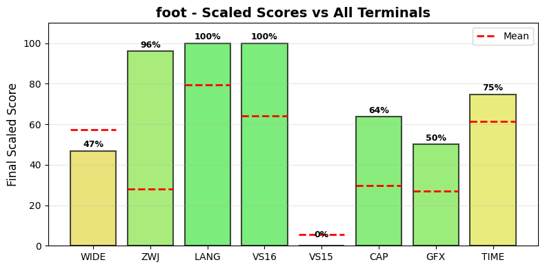

.. _foot:

foot
----

Tested Software version 1.16.2 on Linux.
The homepage URL of this terminal is https://codeberg.org/dnkl/foot.
Full results available at ucs-detect_ repository path
`data/foot.yaml <https://github.com/jquast/ucs-detect/blob/master/data/foot.yaml>`_.

.. _footscores:

Score Breakdown
+++++++++++++++

Detailed breakdown of how scores are calculated for *foot*:

.. table::
   :class: sphinx-datatable

   ===  ==================================  ===========  ====================
     #  Score Type                          Raw Score    Final Scaled Score
   ===  ==================================  ===========  ====================
     1  :ref:`WIDE <footwide>`              99.52%       46.7%
     2  :ref:`ZWJ <footzwj>`                95.99%       96.0%
     3  :ref:`LANG <footlang>`              100.00%      100.0%
     4  :ref:`VS16 <footvs16>`              100.00%      100.0%
     5  :ref:`VS15 <footvs15>`              0.00%        0.0%
     6  :ref:`Capabilities <footdecmodes>`  58.33%       63.6%
     7  :ref:`Graphics <footgraphics>`      50%          50.0%
     8  :ref:`TIME <foottime>`              26.21s       74.6%
   ===  ==================================  ===========  ====================

**Score Comparison Plot:**

The following plot shows how this terminal's scores compare to all other terminals tested.

   Scaled scores comparison across all metrics (normalized 0-100%)

**Final Scaled Score Calculation:**

- Raw Final Score: 72.15%
  (weighted average: WIDE + ZWJ + LANG + VS16 + VS15 + CAP + GFX + 0.5*TIME)
  the categorized 'average' absolute support level of this terminal
  Note: TIME is normalized to 0-1 range before averaging.
  TIME is weighted at 0.5 (half as powerful as other metrics).
  CAP (Capabilities) is the fraction of 7 notable capabilities supported.
  GFX (Graphics) scores 100% for modern protocols (iTerm2, Kitty),
  50% for legacy only (Sixel, ReGIS), 0% for none.
  Sixel/ReGIS support contributes to the GFX score at 50%.

- Final Scaled Score: 64.4%
  (normalized across all terminals tested).
  *Final Scaled scores* are normalized (0-100%) relative to all terminals tested

**WIDE Score Details:**

Wide character support calculation:

- Total successful codepoints: 43381
- Total codepoints tested: 43592
- Formula: 43381 / 43592
- Result: 99.52%

**ZWJ Score Details:**

Emoji ZWJ (Zero-Width Joiner) support calculation:

- Total successful sequences: 1387
- Total sequences tested: 1445
- Formula: 1387 / 1445
- Result: 95.99%

**VS16 Score Details:**

Variation Selector-16 support calculation:

- Errors: 0 of 426 codepoints tested
- Success rate: 100.0%
- Formula: 100.0 / 100
- Result: 100.00%

**VS15 Score Details:**

Variation Selector-15 support calculation:

- Errors: 158 of 158 codepoints tested
- Success rate: 0.0%
- Formula: 0.0 / 100
- Result: 0.00%

**Capabilities Score Details:**

Notable terminal capabilities (7 / 12):

- Set bracketed paste mode (2004): **yes**
- Synchronized Output (2026): **yes**
- Send FocusIn/FocusOut events (1004): **yes**
- Enable SGR Mouse Mode (1006): **yes**
- Grapheme Clustering (2027): **yes**
- Bracketed Paste MIME (5522): **no**
- Kitty Keyboard: **yes**
- XTGETTCAP: **yes**
- Text Sizing (OSC 66): **no**
- Kitty Clipboard Protocol: **no**
- Kitty Pointer Shapes (OSC 22): **no**
- Kitty Notifications (OSC 99): **no**

Raw score: 58.33%

**Graphics Score Details:**

Graphics protocol support (50%):

- Sixel: **yes**
- ReGIS: **no**
- iTerm2: **no**
- Kitty: **no**

Scoring: 100% for modern (iTerm2/Kitty), 50% for legacy only (Sixel/ReGIS), 0% for none

**TIME Score Details:**

Test execution time:

- Elapsed time: 26.21 seconds
- Note: This is a raw measurement; lower is better
- Scaled score uses inverse log10 scaling across all terminals
- Scaled result: 74.6%

**LANG Score Details (Geometric Mean):**

Geometric mean calculation:

- Formula: (p₁ × p₂ × ... × pₙ)^(1/n) where n = 94 languages
- About `geometric mean <https://en.wikipedia.org/wiki/Geometric_mean>`_
- Result: 100.00%

.. _footwide:

Wide character support
++++++++++++++++++++++

Wide character support of *foot* is **99.5%** (211 errors of 43592 codepoints tested).

Sequence of a WIDE character, from midpoint of alignment failure records:

.. table::
   :class: sphinx-datatable

   ===  =================================================  =============  ==========  =========  ===================
     #  Codepoint                                          Python         Category      wcwidth  Name
   ===  =================================================  =============  ==========  =========  ===================
     1  `U+0001D331 <https://codepoints.net/U+0001D331>`_  '\\U0001d331'  So                  2  TETRAGRAM FOR STOVE
   ===  =================================================  =============  ==========  =========  ===================

Total codepoints: 1

- Shell test using `printf(1)`_, ``'|'`` should align in output::

        $ printf "\xf0\x9d\x8c\xb1|\\n12|\\n"
        𝌱|
        12|

- python `wcwidth.wcswidth()`_ measures width 2,
  while *foot* measures width 1.

.. _footzwj:

Emoji ZWJ support
+++++++++++++++++

Compatibility of *foot* with the Unicode Emoji ZWJ sequence table is **96.0%** (58 errors of 1445 sequences tested).

Sequence of an Emoji ZWJ Sequence, from midpoint of alignment failure records:

.. table::
   :class: sphinx-datatable

   ===  =================================================  =============  ==========  =========  =================================
     #  Codepoint                                          Python         Category      wcwidth  Name
   ===  =================================================  =============  ==========  =========  =================================
     1  `U+0001F469 <https://codepoints.net/U+0001F469>`_  '\\U0001f469'  So                  2  WOMAN
     2  `U+0001F3FD <https://codepoints.net/U+0001F3FD>`_  '\\U0001f3fd'  Sk                  2  EMOJI MODIFIER FITZPATRICK TYPE-4
     3  `U+200D <https://codepoints.net/U+200D>`_          '\\u200d'      Cf                  0  ZERO WIDTH JOINER
     4  `U+0001FAEF <https://codepoints.net/U+0001FAEF>`_  '\\U0001faef'  So                  2  FIGHT CLOUD
     5  `U+200D <https://codepoints.net/U+200D>`_          '\\u200d'      Cf                  0  ZERO WIDTH JOINER
     6  `U+0001F469 <https://codepoints.net/U+0001F469>`_  '\\U0001f469'  So                  2  WOMAN
     7  `U+0001F3FC <https://codepoints.net/U+0001F3FC>`_  '\\U0001f3fc'  Sk                  2  EMOJI MODIFIER FITZPATRICK TYPE-3
   ===  =================================================  =============  ==========  =========  =================================

Total codepoints: 7

- Shell test using `printf(1)`_, ``'|'`` should align in output::

        $ printf "\xf0\x9f\x91\xa9\xf0\x9f\x8f\xbd\xe2\x80\x8d\xf0\x9f\xab\xaf\xe2\x80\x8d\xf0\x9f\x91\xa9\xf0\x9f\x8f\xbc|\\n12|\\n"
        👩🏽‍🫯‍👩🏼|
        12|

- python `wcwidth.wcswidth()`_ measures width 2,
  while *foot* measures width 4.

.. _footvs16:

Variation Selector-16 support
+++++++++++++++++++++++++++++

Emoji VS-16 results for *foot* is 0 errors
out of 426 total codepoints tested, 100.0% success.
All codepoint combinations with Variation Selector-16 tested were successful.

.. _footvs15:

Variation Selector-15 support
+++++++++++++++++++++++++++++

Emoji VS-15 results for *foot* is 158 errors
out of 158 total codepoints tested, 0.0% success.
Sequence of a WIDE Emoji made NARROW by *Variation Selector-15*, from midpoint of alignment failure records:

.. table::
   :class: sphinx-datatable

   ===  =================================================  =============  ==========  =========  =====================
     #  Codepoint                                          Python         Category      wcwidth  Name
   ===  =================================================  =============  ==========  =========  =====================
     1  `U+0001F3AE <https://codepoints.net/U+0001F3AE>`_  '\\U0001f3ae'  So                  2  VIDEO GAME
     2  `U+FE0E <https://codepoints.net/U+FE0E>`_          '\\ufe0e'      Mn                  0  VARIATION SELECTOR-15
   ===  =================================================  =============  ==========  =========  =====================

Total codepoints: 2

- Shell test using `printf(1)`_, ``'|'`` should align in output::

        $ printf "\xf0\x9f\x8e\xae\xef\xb8\x8e|\\n1|\\n"
        🎮︎|
        1|

- python `wcwidth.wcswidth()`_ measures width 1,
  while *foot* measures width 2.

.. _footgraphics:

Graphics Protocol Support
+++++++++++++++++++++++++

*foot* supports the following graphics protocols: Sixel_, `iTerm2 inline images`_.

**Detection Methods:**

- **Sixel** and **ReGIS**: Detected via the Device Attributes (DA1) query
  ``CSI c`` (``\x1b[c``). Extension code ``4`` indicates Sixel_ support,
  ``3`` ReGIS_.
- **Kitty graphics**: Detected by sending a Kitty graphics query and
  checking for an ``OK`` response.
- **iTerm2 inline images**: Detected via the iTerm2 capabilities query
  ``OSC 1337 ; Capabilities``.

**Device Attributes Response:**

- Extensions reported: 4, 22
- Sixel_ indicator (``4``): present
- ReGIS_ indicator (``3``): not present

.. _Sixel: https://en.wikipedia.org/wiki/Sixel
.. _ReGIS: https://en.wikipedia.org/wiki/ReGIS
.. _`iTerm2 inline images`: https://iterm2.com/documentation-images.html
.. _`Kitty graphics protocol`: https://sw.kovidgoyal.net/kitty/graphics-protocol/

.. _footlang:

Language Support
++++++++++++++++

The following 94 languages were tested with 100% success:

Aja, Amarakaeri, Arabic, Standard, Assyrian Neo-Aramaic, Baatonum, Bamun, Belanda Viri, Bengali, Bhojpuri, Bora, Burmese, Catalan (2), Chakma, Chickasaw, Chinantec, Chiltepec, Dagaare, Southern, Dangme, Dari, Dendi, Dinka, Northeastern, Ditammari, Dzongkha, Evenki, Farsi, Western, Fon, French (Welche), Fur, Ga, Gen, Gilyak, Gujarati, Gumuz, Hindi, Javanese (Javanese), Kabyle, Kannada, Khmer, Central, Khün, Lamnso', Lao, Lingala (tones), Magahi, Maithili, Malayalam, Maldivian, Maori (2), Marathi, Mazahua Central, Mirandese, Mixtec, Metlatónoc, Mon, Mòoré, Nanai, Navajo, Nepali, Orok, Otomi, Mezquital, Panjabi, Eastern, Panjabi, Western, Pashto, Northern, Picard, Pular (Adlam), Saint Lucian Creole French, Sanskrit, Sanskrit (Grantha), Secoya, Seraiki, Shan, Shipibo-Conibo, Sinhala, Siona, South Azerbaijani, Tagalog (Tagalog), Tai Dam, Tamang, Eastern, Tamazight, Central Atlas, Tamil, Tamil (Sri Lanka), Telugu, Tem, Thai, Thai (2), Tibetan, Central, Ticuna, Uduk, Urdu, Urdu (2), Veps, Vietnamese, Waama, Yaneshaʼ, Yiddish, Eastern, Yoruba, Éwé.

All tested languages are fully supported.

.. _footdecmodes:

DEC Private Modes Support
+++++++++++++++++++++++++

DEC private modes results for *foot*: 5 changeable modes
of 5 supported out of 7 total modes tested (71.4% support, 71.4% changeable).

Complete list of DEC private modes tested:

.. table::
   :class: sphinx-datatable

   ======  =====================  ===================================  ===========  ============  =========
     Mode  Name                   Description                          Supported    Changeable    Enabled
   ======  =====================  ===================================  ===========  ============  =========
     1004  FOCUS_IN_OUT_EVENTS    Send FocusIn/FocusOut events         Yes          Yes           No
     1006  MOUSE_EXTENDED_SGR     Enable SGR Mouse Mode                Yes          Yes           No
     2004  BRACKETED_PASTE        Set bracketed paste mode             Yes          Yes           No
     2026  SYNCHRONIZED_OUTPUT    Synchronized Output                  Yes          Yes           No
     2027  GRAPHEME_CLUSTERING    Grapheme Clustering                  Yes          Yes           Yes
     2048  IN_BAND_WINDOW_RESIZE  In-Band Window Resize Notifications  No           No            No
     5522  BRACKETED_PASTE_MIME   Bracketed Paste MIME                 No           No            No
   ======  =====================  ===================================  ===========  ============  =========

**Summary**: 5 changeable, 2 not changeable.

.. _footkittykbd:

Kitty Keyboard Protocol
+++++++++++++++++++++++

*foot* supports the `Kitty keyboard protocol`_.

.. table::
   :class: sphinx-datatable

   ===  ===============================  =====================  =======
     #  Flag                             Key                    State
   ===  ===============================  =====================  =======
     1  Disambiguate escape codes        ``disambiguate``       No
     2  Report event types               ``report_events``      No
     3  Report alternate keys            ``report_alternates``  No
     4  Report all keys as escape codes  ``report_all_keys``    No
     5  Report associated text           ``report_text``        No
   ===  ===============================  =====================  =======

Detection is performed by sending ``CSI ? u`` to query the current
progressive enhancement flags. A terminal that supports this protocol
responds with the active flags value.

.. _`Kitty keyboard protocol`: https://sw.kovidgoyal.net/kitty/keyboard-protocol/

.. _footxtgettcap:

XTGETTCAP (Terminfo Capabilities)
+++++++++++++++++++++++++++++++++

*foot* supports the ``XTGETTCAP`` sequence and reports **63** terminfo capabilities.

.. table::
   :class: sphinx-datatable

   ===  ============  ======================  ================================================================
     #  Capability    Description             Value
   ===  ============  ======================  ================================================================
     1  Co            Number of colors        ``256``
     2  TN            Terminal name           ``foot``
     3  bel           Bell                    ``^G``
     4  blink         Enter blink mode        ````
     5  bold          Enter bold mode         ````
     6  civis         Hide cursor             ``[?25l``
     7  clear         Clear screen            ````
     8  cnorm         Normal cursor           ``[?12l[?25h``
     9  colors        Max colors              ``256``
    10  cr            Carriage return         ``
                                              ``
    11  csr           Change scroll region    ``\E[%i%p1%d;%p2%dr``
    12  cub           Cursor left n           ``\E[%p1%dD``
    13  cub1          Cursor left             ``^H``
    14  cud           Cursor down n           ``\E[%p1%dB``
    15  cud1          Cursor down             ``
                                              ``
    16  cuf           Cursor right n          ``\E[%p1%dC``
    17  cuf1          Cursor right            ````
    18  cup           Cursor address          ``\E[%i%p1%d;%p2%dH``
    19  cuu           Cursor up n             ``\E[%p1%dA``
    20  cuu1          Cursor up               ````
    21  cvvis         Very visible cursor     ``[?12;25h``
    22  dch           Delete n characters     ``\E[%p1%dP``
    23  dch1          Delete character        ````
    24  dim           Enter dim mode          ````
    25  dl            Delete n lines          ``\E[%p1%dM``
    26  dl1           Delete line             ````
    27  ech           Erase characters        ``\E[%p1%dX``
    28  ed            Clear to end of screen  ````
    29  el            Clear to end of line    ````
    30  el1           Clear to start of line  ````
    31  flash         Flash screen            ``]555\``
    32  home          Cursor home             ````
    33  hpa           Horizontal position     ``\E[%i%p1%dG``
    34  ich           Insert n characters     ``\E[%p1%d@``
    35  il            Insert n lines          ``\E[%p1%dL``
    36  il1           Insert line             ````
    37  ind           Scroll forward          ``
                                              ``
    38  indn          Scroll forward n        ``\E[%p1%dS``
    39  op            Original pair           ````
    40  rc            Restore cursor          ``8``
    41  rev           Enter reverse mode      ````
    42  rin           Scroll reverse n        ``\E[%p1%dT``
    43  ritm          Exit italics mode       ````
    44  rmam          Disable line wrap       ``[?7l``
    45  rmcup         Exit alt screen         ``[?1049l``
    46  rmkx          Keypad local mode       ``[?1l>``
    47  rmso          Exit standout mode      ````
    48  rmul          Exit underline mode     ````
    49  sc            Save cursor             ``7``
    50  setab         Set background color    ``\E[%?%p1%{8}%<%t4%p1%d%e%p1%{16}%<%t10%p1%{8}%-%d%e48\:5\...``
    51  setaf         Set foreground color    ``\E[%?%p1%{8}%<%t3%p1%d%e%p1%{16}%<%t9%p1%{8}%-%d%e38\:5\:...``
    52  sgr0          Reset attributes        ``(B``
    53  sitm          Enter italics mode      ````
    54  smam          Enable line wrap        ``[?7h``
    55  smcup         Enter alt screen        ``[?1049h``
    56  smkx          Keypad transmit mode    ``[?1h=``
    57  smso          Enter standout mode     ````
    58  smul          Enter underline mode    ````
    59  u6            CPR response format     ``\E[%i%d;%dR``
    60  u7            CPR request             ````
    61  u8            DA response format      ``\E[?%[;0123456789]c``
    62  u9            DA request              ````
    63  vpa           Vertical position       ``\E[%i%p1%dd``
   ===  ============  ======================  ================================================================

The ``XTGETTCAP`` sequence (``DCS + q Pt ST``) allows applications to query
terminfo capabilities directly from the terminal emulator, rather than relying
on the system terminfo database.

.. _footreproduce:

Reproduction
++++++++++++

To reproduce these results for *foot*, install and run ucs-detect_
with the following commands::

    pip install ucs-detect
    ucs-detect --rerun data/foot.yaml

.. _foottime:

Test Execution Time
+++++++++++++++++++

The test suite completed in **26.21 seconds** (26s).

This time measurement represents the total duration of the test execution,
including all Unicode wide character tests, emoji ZWJ sequences, variation
selectors, language support checks, and DEC mode detection.

.. _`printf(1)`: https://www.man7.org/linux/man-pages/man1/printf.1.html
.. _`wcwidth.wcswidth()`: https://wcwidth.readthedocs.io/en/latest/intro.html
.. _`ucs-detect`: https://github.com/jquast/ucs-detect
.. _`DEC Private Modes`: https://blessed.readthedocs.io/en/latest/dec_modes.html
