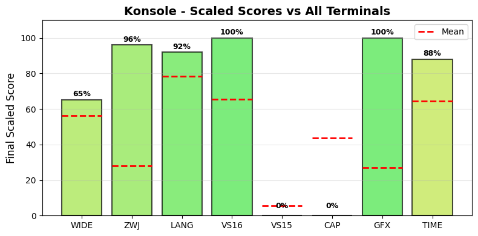

.. _konsole:

Konsole
-------

Tested Software version 25.12.1 on Linux.
The homepage URL of this terminal is https://apps.kde.org/konsole/.
Full results available at ucs-detect_ repository path
`data/konsole.yaml <https://github.com/jquast/ucs-detect/blob/master/data/konsole.yaml>`_.

.. _konsolescores:

Score Breakdown
+++++++++++++++

Detailed breakdown of how scores are calculated for *Konsole*:

.. table::
   :class: sphinx-datatable

   ===  =====================================  ===========  ====================
     #  Score Type                             Raw Score    Final Scaled Score
   ===  =====================================  ===========  ====================
     1  :ref:`WIDE <konsolewide>`              99.68%       65.2%
     2  :ref:`ZWJ <konsolezwj>`                95.99%       96.0%
     3  :ref:`LANG <konsolelang>`              97.58%       91.9%
     4  :ref:`VS16 <konsolevs16>`              100.00%      100.0%
     5  :ref:`VS15 <konsolevs15>`              0.00%        0.0%
     6  :ref:`Capabilities <konsoledecmodes>`  0.00%        0.0%
     7  :ref:`Graphics <konsolegraphics>`      100%         100.0%
     8  :ref:`TIME <konsoletime>`              11.69s       88.0%
   ===  =====================================  ===========  ====================

**Score Comparison Plot:**

The following plot shows how this terminal's scores compare to all other terminals tested.

   Scaled scores comparison across all metrics (normalized 0-100%)

**Final Scaled Score Calculation:**

- Raw Final Score: 71.64%
  (weighted average: WIDE + ZWJ + LANG + VS16 + VS15 + CAP + GFX + 0.5*TIME)
  the categorized 'average' absolute support level of this terminal
  Note: TIME is normalized to 0-1 range before averaging.
  TIME is weighted at 0.5 (half as powerful as other metrics).
  CAP (Capabilities) is the fraction of 7 notable capabilities supported.
  GFX (Graphics) scores 100% for modern protocols (iTerm2, Kitty),
  50% for legacy only (Sixel, ReGIS), 0% for none.
  Sixel/ReGIS support contributes to the GFX score at 50%.

- Final Scaled Score: 59.6%
  (normalized across all terminals tested).
  *Final Scaled scores* are normalized (0-100%) relative to all terminals tested

**WIDE Score Details:**

Wide character support calculation:

- Total successful codepoints: 7243
- Total codepoints tested: 7266
- Formula: 7243 / 7266
- Result: 99.68%

**ZWJ Score Details:**

Emoji ZWJ (Zero-Width Joiner) support calculation:

- Total successful sequences: 1387
- Total sequences tested: 1445
- Formula: 1387 / 1445
- Result: 95.99%

**VS16 Score Details:**

Variation Selector-16 support calculation:

- Errors: 0 of 426 codepoints tested
- Success rate: 100.0%
- Formula: 100.0 / 100
- Result: 100.00%

**VS15 Score Details:**

Variation Selector-15 support calculation:

- Errors: 158 of 158 codepoints tested
- Success rate: 0.0%
- Formula: 0.0 / 100
- Result: 0.00%

**Capabilities Score Details:**

Notable terminal capabilities (0 / 7):

- Bracketed Paste (2004): **no**
- Synced Output (2026): **no**
- Focus Events (1004): **no**
- Mouse SGR (1006): **no**
- Graphemes (2027): **no**
- Kitty Keyboard: **no**
- XTGETTCAP: **no**

Raw score: 0.00%

**Graphics Score Details:**

Graphics protocol support (100%):

- Sixel: **yes**
- ReGIS: **no**
- iTerm2: **no**
- Kitty: **yes**

Scoring: 100% for modern (iTerm2/Kitty), 50% for legacy only (Sixel/ReGIS), 0% for none

**TIME Score Details:**

Test execution time:

- Elapsed time: 11.69 seconds
- Note: This is a raw measurement; lower is better
- Scaled score uses inverse log10 scaling across all terminals
- Scaled result: 88.0%

**LANG Score Details (Geometric Mean):**

Geometric mean calculation:

- Formula: (p₁ × p₂ × ... × pₙ)^(1/n) where n = 94 languages
- About `geometric mean <https://en.wikipedia.org/wiki/Geometric_mean>`_
- Result: 97.58%

.. _konsolewide:

Wide character support
++++++++++++++++++++++

Wide character support of *Konsole* is **99.7%** (23 errors of 7266 codepoints tested).

Sequence of a WIDE character, from midpoint of alignment failure records:

.. table::
   :class: sphinx-datatable

   ===  =================================================  =============  ==========  =========  =====================
     #  Codepoint                                          Python         Category      wcwidth  Name
   ===  =================================================  =============  ==========  =========  =====================
     1  `U+0001D334 <https://codepoints.net/U+0001D334>`_  '\\U0001d334'  So                  2  TETRAGRAM FOR PATTERN
   ===  =================================================  =============  ==========  =========  =====================

Total codepoints: 1

- Shell test using `printf(1)`_, ``'|'`` should align in output::

        $ printf "\xf0\x9d\x8c\xb4|\\n12|\\n"
        𝌴|
        12|

- python `wcwidth.wcswidth()`_ measures width 2,
  while *Konsole* measures width 1.

.. _konsolezwj:

Emoji ZWJ support
+++++++++++++++++

Compatibility of *Konsole* with the Unicode Emoji ZWJ sequence table is **96.0%** (58 errors of 1445 sequences tested).

Sequence of an Emoji ZWJ Sequence, from midpoint of alignment failure records:

.. table::
   :class: sphinx-datatable

   ===  =================================================  =============  ==========  =========  =================================
     #  Codepoint                                          Python         Category      wcwidth  Name
   ===  =================================================  =============  ==========  =========  =================================
     1  `U+0001F469 <https://codepoints.net/U+0001F469>`_  '\\U0001f469'  So                  2  WOMAN
     2  `U+0001F3FD <https://codepoints.net/U+0001F3FD>`_  '\\U0001f3fd'  Sk                  2  EMOJI MODIFIER FITZPATRICK TYPE-4
     3  `U+200D <https://codepoints.net/U+200D>`_          '\\u200d'      Cf                  0  ZERO WIDTH JOINER
     4  `U+0001FAEF <https://codepoints.net/U+0001FAEF>`_  '\\U0001faef'  Cn                  2  na
     5  `U+200D <https://codepoints.net/U+200D>`_          '\\u200d'      Cf                  0  ZERO WIDTH JOINER
     6  `U+0001F469 <https://codepoints.net/U+0001F469>`_  '\\U0001f469'  So                  2  WOMAN
     7  `U+0001F3FC <https://codepoints.net/U+0001F3FC>`_  '\\U0001f3fc'  Sk                  2  EMOJI MODIFIER FITZPATRICK TYPE-3
   ===  =================================================  =============  ==========  =========  =================================

Total codepoints: 7

- Shell test using `printf(1)`_, ``'|'`` should align in output::

        $ printf "\xf0\x9f\x91\xa9\xf0\x9f\x8f\xbd\xe2\x80\x8d\xf0\x9f\xab\xaf\xe2\x80\x8d\xf0\x9f\x91\xa9\xf0\x9f\x8f\xbc|\\n12|\\n"
        👩🏽‍🫯‍👩🏼|
        12|

- python `wcwidth.wcswidth()`_ measures width 2,
  while *Konsole* measures width 3.

.. _konsolevs16:

Variation Selector-16 support
+++++++++++++++++++++++++++++

Emoji VS-16 results for *Konsole* is 0 errors
out of 426 total codepoints tested, 100.0% success.
All codepoint combinations with Variation Selector-16 tested were successful.

.. _konsolevs15:

Variation Selector-15 support
+++++++++++++++++++++++++++++

Emoji VS-15 results for *Konsole* is 158 errors
out of 158 total codepoints tested, 0.0% success.
Sequence of a WIDE Emoji made NARROW by *Variation Selector-15*, from midpoint of alignment failure records:

.. table::
   :class: sphinx-datatable

   ===  =================================================  =============  ==========  =========  =====================
     #  Codepoint                                          Python         Category      wcwidth  Name
   ===  =================================================  =============  ==========  =========  =====================
     1  `U+0001F3AE <https://codepoints.net/U+0001F3AE>`_  '\\U0001f3ae'  So                  2  VIDEO GAME
     2  `U+FE0E <https://codepoints.net/U+FE0E>`_          '\\ufe0e'      Mn                  0  VARIATION SELECTOR-15
   ===  =================================================  =============  ==========  =========  =====================

Total codepoints: 2

- Shell test using `printf(1)`_, ``'|'`` should align in output::

        $ printf "\xf0\x9f\x8e\xae\xef\xb8\x8e|\\n1|\\n"
        🎮︎|
        1|

- python `wcwidth.wcswidth()`_ measures width 1,
  while *Konsole* measures width 2.

.. _konsolegraphics:

Graphics Protocol Support
+++++++++++++++++++++++++

*Konsole* supports the following graphics protocols: Sixel_, `iTerm2 inline images`_, `Kitty graphics protocol`_.

**Detection Methods:**

- **Sixel** and **ReGIS**: Detected via the Device Attributes (DA1) query
  ``CSI c`` (``\x1b[c``). Extension code ``4`` indicates Sixel_ support,
  ``3`` ReGIS_.
- **Kitty graphics**: Detected by sending a Kitty graphics query and
  checking for an ``OK`` response.
- **iTerm2 inline images**: Detected via the iTerm2 capabilities query
  ``OSC 1337 ; Capabilities``.

**Device Attributes Response:**

- Extensions reported: 1, 4
- Sixel_ indicator (``4``): present
- ReGIS_ indicator (``3``): not present

.. _Sixel: https://en.wikipedia.org/wiki/Sixel
.. _ReGIS: https://en.wikipedia.org/wiki/ReGIS
.. _`iTerm2 inline images`: https://iterm2.com/documentation-images.html
.. _`Kitty graphics protocol`: https://sw.kovidgoyal.net/kitty/graphics-protocol/

.. _konsolelang:

Language Support
++++++++++++++++

The following 73 languages were tested with 100% success:

Aja, Amarakaeri, Arabic, Standard, Assyrian Neo-Aramaic, Baatonum, Bamun, Belanda Viri, Bora, Catalan (2), Chakma, Chickasaw, Chinantec, Chiltepec, Dagaare, Southern, Dangme, Dari, Dendi, Dinka, Northeastern, Ditammari, Dzongkha, Evenki, Farsi, Western, Fon, French (Welche), Fur, Ga, Gen, Gilyak, Gumuz, Kabyle, Lamnso', Lao, Lingala (tones), Maldivian, Maori (2), Mazahua Central, Mirandese, Mixtec, Metlatónoc, Mòoré, Nanai, Navajo, Orok, Otomi, Mezquital, Panjabi, Eastern, Panjabi, Western, Pashto, Northern, Picard, Pular (Adlam), Saint Lucian Creole French, Sanskrit (Grantha), Secoya, Seraiki, Shan, Shipibo-Conibo, Siona, South Azerbaijani, Tagalog (Tagalog), Tai Dam, Tamazight, Central Atlas, Tamil, Tamil (Sri Lanka), Tem, Thai, Thai (2), Tibetan, Central, Ticuna, Uduk, Veps, Vietnamese, Waama, Yaneshaʼ, Yiddish, Eastern, Yoruba, Éwé.

The following 21 languages are not fully supported:

.. table::
   :class: sphinx-datatable

   ========================================================  ==========  =========  =============
   lang                                                        n_errors    n_total  pct_success
   ========================================================  ==========  =========  =============
   :ref:`Malayalam <konsolelangmalayalam>`                          246        845  70.9%
   :ref:`Sanskrit <konsolelangsanskrit>`                            135        493  72.6%
   :ref:`Bengali <konsolelangbengali>`                               98        385  74.5%
   :ref:`Marathi <konsolelangmarathi>`                               85        391  78.3%
   :ref:`Hindi <konsolelanghindi>`                                   83        390  78.7%
   :ref:`Maithili <konsolelangmaithili>`                             73        357  79.6%
   :ref:`Nepali <konsolelangnepali>`                                 68        352  80.7%
   :ref:`Tamang, Eastern <konsolelangtamangeastern>`                 11         70  84.3%
   :ref:`Magahi <konsolelangmagahi>`                                 47        314  85.0%
   :ref:`Gujarati <konsolelanggujarati>`                             50        343  85.4%
   :ref:`Bhojpuri <konsolelangbhojpuri>`                             45        313  85.6%
   :ref:`Telugu <konsolelangtelugu>`                                 52        384  86.5%
   :ref:`Mon <konsolelangmon>`                                       15        332  95.5%
   :ref:`Burmese <konsolelangburmese>`                               12        268  95.5%
   :ref:`Kannada <konsolelangkannada>`                               11        287  96.2%
   :ref:`Javanese (Javanese) <konsolelangjavanesejavanese>`          11        530  97.9%
   :ref:`Khmer, Central <konsolelangkhmercentral>`                    8        443  98.2%
   :ref:`Urdu (2) <konsolelangurdu2>`                                 1         82  98.8%
   :ref:`Khün <konsolelangkhn>`                                       4        396  99.0%
   :ref:`Urdu <konsolelangurdu>`                                      1        110  99.1%
   :ref:`Sinhala <konsolelangsinhala>`                                2        258  99.2%
   ========================================================  ==========  =========  =============

.. _konsolelangmalayalam:

Malayalam
^^^^^^^^^

Sequence of language *Malayalam* from midpoint of alignment failure records:

.. table::
   :class: sphinx-datatable

   ===  =========================================  =========  ==========  =========  =======================
     #  Codepoint                                  Python     Category      wcwidth  Name
   ===  =========================================  =========  ==========  =========  =======================
     1  `U+0D15 <https://codepoints.net/U+0D15>`_  '\\u0d15'  Lo                  1  MALAYALAM LETTER KA
     2  `U+0D4D <https://codepoints.net/U+0D4D>`_  '\\u0d4d'  Mn                  0  MALAYALAM SIGN VIRAMA
     3  `U+0D15 <https://codepoints.net/U+0D15>`_  '\\u0d15'  Lo                  1  MALAYALAM LETTER KA
     4  `U+0D3E <https://codepoints.net/U+0D3E>`_  '\\u0d3e'  Mc                  0  MALAYALAM VOWEL SIGN AA
   ===  =========================================  =========  ==========  =========  =======================

Total codepoints: 4

- Shell test using `printf(1)`_, ``'|'`` should align in output::

        $ printf "\xe0\xb4\x95\xe0\xb5\x8d\xe0\xb4\x95\xe0\xb4\xbe|\\n12|\\n"
        ക്കാ|
        12|

- python `wcwidth.wcswidth()`_ measures width 2,
  while *Konsole* measures width 3.

.. _konsolelangsanskrit:

Sanskrit
^^^^^^^^

Sequence of language *Sanskrit* from midpoint of alignment failure records:

.. table::
   :class: sphinx-datatable

   ===  =========================================  =========  ==========  =========  =======================
     #  Codepoint                                  Python     Category      wcwidth  Name
   ===  =========================================  =========  ==========  =========  =======================
     1  `U+0915 <https://codepoints.net/U+0915>`_  '\\u0915'  Lo                  1  DEVANAGARI LETTER KA
     2  `U+094D <https://codepoints.net/U+094D>`_  '\\u094d'  Mn                  0  DEVANAGARI SIGN VIRAMA
     3  `U+0924 <https://codepoints.net/U+0924>`_  '\\u0924'  Lo                  1  DEVANAGARI LETTER TA
     4  `U+093F <https://codepoints.net/U+093F>`_  '\\u093f'  Mc                  0  DEVANAGARI VOWEL SIGN I
   ===  =========================================  =========  ==========  =========  =======================

Total codepoints: 4

- Shell test using `printf(1)`_, ``'|'`` should align in output::

        $ printf "\xe0\xa4\x95\xe0\xa5\x8d\xe0\xa4\xa4\xe0\xa4\xbf|\\n12|\\n"
        क्ति|
        12|

.. _konsolelangbengali:

Bengali
^^^^^^^

Sequence of language *Bengali* from midpoint of alignment failure records:

.. table::
   :class: sphinx-datatable

   ===  =========================================  =========  ==========  =========  ====================
     #  Codepoint                                  Python     Category      wcwidth  Name
   ===  =========================================  =========  ==========  =========  ====================
     1  `U+0995 <https://codepoints.net/U+0995>`_  '\\u0995'  Lo                  1  BENGALI LETTER KA
     2  `U+09CD <https://codepoints.net/U+09CD>`_  '\\u09cd'  Mn                  0  BENGALI SIGN VIRAMA
     3  `U+09A4 <https://codepoints.net/U+09A4>`_  '\\u09a4'  Lo                  1  BENGALI LETTER TA
     4  `U+09BF <https://codepoints.net/U+09BF>`_  '\\u09bf'  Mc                  0  BENGALI VOWEL SIGN I
   ===  =========================================  =========  ==========  =========  ====================

Total codepoints: 4

- Shell test using `printf(1)`_, ``'|'`` should align in output::

        $ printf "\xe0\xa6\x95\xe0\xa7\x8d\xe0\xa6\xa4\xe0\xa6\xbf|\\n12|\\n"
        ক্তি|
        12|

- python `wcwidth.wcswidth()`_ measures width 2,
  while *Konsole* measures width 3.

.. _konsolelangmarathi:

Marathi
^^^^^^^

Sequence of language *Marathi* from midpoint of alignment failure records:

.. table::
   :class: sphinx-datatable

   ===  =========================================  =========  ==========  =========  =======================
     #  Codepoint                                  Python     Category      wcwidth  Name
   ===  =========================================  =========  ==========  =========  =======================
     1  `U+0915 <https://codepoints.net/U+0915>`_  '\\u0915'  Lo                  1  DEVANAGARI LETTER KA
     2  `U+094D <https://codepoints.net/U+094D>`_  '\\u094d'  Mn                  0  DEVANAGARI SIGN VIRAMA
     3  `U+0924 <https://codepoints.net/U+0924>`_  '\\u0924'  Lo                  1  DEVANAGARI LETTER TA
     4  `U+093F <https://codepoints.net/U+093F>`_  '\\u093f'  Mc                  0  DEVANAGARI VOWEL SIGN I
   ===  =========================================  =========  ==========  =========  =======================

Total codepoints: 4

- Shell test using `printf(1)`_, ``'|'`` should align in output::

        $ printf "\xe0\xa4\x95\xe0\xa5\x8d\xe0\xa4\xa4\xe0\xa4\xbf|\\n12|\\n"
        क्ति|
        12|

.. _konsolelanghindi:

Hindi
^^^^^

Sequence of language *Hindi* from midpoint of alignment failure records:

.. table::
   :class: sphinx-datatable

   ===  =========================================  =========  ==========  =========  =======================
     #  Codepoint                                  Python     Category      wcwidth  Name
   ===  =========================================  =========  ==========  =========  =======================
     1  `U+0915 <https://codepoints.net/U+0915>`_  '\\u0915'  Lo                  1  DEVANAGARI LETTER KA
     2  `U+094D <https://codepoints.net/U+094D>`_  '\\u094d'  Mn                  0  DEVANAGARI SIGN VIRAMA
     3  `U+0924 <https://codepoints.net/U+0924>`_  '\\u0924'  Lo                  1  DEVANAGARI LETTER TA
     4  `U+093F <https://codepoints.net/U+093F>`_  '\\u093f'  Mc                  0  DEVANAGARI VOWEL SIGN I
   ===  =========================================  =========  ==========  =========  =======================

Total codepoints: 4

- Shell test using `printf(1)`_, ``'|'`` should align in output::

        $ printf "\xe0\xa4\x95\xe0\xa5\x8d\xe0\xa4\xa4\xe0\xa4\xbf|\\n12|\\n"
        क्ति|
        12|

.. _konsolelangmaithili:

Maithili
^^^^^^^^

Sequence of language *Maithili* from midpoint of alignment failure records:

.. table::
   :class: sphinx-datatable

   ===  =========================================  =========  ==========  =========  =======================
     #  Codepoint                                  Python     Category      wcwidth  Name
   ===  =========================================  =========  ==========  =========  =======================
     1  `U+0915 <https://codepoints.net/U+0915>`_  '\\u0915'  Lo                  1  DEVANAGARI LETTER KA
     2  `U+094D <https://codepoints.net/U+094D>`_  '\\u094d'  Mn                  0  DEVANAGARI SIGN VIRAMA
     3  `U+0924 <https://codepoints.net/U+0924>`_  '\\u0924'  Lo                  1  DEVANAGARI LETTER TA
     4  `U+093F <https://codepoints.net/U+093F>`_  '\\u093f'  Mc                  0  DEVANAGARI VOWEL SIGN I
   ===  =========================================  =========  ==========  =========  =======================

Total codepoints: 4

- Shell test using `printf(1)`_, ``'|'`` should align in output::

        $ printf "\xe0\xa4\x95\xe0\xa5\x8d\xe0\xa4\xa4\xe0\xa4\xbf|\\n12|\\n"
        क्ति|
        12|

.. _konsolelangnepali:

Nepali
^^^^^^

Sequence of language *Nepali* from midpoint of alignment failure records:

.. table::
   :class: sphinx-datatable

   ===  =========================================  =========  ==========  =========  =======================
     #  Codepoint                                  Python     Category      wcwidth  Name
   ===  =========================================  =========  ==========  =========  =======================
     1  `U+0915 <https://codepoints.net/U+0915>`_  '\\u0915'  Lo                  1  DEVANAGARI LETTER KA
     2  `U+094D <https://codepoints.net/U+094D>`_  '\\u094d'  Mn                  0  DEVANAGARI SIGN VIRAMA
     3  `U+0924 <https://codepoints.net/U+0924>`_  '\\u0924'  Lo                  1  DEVANAGARI LETTER TA
     4  `U+093F <https://codepoints.net/U+093F>`_  '\\u093f'  Mc                  0  DEVANAGARI VOWEL SIGN I
   ===  =========================================  =========  ==========  =========  =======================

Total codepoints: 4

- Shell test using `printf(1)`_, ``'|'`` should align in output::

        $ printf "\xe0\xa4\x95\xe0\xa5\x8d\xe0\xa4\xa4\xe0\xa4\xbf|\\n12|\\n"
        क्ति|
        12|

.. _konsolelangtamangeastern:

Tamang, Eastern
^^^^^^^^^^^^^^^

Sequence of language *Tamang, Eastern* from midpoint of alignment failure records:

.. table::
   :class: sphinx-datatable

   ===  =========================================  =========  ==========  =========  =======================
     #  Codepoint                                  Python     Category      wcwidth  Name
   ===  =========================================  =========  ==========  =========  =======================
     1  `U+0915 <https://codepoints.net/U+0915>`_  '\\u0915'  Lo                  1  DEVANAGARI LETTER KA
     2  `U+094D <https://codepoints.net/U+094D>`_  '\\u094d'  Mn                  0  DEVANAGARI SIGN VIRAMA
     3  `U+0924 <https://codepoints.net/U+0924>`_  '\\u0924'  Lo                  1  DEVANAGARI LETTER TA
     4  `U+093F <https://codepoints.net/U+093F>`_  '\\u093f'  Mc                  0  DEVANAGARI VOWEL SIGN I
   ===  =========================================  =========  ==========  =========  =======================

Total codepoints: 4

- Shell test using `printf(1)`_, ``'|'`` should align in output::

        $ printf "\xe0\xa4\x95\xe0\xa5\x8d\xe0\xa4\xa4\xe0\xa4\xbf|\\n12|\\n"
        क्ति|
        12|

.. _konsolelangmagahi:

Magahi
^^^^^^

Sequence of language *Magahi* from midpoint of alignment failure records:

.. table::
   :class: sphinx-datatable

   ===  =========================================  =========  ==========  =========  =======================
     #  Codepoint                                  Python     Category      wcwidth  Name
   ===  =========================================  =========  ==========  =========  =======================
     1  `U+0915 <https://codepoints.net/U+0915>`_  '\\u0915'  Lo                  1  DEVANAGARI LETTER KA
     2  `U+094D <https://codepoints.net/U+094D>`_  '\\u094d'  Mn                  0  DEVANAGARI SIGN VIRAMA
     3  `U+0924 <https://codepoints.net/U+0924>`_  '\\u0924'  Lo                  1  DEVANAGARI LETTER TA
     4  `U+093F <https://codepoints.net/U+093F>`_  '\\u093f'  Mc                  0  DEVANAGARI VOWEL SIGN I
   ===  =========================================  =========  ==========  =========  =======================

Total codepoints: 4

- Shell test using `printf(1)`_, ``'|'`` should align in output::

        $ printf "\xe0\xa4\x95\xe0\xa5\x8d\xe0\xa4\xa4\xe0\xa4\xbf|\\n12|\\n"
        क्ति|
        12|

.. _konsolelanggujarati:

Gujarati
^^^^^^^^

Sequence of language *Gujarati* from midpoint of alignment failure records:

.. table::
   :class: sphinx-datatable

   ===  =========================================  =========  ==========  =========  ======================
     #  Codepoint                                  Python     Category      wcwidth  Name
   ===  =========================================  =========  ==========  =========  ======================
     1  `U+0A95 <https://codepoints.net/U+0A95>`_  '\\u0a95'  Lo                  1  GUJARATI LETTER KA
     2  `U+0ACD <https://codepoints.net/U+0ACD>`_  '\\u0acd'  Mn                  0  GUJARATI SIGN VIRAMA
     3  `U+0A95 <https://codepoints.net/U+0A95>`_  '\\u0a95'  Lo                  1  GUJARATI LETTER KA
     4  `U+0ABE <https://codepoints.net/U+0ABE>`_  '\\u0abe'  Mc                  0  GUJARATI VOWEL SIGN AA
   ===  =========================================  =========  ==========  =========  ======================

Total codepoints: 4

- Shell test using `printf(1)`_, ``'|'`` should align in output::

        $ printf "\xe0\xaa\x95\xe0\xab\x8d\xe0\xaa\x95\xe0\xaa\xbe|\\n12|\\n"
        ક્કા|
        12|

- python `wcwidth.wcswidth()`_ measures width 2,
  while *Konsole* measures width 3.

.. _konsolelangbhojpuri:

Bhojpuri
^^^^^^^^

Sequence of language *Bhojpuri* from midpoint of alignment failure records:

.. table::
   :class: sphinx-datatable

   ===  =========================================  =========  ==========  =========  =======================
     #  Codepoint                                  Python     Category      wcwidth  Name
   ===  =========================================  =========  ==========  =========  =======================
     1  `U+0915 <https://codepoints.net/U+0915>`_  '\\u0915'  Lo                  1  DEVANAGARI LETTER KA
     2  `U+094D <https://codepoints.net/U+094D>`_  '\\u094d'  Mn                  0  DEVANAGARI SIGN VIRAMA
     3  `U+0918 <https://codepoints.net/U+0918>`_  '\\u0918'  Lo                  1  DEVANAGARI LETTER GHA
     4  `U+094D <https://codepoints.net/U+094D>`_  '\\u094d'  Mn                  0  DEVANAGARI SIGN VIRAMA
     5  `U+0918 <https://codepoints.net/U+0918>`_  '\\u0918'  Lo                  1  DEVANAGARI LETTER GHA
     6  `U+093F <https://codepoints.net/U+093F>`_  '\\u093f'  Mc                  0  DEVANAGARI VOWEL SIGN I
     7  `U+094D <https://codepoints.net/U+094D>`_  '\\u094d'  Mn                  0  DEVANAGARI SIGN VIRAMA
   ===  =========================================  =========  ==========  =========  =======================

Total codepoints: 7

- Shell test using `printf(1)`_, ``'|'`` should align in output::

        $ printf "\xe0\xa4\x95\xe0\xa5\x8d\xe0\xa4\x98\xe0\xa5\x8d\xe0\xa4\x98\xe0\xa4\xbf\xe0\xa5\x8d|\\n12|\\n"
        क्घ्घि्|
        12|

- python `wcwidth.wcswidth()`_ measures width 2,
  while *Konsole* measures width 4.

.. _konsolelangtelugu:

Telugu
^^^^^^

Sequence of language *Telugu* from midpoint of alignment failure records:

.. table::
   :class: sphinx-datatable

   ===  =========================================  =========  ==========  =========  ====================
     #  Codepoint                                  Python     Category      wcwidth  Name
   ===  =========================================  =========  ==========  =========  ====================
     1  `U+0C15 <https://codepoints.net/U+0C15>`_  '\\u0c15'  Lo                  1  TELUGU LETTER KA
     2  `U+0C3E <https://codepoints.net/U+0C3E>`_  '\\u0c3e'  Mn                  0  TELUGU VOWEL SIGN AA
     3  `U+0C02 <https://codepoints.net/U+0C02>`_  '\\u0c02'  Mc                  0  TELUGU SIGN ANUSVARA
   ===  =========================================  =========  ==========  =========  ====================

Total codepoints: 3

- Shell test using `printf(1)`_, ``'|'`` should align in output::

        $ printf "\xe0\xb0\x95\xe0\xb0\xbe\xe0\xb0\x82|\\n12|\\n"
        కాం|
        12|

- python `wcwidth.wcswidth()`_ measures width 2,
  while *Konsole* measures width 1.

.. _konsolelangmon:

Mon
^^^

Sequence of language *Mon* from midpoint of alignment failure records:

.. table::
   :class: sphinx-datatable

   ===  =========================================  =========  ==========  =========  ====================================
     #  Codepoint                                  Python     Category      wcwidth  Name
   ===  =========================================  =========  ==========  =========  ====================================
     1  `U+1000 <https://codepoints.net/U+1000>`_  '\\u1000'  Lo                  1  MYANMAR LETTER KA
     2  `U+1060 <https://codepoints.net/U+1060>`_  '\\u1060'  Mn                  0  MYANMAR CONSONANT SIGN MON MEDIAL LA
     3  `U+1031 <https://codepoints.net/U+1031>`_  '\\u1031'  Mc                  0  MYANMAR VOWEL SIGN E
   ===  =========================================  =========  ==========  =========  ====================================

Total codepoints: 3

- Shell test using `printf(1)`_, ``'|'`` should align in output::

        $ printf "\xe1\x80\x80\xe1\x81\xa0\xe1\x80\xb1|\\n12|\\n"
        ကၠေ|
        12|

- python `wcwidth.wcswidth()`_ measures width 2,
  while *Konsole* measures width 1.

.. _konsolelangburmese:

Burmese
^^^^^^^

Sequence of language *Burmese* from midpoint of alignment failure records:

.. table::
   :class: sphinx-datatable

   ===  =========================================  =========  ==========  =========  ================================
     #  Codepoint                                  Python     Category      wcwidth  Name
   ===  =========================================  =========  ==========  =========  ================================
     1  `U+1000 <https://codepoints.net/U+1000>`_  '\\u1000'  Lo                  1  MYANMAR LETTER KA
     2  `U+103A <https://codepoints.net/U+103A>`_  '\\u103a'  Mn                  0  MYANMAR SIGN ASAT
     3  `U+103B <https://codepoints.net/U+103B>`_  '\\u103b'  Mc                  0  MYANMAR CONSONANT SIGN MEDIAL YA
   ===  =========================================  =========  ==========  =========  ================================

Total codepoints: 3

- Shell test using `printf(1)`_, ``'|'`` should align in output::

        $ printf "\xe1\x80\x80\xe1\x80\xba\xe1\x80\xbb|\\n12|\\n"
        က်ျ|
        12|

- python `wcwidth.wcswidth()`_ measures width 2,
  while *Konsole* measures width 1.

.. _konsolelangkannada:

Kannada
^^^^^^^

Sequence of language *Kannada* from midpoint of alignment failure records:

.. table::
   :class: sphinx-datatable

   ===  =========================================  =========  ==========  =========  =====================
     #  Codepoint                                  Python     Category      wcwidth  Name
   ===  =========================================  =========  ==========  =========  =====================
     1  `U+0C95 <https://codepoints.net/U+0C95>`_  '\\u0c95'  Lo                  1  KANNADA LETTER KA
     2  `U+0CBF <https://codepoints.net/U+0CBF>`_  '\\u0cbf'  Mn                  0  KANNADA VOWEL SIGN I
     3  `U+0C82 <https://codepoints.net/U+0C82>`_  '\\u0c82'  Mc                  0  KANNADA SIGN ANUSVARA
   ===  =========================================  =========  ==========  =========  =====================

Total codepoints: 3

- Shell test using `printf(1)`_, ``'|'`` should align in output::

        $ printf "\xe0\xb2\x95\xe0\xb2\xbf\xe0\xb2\x82|\\n12|\\n"
        ಕಿಂ|
        12|

- python `wcwidth.wcswidth()`_ measures width 2,
  while *Konsole* measures width 1.

.. _konsolelangjavanesejavanese:

Javanese (Javanese)
^^^^^^^^^^^^^^^^^^^

Sequence of language *Javanese (Javanese)* from midpoint of alignment failure records:

.. table::
   :class: sphinx-datatable

   ===  =========================================  =========  ==========  =========  ========================
     #  Codepoint                                  Python     Category      wcwidth  Name
   ===  =========================================  =========  ==========  =========  ========================
     1  `U+A9A0 <https://codepoints.net/U+A9A0>`_  '\\ua9a0'  Lo                  1  JAVANESE LETTER TA
     2  `U+A9C0 <https://codepoints.net/U+A9C0>`_  '\\ua9c0'  Mc                  0  JAVANESE PANGKON
     3  `U+A9B1 <https://codepoints.net/U+A9B1>`_  '\\ua9b1'  Lo                  1  JAVANESE LETTER SA
     4  `U+A9B6 <https://codepoints.net/U+A9B6>`_  '\\ua9b6'  Mn                  0  JAVANESE VOWEL SIGN WULU
     5  `U+A983 <https://codepoints.net/U+A983>`_  '\\ua983'  Mc                  0  JAVANESE SIGN WIGNYAN
   ===  =========================================  =========  ==========  =========  ========================

Total codepoints: 5

- Shell test using `printf(1)`_, ``'|'`` should align in output::

        $ printf "\xea\xa6\xa0\xea\xa7\x80\xea\xa6\xb1\xea\xa6\xb6\xea\xa6\x83|\\n1234|\\n"
        ꦠ꧀ꦱꦶꦃ|
        1234|

- python `wcwidth.wcswidth()`_ measures width 4,
  while *Konsole* measures width 3.

.. _konsolelangkhmercentral:

Khmer, Central
^^^^^^^^^^^^^^

Sequence of language *Khmer, Central* from midpoint of alignment failure records:

.. table::
   :class: sphinx-datatable

   ===  =========================================  =========  ==========  =========  ==================
     #  Codepoint                                  Python     Category      wcwidth  Name
   ===  =========================================  =========  ==========  =========  ==================
     1  `U+1782 <https://codepoints.net/U+1782>`_  '\\u1782'  Lo                  1  KHMER LETTER KO
     2  `U+17D2 <https://codepoints.net/U+17D2>`_  '\\u17d2'  Mn                  0  KHMER SIGN COENG
     3  `U+179A <https://codepoints.net/U+179A>`_  '\\u179a'  Lo                  1  KHMER LETTER RO
     4  `U+17B9 <https://codepoints.net/U+17B9>`_  '\\u17b9'  Mn                  0  KHMER VOWEL SIGN Y
     5  `U+17C7 <https://codepoints.net/U+17C7>`_  '\\u17c7'  Mc                  0  KHMER SIGN REAHMUK
   ===  =========================================  =========  ==========  =========  ==================

Total codepoints: 5

- Shell test using `printf(1)`_, ``'|'`` should align in output::

        $ printf "\xe1\x9e\x82\xe1\x9f\x92\xe1\x9e\x9a\xe1\x9e\xb9\xe1\x9f\x87|\\n123|\\n"
        គ្រឹះ|
        123|

- python `wcwidth.wcswidth()`_ measures width 3,
  while *Konsole* measures width 2.

.. _konsolelangurdu2:

Urdu (2)
^^^^^^^^

Sequence of language *Urdu (2)* from midpoint of alignment failure records:

.. table::
   :class: sphinx-datatable

   ===  =========================================  =========  ==========  =========  ===============================
     #  Codepoint                                  Python     Category      wcwidth  Name
   ===  =========================================  =========  ==========  =========  ===============================
     1  `U+0601 <https://codepoints.net/U+0601>`_  '\\u0601'  Cf                  1  ARABIC SIGN SANAH
     2  `U+06F1 <https://codepoints.net/U+06F1>`_  '\\u06f1'  Nd                  1  EXTENDED ARABIC-INDIC DIGIT ONE
   ===  =========================================  =========  ==========  =========  ===============================

Total codepoints: 2

- Shell test using `printf(1)`_, ``'|'`` should align in output::

        $ printf "\xd8\x81\xdb\xb1|\\n12|\\n"
        ؁۱|
        12|

.. _konsolelangkhn:

Khün
^^^^

Sequence of language *Khün* from midpoint of alignment failure records:

.. table::
   :class: sphinx-datatable

   ===  =========================================  =========  ==========  =========  ======================
     #  Codepoint                                  Python     Category      wcwidth  Name
   ===  =========================================  =========  ==========  =========  ======================
     1  `U+1A29 <https://codepoints.net/U+1A29>`_  '\\u1a29'  Lo                  1  TAI THAM LETTER LOW CA
     2  `U+1A75 <https://codepoints.net/U+1A75>`_  '\\u1a75'  Mn                  0  TAI THAM SIGN TONE-1
     3  `U+1A6D <https://codepoints.net/U+1A6D>`_  '\\u1a6d'  Mc                  0  TAI THAM VOWEL SIGN OY
   ===  =========================================  =========  ==========  =========  ======================

Total codepoints: 3

- Shell test using `printf(1)`_, ``'|'`` should align in output::

        $ printf "\xe1\xa8\xa9\xe1\xa9\xb5\xe1\xa9\xad|\\n12|\\n"
        ᨩ᩵ᩭ|
        12|

- python `wcwidth.wcswidth()`_ measures width 2,
  while *Konsole* measures width 1.

.. _konsolelangurdu:

Urdu
^^^^

Sequence of language *Urdu* from midpoint of alignment failure records:

.. table::
   :class: sphinx-datatable

   ===  =========================================  =========  ==========  =========  ===============================
     #  Codepoint                                  Python     Category      wcwidth  Name
   ===  =========================================  =========  ==========  =========  ===============================
     1  `U+0601 <https://codepoints.net/U+0601>`_  '\\u0601'  Cf                  1  ARABIC SIGN SANAH
     2  `U+06F1 <https://codepoints.net/U+06F1>`_  '\\u06f1'  Nd                  1  EXTENDED ARABIC-INDIC DIGIT ONE
   ===  =========================================  =========  ==========  =========  ===============================

Total codepoints: 2

- Shell test using `printf(1)`_, ``'|'`` should align in output::

        $ printf "\xd8\x81\xdb\xb1|\\n12|\\n"
        ؁۱|
        12|

- python `wcwidth.wcswidth()`_ measures width 2,
  while *Konsole* measures width 1.

.. _konsolelangsinhala:

Sinhala
^^^^^^^

Sequence of language *Sinhala* from midpoint of alignment failure records:

.. table::
   :class: sphinx-datatable

   ===  =========================================  =========  ==========  =========  =================================
     #  Codepoint                                  Python     Category      wcwidth  Name
   ===  =========================================  =========  ==========  =========  =================================
     1  `U+0DAF <https://codepoints.net/U+0DAF>`_  '\\u0daf'  Lo                  1  SINHALA LETTER ALPAPRAANA DAYANNA
     2  `U+0DD2 <https://codepoints.net/U+0DD2>`_  '\\u0dd2'  Mn                  0  SINHALA VOWEL SIGN KETTI IS-PILLA
     3  `U+0D82 <https://codepoints.net/U+0D82>`_  '\\u0d82'  Mc                  0  SINHALA SIGN ANUSVARAYA
   ===  =========================================  =========  ==========  =========  =================================

Total codepoints: 3

- Shell test using `printf(1)`_, ``'|'`` should align in output::

        $ printf "\xe0\xb6\xaf\xe0\xb7\x92\xe0\xb6\x82|\\n12|\\n"
        දිං|
        12|

- python `wcwidth.wcswidth()`_ measures width 2,
  while *Konsole* measures width 1.

.. _konsoledecmodes:

DEC Private Modes Support
+++++++++++++++++++++++++

This Terminal does not appear capable of reporting about any DEC Private modes.

.. _konsolekittykbd:

Kitty Keyboard Protocol
+++++++++++++++++++++++

*Konsole* does not support the `Kitty keyboard protocol`_.

.. _`Kitty keyboard protocol`: https://sw.kovidgoyal.net/kitty/keyboard-protocol/

.. _konsolextgettcap:

XTGETTCAP (Terminfo Capabilities)
+++++++++++++++++++++++++++++++++

*Konsole* does not support the ``XTGETTCAP`` sequence.

.. _konsolereproduce:

Reproduction
++++++++++++

To reproduce these results for *Konsole*, install and run ucs-detect_
with the following commands::

    pip install ucs-detect
    ucs-detect --rerun data/konsole.yaml

.. _konsoletime:

Test Execution Time
+++++++++++++++++++

The test suite completed in **11.69 seconds** (11s).

This time measurement represents the total duration of the test execution,
including all Unicode wide character tests, emoji ZWJ sequences, variation
selectors, language support checks, and DEC mode detection.

.. _`printf(1)`: https://www.man7.org/linux/man-pages/man1/printf.1.html
.. _`wcwidth.wcswidth()`: https://wcwidth.readthedocs.io/en/latest/intro.html
.. _`ucs-detect`: https://github.com/jquast/ucs-detect
.. _`DEC Private Modes`: https://blessed.readthedocs.io/en/latest/dec_modes.html
