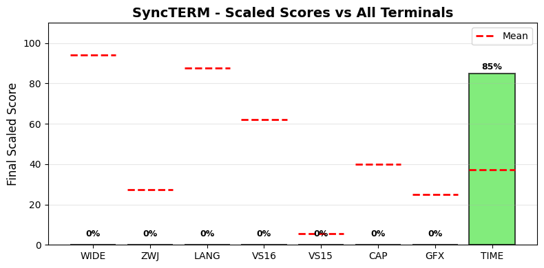

.. _syncterm:

SyncTERM
--------

Tested Software version 1.7 on Linux.
Full results available at ucs-detect_ repository path
`data/syncterm.yaml <https://github.com/jquast/ucs-detect/blob/master/data/syncterm.yaml>`_.

.. _synctermscores:

Score Breakdown
+++++++++++++++

Detailed breakdown of how scores are calculated for *SyncTERM*:

.. table::
   :class: sphinx-datatable

   ===  ======================================  ===========  ====================
     #  Score Type                              Raw Score    Final Scaled Score
   ===  ======================================  ===========  ====================
     1  :ref:`WIDE <synctermwide>`              0.00%        0.0%
     2  :ref:`ZWJ <synctermzwj>`                0.00%        0.0%
     3  :ref:`LANG <synctermlang>`              0.00%        0.0%
     4  :ref:`VS16 <synctermvs16>`              0.00%        0.0%
     5  :ref:`VS15 <synctermvs15>`              0.00%        0.0%
     6  :ref:`Capabilities <synctermdecmodes>`  0.00%        0.0%
     7  :ref:`Graphics <synctermgraphics>`      0%           0.0%
     8  :ref:`TIME <synctermtime>`              0.06s        84.9%
   ===  ======================================  ===========  ====================

**Score Comparison Plot:**

The following plot shows how this terminal's scores compare to all other terminals tested.

   Scaled scores comparison across all metrics (normalized 0-100%)

**Final Scaled Score Calculation:**

- Raw Final Score: 5.66%
  (weighted average: WIDE + ZWJ + LANG + VS16 + VS15 + CAP + GFX + 0.5*TIME)
  the categorized 'average' absolute support level of this terminal
  Note: TIME is normalized to 0-1 range before averaging.
  TIME is weighted at 0.5 (half as powerful as other metrics).
  CAP (Capabilities) is the fraction of 7 notable capabilities supported.
  GFX (Graphics) scores 100% for modern protocols (iTerm2, Kitty),
  50% for legacy only (Sixel, ReGIS), 0% for none.
  Sixel/ReGIS support contributes to the GFX score at 50%.

- Final Scaled Score: 0.0%
  (normalized across all terminals tested).
  *Final Scaled scores* are normalized (0-100%) relative to all terminals tested

**WIDE Score Details:**

No WIDE character support detected.

**ZWJ Score Details:**

No ZWJ support detected.

**VS16 Score Details:**

VS16 results not available.

**VS15 Score Details:**

VS15 results not available.

**Capabilities Score Details:**

Notable terminal capabilities (0 / 7):

- Bracketed Paste (2004): **no**
- Synced Output (2026): **no**
- Focus Events (1004): **no**
- Mouse SGR (1006): **no**
- Graphemes (2027): **no**
- Kitty Keyboard: **no**
- XTGETTCAP: **no**

Raw score: 0.00%

**Graphics Score Details:**

Graphics protocol support (0%):

- Sixel: **no**
- ReGIS: **no**
- iTerm2: **no**
- Kitty: **no**

Scoring: 100% for modern (iTerm2/Kitty), 50% for legacy only (Sixel/ReGIS), 0% for none

**TIME Score Details:**

Test execution time:

- Elapsed time: 0.06 seconds
- Note: This is a raw measurement; lower is better
- Scaled score uses inverse log10 scaling across all terminals
- Scaled result: 84.9%

**LANG Score Details (Geometric Mean):**

.. _synctermwide:

Wide character support
++++++++++++++++++++++

Wide character results for *SyncTERM* are not available.

.. _synctermzwj:

Emoji ZWJ support
+++++++++++++++++

Emoji ZWJ results for *SyncTERM* are not available.

.. _synctermvs16:

Variation Selector-16 support
+++++++++++++++++++++++++++++

Emoji VS-16 results for *SyncTERM* are not available.

.. _synctermvs15:

Variation Selector-15 support
+++++++++++++++++++++++++++++

Emoji VS-15 results for *SyncTERM* are not available.

.. _synctermgraphics:

Graphics Protocol Support
+++++++++++++++++++++++++

*SyncTERM* does not report support for any graphics protocols.

**Detection Methods:**

- **Sixel** and **ReGIS**: Detected via the Device Attributes (DA1) query
  ``CSI c`` (``\x1b[c``). Extension code ``4`` indicates Sixel_ support,
  ``3`` ReGIS_.
- **Kitty graphics**: Detected by sending a Kitty graphics query and
  checking for an ``OK`` response.
- **iTerm2 inline images**: Detected via the iTerm2 capabilities query
  ``OSC 1337 ; Capabilities``.

.. _Sixel: https://en.wikipedia.org/wiki/Sixel
.. _ReGIS: https://en.wikipedia.org/wiki/ReGIS
.. _`iTerm2 inline images`: https://iterm2.com/documentation-images.html
.. _`Kitty graphics protocol`: https://sw.kovidgoyal.net/kitty/graphics-protocol/

.. _synctermlang:

Language Support
++++++++++++++++

Language results for *SyncTERM* are not available.

.. _synctermdecmodes:

DEC Private Modes Support
+++++++++++++++++++++++++

This Terminal does not appear capable of reporting about any DEC Private modes.

.. _synctermkittykbd:

Kitty Keyboard Protocol
+++++++++++++++++++++++

*SyncTERM* does not support the `Kitty keyboard protocol`_.

.. _`Kitty keyboard protocol`: https://sw.kovidgoyal.net/kitty/keyboard-protocol/

.. _synctermxtgettcap:

XTGETTCAP (Terminfo Capabilities)
+++++++++++++++++++++++++++++++++

*SyncTERM* supports the ``XTGETTCAP`` sequence but returned no capabilities.

.. _synctermreproduce:

Reproduction
++++++++++++

To reproduce these results for *SyncTERM*, install and run ucs-detect_
with the following commands::

    pip install ucs-detect
    ucs-detect --rerun data/syncterm.yaml

.. _synctermtime:

Test Execution Time
+++++++++++++++++++

The test suite completed in **0.06 seconds** (0s).

This time measurement represents the total duration of the test execution,
including all Unicode wide character tests, emoji ZWJ sequences, variation
selectors, language support checks, and DEC mode detection.

.. _`printf(1)`: https://www.man7.org/linux/man-pages/man1/printf.1.html
.. _`wcwidth.wcswidth()`: https://wcwidth.readthedocs.io/en/latest/intro.html
.. _`ucs-detect`: https://github.com/jquast/ucs-detect
.. _`DEC Private Modes`: https://blessed.readthedocs.io/en/latest/dec_modes.html
