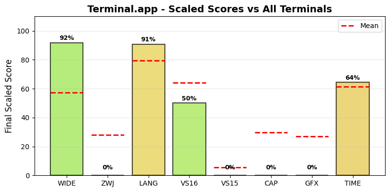

.. _terminalapp:

Terminal.app
------------

Tested Software version 2.15(465) on Darwin.
The homepage URL of this terminal is https://support.apple.com/guide/terminal/welcome/mac.
Full results available at ucs-detect_ repository path
`data/terminalapp.yaml <https://github.com/jquast/ucs-detect/blob/master/data/terminalapp.yaml>`_.

.. _terminalappscores:

Score Breakdown
+++++++++++++++

Detailed breakdown of how scores are calculated for *Terminal.app*:

.. table::
   :class: sphinx-datatable

   ===  =========================================  ===========  ====================
     #  Score Type                                 Raw Score    Final Scaled Score
   ===  =========================================  ===========  ====================
     1  :ref:`WIDE <terminalappwide>`              99.92%       91.7%
     2  :ref:`ZWJ <terminalappzwj>`                0.00%        0.0%
     3  :ref:`LANG <terminalapplang>`              97.21%       90.7%
     4  :ref:`VS16 <terminalappvs16>`              50.00%       50.0%
     5  :ref:`VS15 <terminalappvs15>`              0.00%        0.0%
     6  :ref:`Capabilities <terminalappdecmodes>`  0.00%        0.0%
     7  :ref:`Graphics <terminalappgraphics>`      0%           0.0%
     8  :ref:`TIME <terminalapptime>`              48.30s       64.3%
   ===  =========================================  ===========  ====================

**Score Comparison Plot:**

The following plot shows how this terminal's scores compare to all other terminals tested.

   Scaled scores comparison across all metrics (normalized 0-100%)

**Final Scaled Score Calculation:**

- Raw Final Score: 37.24%
  (weighted average: WIDE + ZWJ + LANG + VS16 + VS15 + CAP + GFX + 0.5*TIME)
  the categorized 'average' absolute support level of this terminal
  Note: TIME is normalized to 0-1 range before averaging.
  TIME is weighted at 0.5 (half as powerful as other metrics).
  CAP (Capabilities) is the fraction of 7 notable capabilities supported.
  GFX (Graphics) scores 100% for modern protocols (iTerm2, Kitty),
  50% for legacy only (Sixel, ReGIS), 0% for none.
  Sixel/ReGIS support contributes to the GFX score at 50%.

- Final Scaled Score: 4.4%
  (normalized across all terminals tested).
  *Final Scaled scores* are normalized (0-100%) relative to all terminals tested

**WIDE Score Details:**

Wide character support calculation:

- Total successful codepoints: 43559
- Total codepoints tested: 43592
- Formula: 43559 / 43592
- Result: 99.92%

**ZWJ Score Details:**

Emoji ZWJ (Zero-Width Joiner) support calculation:

- Total successful sequences: 0
- Total sequences tested: 1445
- Formula: 0 / 1445
- Result: 0.00%

**VS16 Score Details:**

Variation Selector-16 support calculation:

- Errors: 213 of 426 codepoints tested
- Success rate: 50.0%
- Formula: 50.0 / 100
- Result: 50.00%

**VS15 Score Details:**

Variation Selector-15 support calculation:

- Errors: 158 of 158 codepoints tested
- Success rate: 0.0%
- Formula: 0.0 / 100
- Result: 0.00%

**Capabilities Score Details:**

Notable terminal capabilities (0 / 12):

- Set bracketed paste mode (2004): **no**
- Synchronized Output (2026): **no**
- Send FocusIn/FocusOut events (1004): **no**
- Enable SGR Mouse Mode (1006): **no**
- Grapheme Clustering (2027): **no**
- Bracketed Paste MIME (5522): **no**
- Kitty Keyboard: **no**
- XTGETTCAP: **no**
- Text Sizing (OSC 66): **no**
- Kitty Clipboard Protocol: **no**
- Kitty Pointer Shapes (OSC 22): **no**
- Kitty Notifications (OSC 99): **no**

Raw score: 0.00%

**Graphics Score Details:**

Graphics protocol support (0%):

- Sixel: **no**
- ReGIS: **no**
- iTerm2: **no**
- Kitty: **no**

Scoring: 100% for modern (iTerm2/Kitty), 50% for legacy only (Sixel/ReGIS), 0% for none

**TIME Score Details:**

Test execution time:

- Elapsed time: 48.30 seconds
- Note: This is a raw measurement; lower is better
- Scaled score uses inverse log10 scaling across all terminals
- Scaled result: 64.3%

**LANG Score Details (Geometric Mean):**

Geometric mean calculation:

- Formula: (p₁ × p₂ × ... × pₙ)^(1/n) where n = 94 languages
- About `geometric mean <https://en.wikipedia.org/wiki/Geometric_mean>`_
- Result: 97.21%

.. _terminalappwide:

Wide character support
++++++++++++++++++++++

Wide character support of *Terminal.app* is **99.9%** (33 errors of 43592 codepoints tested).

Sequence of a WIDE character, from midpoint of alignment failure records:

.. table::
   :class: sphinx-datatable

   ===  =================================================  =============  ==========  =========  ==================================
     #  Codepoint                                          Python         Category      wcwidth  Name
   ===  =================================================  =============  ==========  =========  ==================================
     1  `U+0001F1F6 <https://codepoints.net/U+0001F1F6>`_  '\\U0001f1f6'  So                  2  REGIONAL INDICATOR SYMBOL LETTER Q
   ===  =================================================  =============  ==========  =========  ==================================

Total codepoints: 1

- Shell test using `printf(1)`_, ``'|'`` should align in output::

        $ printf "\xf0\x9f\x87\xb6|\\n12|\\n"
        🇶|
        12|

- python `wcwidth.wcswidth()`_ measures width 2,
  while *Terminal.app* measures width 1.

.. _terminalappzwj:

Emoji ZWJ support
+++++++++++++++++

Compatibility of *Terminal.app* with the Unicode Emoji ZWJ sequence table is **0.0%** (1445 errors of 1445 sequences tested).

Sequence of an Emoji ZWJ Sequence, from midpoint of alignment failure records:

.. table::
   :class: sphinx-datatable

   ===  =================================================  =============  ==========  =========  =================================
     #  Codepoint                                          Python         Category      wcwidth  Name
   ===  =================================================  =============  ==========  =========  =================================
     1  `U+0001F3C3 <https://codepoints.net/U+0001F3C3>`_  '\\U0001f3c3'  So                  2  RUNNER
     2  `U+0001F3FF <https://codepoints.net/U+0001F3FF>`_  '\\U0001f3ff'  Sk                  2  EMOJI MODIFIER FITZPATRICK TYPE-6
     3  `U+200D <https://codepoints.net/U+200D>`_          '\\u200d'      Cf                  0  ZERO WIDTH JOINER
     4  `U+2640 <https://codepoints.net/U+2640>`_          '\\u2640'      So                  1  FEMALE SIGN
     5  `U+FE0F <https://codepoints.net/U+FE0F>`_          '\\ufe0f'      Mn                  0  VARIATION SELECTOR-16
   ===  =================================================  =============  ==========  =========  =================================

Total codepoints: 5

- Shell test using `printf(1)`_, ``'|'`` should align in output::

        $ printf "\xf0\x9f\x8f\x83\xf0\x9f\x8f\xbf\xe2\x80\x8d\xe2\x99\x80\xef\xb8\x8f|\\n12|\\n"
        🏃🏿‍♀️|
        12|

- python `wcwidth.wcswidth()`_ measures width 2,
  while *Terminal.app* measures width 6.

.. _terminalappvs16:

Variation Selector-16 support
+++++++++++++++++++++++++++++

Emoji VS-16 results for *Terminal.app* is 213 errors
out of 426 total codepoints tested, 50.0% success.
Sequence of a NARROW Emoji made WIDE by *Variation Selector-16*, from midpoint of alignment failure records:

.. table::
   :class: sphinx-datatable

   ===  =========================================  =========  ==========  =========  =====================
     #  Codepoint                                  Python     Category      wcwidth  Name
   ===  =========================================  =========  ==========  =========  =====================
     1  `U+2733 <https://codepoints.net/U+2733>`_  '\\u2733'  So                  1  EIGHT SPOKED ASTERISK
     2  `U+FE0F <https://codepoints.net/U+FE0F>`_  '\\ufe0f'  Mn                  0  VARIATION SELECTOR-16
   ===  =========================================  =========  ==========  =========  =====================

Total codepoints: 2

- Shell test using `printf(1)`_, ``'|'`` should align in output::

        $ printf "\xe2\x9c\xb3\xef\xb8\x8f|\\n12|\\n"
        ✳️|
        12|

- python `wcwidth.wcswidth()`_ measures width 2,
  while *Terminal.app* measures width 1.

.. _terminalappvs15:

Variation Selector-15 support
+++++++++++++++++++++++++++++

Emoji VS-15 results for *Terminal.app* is 158 errors
out of 158 total codepoints tested, 0.0% success.
Sequence of a WIDE Emoji made NARROW by *Variation Selector-15*, from midpoint of alignment failure records:

.. table::
   :class: sphinx-datatable

   ===  =================================================  =============  ==========  =========  =====================
     #  Codepoint                                          Python         Category      wcwidth  Name
   ===  =================================================  =============  ==========  =========  =====================
     1  `U+0001F3AE <https://codepoints.net/U+0001F3AE>`_  '\\U0001f3ae'  So                  2  VIDEO GAME
     2  `U+FE0E <https://codepoints.net/U+FE0E>`_          '\\ufe0e'      Mn                  0  VARIATION SELECTOR-15
   ===  =================================================  =============  ==========  =========  =====================

Total codepoints: 2

- Shell test using `printf(1)`_, ``'|'`` should align in output::

        $ printf "\xf0\x9f\x8e\xae\xef\xb8\x8e|\\n1|\\n"
        🎮︎|
        1|

- python `wcwidth.wcswidth()`_ measures width 1,
  while *Terminal.app* measures width 2.

.. _terminalappgraphics:

Graphics Protocol Support
+++++++++++++++++++++++++

*Terminal.app* supports the following graphics protocols: `iTerm2 inline images`_.

**Detection Methods:**

- **Sixel** and **ReGIS**: Detected via the Device Attributes (DA1) query
  ``CSI c`` (``\x1b[c``). Extension code ``4`` indicates Sixel_ support,
  ``3`` ReGIS_.
- **Kitty graphics**: Detected by sending a Kitty graphics query and
  checking for an ``OK`` response.
- **iTerm2 inline images**: Detected via the iTerm2 capabilities query
  ``OSC 1337 ; Capabilities``.

**Device Attributes Response:**

- Extensions reported: 2
- Sixel_ indicator (``4``): not present
- ReGIS_ indicator (``3``): not present

.. _Sixel: https://en.wikipedia.org/wiki/Sixel
.. _ReGIS: https://en.wikipedia.org/wiki/ReGIS
.. _`iTerm2 inline images`: https://iterm2.com/documentation-images.html
.. _`Kitty graphics protocol`: https://sw.kovidgoyal.net/kitty/graphics-protocol/

.. _terminalapplang:

Language Support
++++++++++++++++

The following 71 languages were tested with 100% success:

Aja, Amarakaeri, Arabic, Standard, Assyrian Neo-Aramaic, Baatonum, Bamun, Belanda Viri, Bora, Catalan (2), Chakma, Chickasaw, Chinantec, Chiltepec, Dagaare, Southern, Dangme, Dendi, Dinka, Northeastern, Ditammari, Dzongkha, Evenki, Fon, French (Welche), Fur, Ga, Gen, Gilyak, Gumuz, Kabyle, Lamnso', Lao, Lingala (tones), Maldivian, Maori (2), Mazahua Central, Mirandese, Mixtec, Metlatónoc, Mòoré, Nanai, Navajo, Orok, Otomi, Mezquital, Panjabi, Eastern, Pashto, Northern, Picard, Pular (Adlam), Saint Lucian Creole French, Secoya, Seraiki, Shan, Shipibo-Conibo, Siona, South Azerbaijani, Tagalog (Tagalog), Tai Dam, Tamazight, Central Atlas, Tamil, Tamil (Sri Lanka), Tem, Thai, Thai (2), Tibetan, Central, Ticuna, Uduk, Urdu, Urdu (2), Veps, Vietnamese, Waama, Yaneshaʼ, Yiddish, Eastern, Yoruba, Éwé.

The following 23 languages are not fully supported:

.. table::
   :class: sphinx-datatable

   ============================================================  ==========  =========  =============
   lang                                                            n_errors    n_total  pct_success
   ============================================================  ==========  =========  =============
   :ref:`Malayalam <terminalapplangmalayalam>`                          271        845  67.9%
   :ref:`Bengali <terminalapplangbengali>`                              117        385  69.6%
   :ref:`Sanskrit <terminalapplangsanskrit>`                            145        493  70.6%
   :ref:`Marathi <terminalapplangmarathi>`                               88        391  77.5%
   :ref:`Hindi <terminalapplanghindi>`                                   82        390  79.0%
   :ref:`Maithili <terminalapplangmaithili>`                             71        357  80.1%
   :ref:`Nepali <terminalapplangnepali>`                                 70        352  80.1%
   :ref:`Tamang, Eastern <terminalapplangtamangeastern>`                 11         70  84.3%
   :ref:`Gujarati <terminalapplanggujarati>`                             50        343  85.4%
   :ref:`Magahi <terminalapplangmagahi>`                                 43        314  86.3%
   :ref:`Sanskrit (Grantha) <terminalapplangsanskritgrantha>`            39        293  86.7%
   :ref:`Bhojpuri <terminalapplangbhojpuri>`                             41        313  86.9%
   :ref:`Telugu <terminalapplangtelugu>`                                 42        384  89.1%
   :ref:`Farsi, Western <terminalapplangfarsiwestern>`                    4         49  91.8%
   :ref:`Javanese (Javanese) <terminalapplangjavanesejavanese>`          43        530  91.9%
   :ref:`Dari <terminalapplangdari>`                                      4         54  92.6%
   :ref:`Kannada <terminalapplangkannada>`                               15        287  94.8%
   :ref:`Sinhala <terminalapplangsinhala>`                               11        258  95.7%
   :ref:`Burmese <terminalapplangburmese>`                               10        268  96.3%
   :ref:`Khmer, Central <terminalapplangkhmercentral>`                    8        443  98.2%
   :ref:`Panjabi, Western <terminalapplangpanjabiwestern>`                1         62  98.4%
   :ref:`Mon <terminalapplangmon>`                                        3        332  99.1%
   :ref:`Khün <terminalapplangkhn>`                                       1        396  99.7%
   ============================================================  ==========  =========  =============

.. _terminalapplangmalayalam:

Malayalam
^^^^^^^^^

Sequence of language *Malayalam* from midpoint of alignment failure records:

.. table::
   :class: sphinx-datatable

   ===  =========================================  =========  ==========  =========  =======================
     #  Codepoint                                  Python     Category      wcwidth  Name
   ===  =========================================  =========  ==========  =========  =======================
     1  `U+0D15 <https://codepoints.net/U+0D15>`_  '\\u0d15'  Lo                  1  MALAYALAM LETTER KA
     2  `U+0D4D <https://codepoints.net/U+0D4D>`_  '\\u0d4d'  Mn                  0  MALAYALAM SIGN VIRAMA
     3  `U+0D15 <https://codepoints.net/U+0D15>`_  '\\u0d15'  Lo                  1  MALAYALAM LETTER KA
     4  `U+0D3E <https://codepoints.net/U+0D3E>`_  '\\u0d3e'  Mc                  0  MALAYALAM VOWEL SIGN AA
   ===  =========================================  =========  ==========  =========  =======================

Total codepoints: 4

- Shell test using `printf(1)`_, ``'|'`` should align in output::

        $ printf "\xe0\xb4\x95\xe0\xb5\x8d\xe0\xb4\x95\xe0\xb4\xbe|\\n12|\\n"
        ക്കാ|
        12|

- python `wcwidth.wcswidth()`_ measures width 2,
  while *Terminal.app* measures width 3.

.. _terminalapplangbengali:

Bengali
^^^^^^^

Sequence of language *Bengali* from midpoint of alignment failure records:

.. table::
   :class: sphinx-datatable

   ===  =========================================  =========  ==========  =========  =====================
     #  Codepoint                                  Python     Category      wcwidth  Name
   ===  =========================================  =========  ==========  =========  =====================
     1  `U+0995 <https://codepoints.net/U+0995>`_  '\\u0995'  Lo                  1  BENGALI LETTER KA
     2  `U+09BE <https://codepoints.net/U+09BE>`_  '\\u09be'  Mc                  0  BENGALI VOWEL SIGN AA
     3  `U+200C <https://codepoints.net/U+200C>`_  '\\u200c'  Cf                  0  ZERO WIDTH NON-JOINER
   ===  =========================================  =========  ==========  =========  =====================

Total codepoints: 3

- Shell test using `printf(1)`_, ``'|'`` should align in output::

        $ printf "\xe0\xa6\x95\xe0\xa6\xbe\xe2\x80\x8c|\\n12|\\n"
        কা‌|
        12|

- python `wcwidth.wcswidth()`_ measures width 2,
  while *Terminal.app* measures width 3.

.. _terminalapplangsanskrit:

Sanskrit
^^^^^^^^

Sequence of language *Sanskrit* from midpoint of alignment failure records:

.. table::
   :class: sphinx-datatable

   ===  =========================================  =========  ==========  =========  =======================
     #  Codepoint                                  Python     Category      wcwidth  Name
   ===  =========================================  =========  ==========  =========  =======================
     1  `U+0915 <https://codepoints.net/U+0915>`_  '\\u0915'  Lo                  1  DEVANAGARI LETTER KA
     2  `U+094D <https://codepoints.net/U+094D>`_  '\\u094d'  Mn                  0  DEVANAGARI SIGN VIRAMA
     3  `U+0924 <https://codepoints.net/U+0924>`_  '\\u0924'  Lo                  1  DEVANAGARI LETTER TA
     4  `U+093F <https://codepoints.net/U+093F>`_  '\\u093f'  Mc                  0  DEVANAGARI VOWEL SIGN I
   ===  =========================================  =========  ==========  =========  =======================

Total codepoints: 4

- Shell test using `printf(1)`_, ``'|'`` should align in output::

        $ printf "\xe0\xa4\x95\xe0\xa5\x8d\xe0\xa4\xa4\xe0\xa4\xbf|\\n12|\\n"
        क्ति|
        12|

.. _terminalapplangmarathi:

Marathi
^^^^^^^

Sequence of language *Marathi* from midpoint of alignment failure records:

.. table::
   :class: sphinx-datatable

   ===  =========================================  =========  ==========  =========  =======================
     #  Codepoint                                  Python     Category      wcwidth  Name
   ===  =========================================  =========  ==========  =========  =======================
     1  `U+0915 <https://codepoints.net/U+0915>`_  '\\u0915'  Lo                  1  DEVANAGARI LETTER KA
     2  `U+094D <https://codepoints.net/U+094D>`_  '\\u094d'  Mn                  0  DEVANAGARI SIGN VIRAMA
     3  `U+0924 <https://codepoints.net/U+0924>`_  '\\u0924'  Lo                  1  DEVANAGARI LETTER TA
     4  `U+093F <https://codepoints.net/U+093F>`_  '\\u093f'  Mc                  0  DEVANAGARI VOWEL SIGN I
   ===  =========================================  =========  ==========  =========  =======================

Total codepoints: 4

- Shell test using `printf(1)`_, ``'|'`` should align in output::

        $ printf "\xe0\xa4\x95\xe0\xa5\x8d\xe0\xa4\xa4\xe0\xa4\xbf|\\n12|\\n"
        क्ति|
        12|

.. _terminalapplanghindi:

Hindi
^^^^^

Sequence of language *Hindi* from midpoint of alignment failure records:

.. table::
   :class: sphinx-datatable

   ===  =========================================  =========  ==========  =========  =======================
     #  Codepoint                                  Python     Category      wcwidth  Name
   ===  =========================================  =========  ==========  =========  =======================
     1  `U+0915 <https://codepoints.net/U+0915>`_  '\\u0915'  Lo                  1  DEVANAGARI LETTER KA
     2  `U+094D <https://codepoints.net/U+094D>`_  '\\u094d'  Mn                  0  DEVANAGARI SIGN VIRAMA
     3  `U+0924 <https://codepoints.net/U+0924>`_  '\\u0924'  Lo                  1  DEVANAGARI LETTER TA
     4  `U+093F <https://codepoints.net/U+093F>`_  '\\u093f'  Mc                  0  DEVANAGARI VOWEL SIGN I
   ===  =========================================  =========  ==========  =========  =======================

Total codepoints: 4

- Shell test using `printf(1)`_, ``'|'`` should align in output::

        $ printf "\xe0\xa4\x95\xe0\xa5\x8d\xe0\xa4\xa4\xe0\xa4\xbf|\\n12|\\n"
        क्ति|
        12|

.. _terminalapplangmaithili:

Maithili
^^^^^^^^

Sequence of language *Maithili* from midpoint of alignment failure records:

.. table::
   :class: sphinx-datatable

   ===  =========================================  =========  ==========  =========  =======================
     #  Codepoint                                  Python     Category      wcwidth  Name
   ===  =========================================  =========  ==========  =========  =======================
     1  `U+0915 <https://codepoints.net/U+0915>`_  '\\u0915'  Lo                  1  DEVANAGARI LETTER KA
     2  `U+094D <https://codepoints.net/U+094D>`_  '\\u094d'  Mn                  0  DEVANAGARI SIGN VIRAMA
     3  `U+0924 <https://codepoints.net/U+0924>`_  '\\u0924'  Lo                  1  DEVANAGARI LETTER TA
     4  `U+093F <https://codepoints.net/U+093F>`_  '\\u093f'  Mc                  0  DEVANAGARI VOWEL SIGN I
   ===  =========================================  =========  ==========  =========  =======================

Total codepoints: 4

- Shell test using `printf(1)`_, ``'|'`` should align in output::

        $ printf "\xe0\xa4\x95\xe0\xa5\x8d\xe0\xa4\xa4\xe0\xa4\xbf|\\n12|\\n"
        क्ति|
        12|

.. _terminalapplangnepali:

Nepali
^^^^^^

Sequence of language *Nepali* from midpoint of alignment failure records:

.. table::
   :class: sphinx-datatable

   ===  =========================================  =========  ==========  =========  =======================
     #  Codepoint                                  Python     Category      wcwidth  Name
   ===  =========================================  =========  ==========  =========  =======================
     1  `U+0915 <https://codepoints.net/U+0915>`_  '\\u0915'  Lo                  1  DEVANAGARI LETTER KA
     2  `U+094D <https://codepoints.net/U+094D>`_  '\\u094d'  Mn                  0  DEVANAGARI SIGN VIRAMA
     3  `U+0924 <https://codepoints.net/U+0924>`_  '\\u0924'  Lo                  1  DEVANAGARI LETTER TA
     4  `U+093F <https://codepoints.net/U+093F>`_  '\\u093f'  Mc                  0  DEVANAGARI VOWEL SIGN I
   ===  =========================================  =========  ==========  =========  =======================

Total codepoints: 4

- Shell test using `printf(1)`_, ``'|'`` should align in output::

        $ printf "\xe0\xa4\x95\xe0\xa5\x8d\xe0\xa4\xa4\xe0\xa4\xbf|\\n12|\\n"
        क्ति|
        12|

.. _terminalapplangtamangeastern:

Tamang, Eastern
^^^^^^^^^^^^^^^

Sequence of language *Tamang, Eastern* from midpoint of alignment failure records:

.. table::
   :class: sphinx-datatable

   ===  =========================================  =========  ==========  =========  =======================
     #  Codepoint                                  Python     Category      wcwidth  Name
   ===  =========================================  =========  ==========  =========  =======================
     1  `U+0915 <https://codepoints.net/U+0915>`_  '\\u0915'  Lo                  1  DEVANAGARI LETTER KA
     2  `U+094D <https://codepoints.net/U+094D>`_  '\\u094d'  Mn                  0  DEVANAGARI SIGN VIRAMA
     3  `U+0924 <https://codepoints.net/U+0924>`_  '\\u0924'  Lo                  1  DEVANAGARI LETTER TA
     4  `U+093F <https://codepoints.net/U+093F>`_  '\\u093f'  Mc                  0  DEVANAGARI VOWEL SIGN I
   ===  =========================================  =========  ==========  =========  =======================

Total codepoints: 4

- Shell test using `printf(1)`_, ``'|'`` should align in output::

        $ printf "\xe0\xa4\x95\xe0\xa5\x8d\xe0\xa4\xa4\xe0\xa4\xbf|\\n12|\\n"
        क्ति|
        12|

.. _terminalapplanggujarati:

Gujarati
^^^^^^^^

Sequence of language *Gujarati* from midpoint of alignment failure records:

.. table::
   :class: sphinx-datatable

   ===  =========================================  =========  ==========  =========  ======================
     #  Codepoint                                  Python     Category      wcwidth  Name
   ===  =========================================  =========  ==========  =========  ======================
     1  `U+0A95 <https://codepoints.net/U+0A95>`_  '\\u0a95'  Lo                  1  GUJARATI LETTER KA
     2  `U+0ACD <https://codepoints.net/U+0ACD>`_  '\\u0acd'  Mn                  0  GUJARATI SIGN VIRAMA
     3  `U+0A95 <https://codepoints.net/U+0A95>`_  '\\u0a95'  Lo                  1  GUJARATI LETTER KA
     4  `U+0ABE <https://codepoints.net/U+0ABE>`_  '\\u0abe'  Mc                  0  GUJARATI VOWEL SIGN AA
   ===  =========================================  =========  ==========  =========  ======================

Total codepoints: 4

- Shell test using `printf(1)`_, ``'|'`` should align in output::

        $ printf "\xe0\xaa\x95\xe0\xab\x8d\xe0\xaa\x95\xe0\xaa\xbe|\\n12|\\n"
        ક્કા|
        12|

- python `wcwidth.wcswidth()`_ measures width 2,
  while *Terminal.app* measures width 3.

.. _terminalapplangmagahi:

Magahi
^^^^^^

Sequence of language *Magahi* from midpoint of alignment failure records:

.. table::
   :class: sphinx-datatable

   ===  =========================================  =========  ==========  =========  =======================
     #  Codepoint                                  Python     Category      wcwidth  Name
   ===  =========================================  =========  ==========  =========  =======================
     1  `U+0915 <https://codepoints.net/U+0915>`_  '\\u0915'  Lo                  1  DEVANAGARI LETTER KA
     2  `U+094D <https://codepoints.net/U+094D>`_  '\\u094d'  Mn                  0  DEVANAGARI SIGN VIRAMA
     3  `U+0924 <https://codepoints.net/U+0924>`_  '\\u0924'  Lo                  1  DEVANAGARI LETTER TA
     4  `U+093F <https://codepoints.net/U+093F>`_  '\\u093f'  Mc                  0  DEVANAGARI VOWEL SIGN I
   ===  =========================================  =========  ==========  =========  =======================

Total codepoints: 4

- Shell test using `printf(1)`_, ``'|'`` should align in output::

        $ printf "\xe0\xa4\x95\xe0\xa5\x8d\xe0\xa4\xa4\xe0\xa4\xbf|\\n12|\\n"
        क्ति|
        12|

.. _terminalapplangsanskritgrantha:

Sanskrit (Grantha)
^^^^^^^^^^^^^^^^^^

Sequence of language *Sanskrit (Grantha)* from midpoint of alignment failure records:

.. table::
   :class: sphinx-datatable

   ===  =================================================  =============  ==========  =========  =====================
     #  Codepoint                                          Python         Category      wcwidth  Name
   ===  =================================================  =============  ==========  =========  =====================
     1  `U+00011315 <https://codepoints.net/U+00011315>`_  '\\U00011315'  Lo                  1  GRANTHA LETTER KA
     2  `U+0001133E <https://codepoints.net/U+0001133E>`_  '\\U0001133e'  Mc                  0  GRANTHA VOWEL SIGN AA
     3  `U+00011302 <https://codepoints.net/U+00011302>`_  '\\U00011302'  Mc                  0  GRANTHA SIGN ANUSVARA
   ===  =================================================  =============  ==========  =========  =====================

Total codepoints: 3

- Shell test using `printf(1)`_, ``'|'`` should align in output::

        $ printf "\xf0\x91\x8c\x95\xf0\x91\x8c\xbe\xf0\x91\x8c\x82|\\n12|\\n"
        𑌕𑌾𑌂|
        12|

- python `wcwidth.wcswidth()`_ measures width 2,
  while *Terminal.app* measures width 3.

.. _terminalapplangbhojpuri:

Bhojpuri
^^^^^^^^

Sequence of language *Bhojpuri* from midpoint of alignment failure records:

.. table::
   :class: sphinx-datatable

   ===  =========================================  =========  ==========  =========  =======================
     #  Codepoint                                  Python     Category      wcwidth  Name
   ===  =========================================  =========  ==========  =========  =======================
     1  `U+0915 <https://codepoints.net/U+0915>`_  '\\u0915'  Lo                  1  DEVANAGARI LETTER KA
     2  `U+094D <https://codepoints.net/U+094D>`_  '\\u094d'  Mn                  0  DEVANAGARI SIGN VIRAMA
     3  `U+0918 <https://codepoints.net/U+0918>`_  '\\u0918'  Lo                  1  DEVANAGARI LETTER GHA
     4  `U+094D <https://codepoints.net/U+094D>`_  '\\u094d'  Mn                  0  DEVANAGARI SIGN VIRAMA
     5  `U+0918 <https://codepoints.net/U+0918>`_  '\\u0918'  Lo                  1  DEVANAGARI LETTER GHA
     6  `U+093F <https://codepoints.net/U+093F>`_  '\\u093f'  Mc                  0  DEVANAGARI VOWEL SIGN I
     7  `U+094D <https://codepoints.net/U+094D>`_  '\\u094d'  Mn                  0  DEVANAGARI SIGN VIRAMA
   ===  =========================================  =========  ==========  =========  =======================

Total codepoints: 7

- Shell test using `printf(1)`_, ``'|'`` should align in output::

        $ printf "\xe0\xa4\x95\xe0\xa5\x8d\xe0\xa4\x98\xe0\xa5\x8d\xe0\xa4\x98\xe0\xa4\xbf\xe0\xa5\x8d|\\n12|\\n"
        क्घ्घि्|
        12|

- python `wcwidth.wcswidth()`_ measures width 2,
  while *Terminal.app* measures width 4.

.. _terminalapplangtelugu:

Telugu
^^^^^^

Sequence of language *Telugu* from midpoint of alignment failure records:

.. table::
   :class: sphinx-datatable

   ===  =========================================  =========  ==========  =========  ====================
     #  Codepoint                                  Python     Category      wcwidth  Name
   ===  =========================================  =========  ==========  =========  ====================
     1  `U+0C15 <https://codepoints.net/U+0C15>`_  '\\u0c15'  Lo                  1  TELUGU LETTER KA
     2  `U+0C41 <https://codepoints.net/U+0C41>`_  '\\u0c41'  Mc                  0  TELUGU VOWEL SIGN U
     3  `U+0C02 <https://codepoints.net/U+0C02>`_  '\\u0c02'  Mc                  0  TELUGU SIGN ANUSVARA
   ===  =========================================  =========  ==========  =========  ====================

Total codepoints: 3

- Shell test using `printf(1)`_, ``'|'`` should align in output::

        $ printf "\xe0\xb0\x95\xe0\xb1\x81\xe0\xb0\x82|\\n12|\\n"
        కుం|
        12|

- python `wcwidth.wcswidth()`_ measures width 2,
  while *Terminal.app* measures width 3.

.. _terminalapplangfarsiwestern:

Farsi, Western
^^^^^^^^^^^^^^

Sequence of language *Farsi, Western* from midpoint of alignment failure records:

.. table::
   :class: sphinx-datatable

   ===  =========================================  =========  ==========  =========  =====================
     #  Codepoint                                  Python     Category      wcwidth  Name
   ===  =========================================  =========  ==========  =========  =====================
     1  `U+062A <https://codepoints.net/U+062A>`_  '\\u062a'  Lo                  1  ARABIC LETTER TEH
     2  `U+200C <https://codepoints.net/U+200C>`_  '\\u200c'  Cf                  0  ZERO WIDTH NON-JOINER
   ===  =========================================  =========  ==========  =========  =====================

Total codepoints: 2

- Shell test using `printf(1)`_, ``'|'`` should align in output::

        $ printf "\xd8\xaa\xe2\x80\x8c|\\n1|\\n"
        ت‌|
        1|

.. _terminalapplangjavanesejavanese:

Javanese (Javanese)
^^^^^^^^^^^^^^^^^^^

Sequence of language *Javanese (Javanese)* from midpoint of alignment failure records:

.. table::
   :class: sphinx-datatable

   ===  =========================================  =========  ==========  =========  ==========================
     #  Codepoint                                  Python     Category      wcwidth  Name
   ===  =========================================  =========  ==========  =========  ==========================
     1  `U+A98F <https://codepoints.net/U+A98F>`_  '\\ua98f'  Lo                  1  JAVANESE LETTER KA
     2  `U+A9C0 <https://codepoints.net/U+A9C0>`_  '\\ua9c0'  Mc                  0  JAVANESE PANGKON
     3  `U+A9B2 <https://codepoints.net/U+A9B2>`_  '\\ua9b2'  Lo                  1  JAVANESE LETTER HA
     4  `U+A9BA <https://codepoints.net/U+A9BA>`_  '\\ua9ba'  Mc                  0  JAVANESE VOWEL SIGN TALING
     5  `U+A9B4 <https://codepoints.net/U+A9B4>`_  '\\ua9b4'  Mc                  0  JAVANESE VOWEL SIGN TARUNG
   ===  =========================================  =========  ==========  =========  ==========================

Total codepoints: 5

- Shell test using `printf(1)`_, ``'|'`` should align in output::

        $ printf "\xea\xa6\x8f\xea\xa7\x80\xea\xa6\xb2\xea\xa6\xba\xea\xa6\xb4|\\n1234|\\n"
        ꦏ꧀ꦲꦺꦴ|
        1234|

- python `wcwidth.wcswidth()`_ measures width 4,
  while *Terminal.app* measures width 5.

.. _terminalapplangdari:

Dari
^^^^

Sequence of language *Dari* from midpoint of alignment failure records:

.. table::
   :class: sphinx-datatable

   ===  =========================================  =========  ==========  =========  =====================
     #  Codepoint                                  Python     Category      wcwidth  Name
   ===  =========================================  =========  ==========  =========  =====================
     1  `U+062A <https://codepoints.net/U+062A>`_  '\\u062a'  Lo                  1  ARABIC LETTER TEH
     2  `U+200C <https://codepoints.net/U+200C>`_  '\\u200c'  Cf                  0  ZERO WIDTH NON-JOINER
   ===  =========================================  =========  ==========  =========  =====================

Total codepoints: 2

- Shell test using `printf(1)`_, ``'|'`` should align in output::

        $ printf "\xd8\xaa\xe2\x80\x8c|\\n1|\\n"
        ت‌|
        1|

- python `wcwidth.wcswidth()`_ measures width 1,
  while *Terminal.app* measures width 2.

.. _terminalapplangkannada:

Kannada
^^^^^^^

Sequence of language *Kannada* from midpoint of alignment failure records:

.. table::
   :class: sphinx-datatable

   ===  =========================================  =========  ==========  =========  =====================
     #  Codepoint                                  Python     Category      wcwidth  Name
   ===  =========================================  =========  ==========  =========  =====================
     1  `U+0C95 <https://codepoints.net/U+0C95>`_  '\\u0c95'  Lo                  1  KANNADA LETTER KA
     2  `U+0CBE <https://codepoints.net/U+0CBE>`_  '\\u0cbe'  Mc                  0  KANNADA VOWEL SIGN AA
     3  `U+0C82 <https://codepoints.net/U+0C82>`_  '\\u0c82'  Mc                  0  KANNADA SIGN ANUSVARA
   ===  =========================================  =========  ==========  =========  =====================

Total codepoints: 3

- Shell test using `printf(1)`_, ``'|'`` should align in output::

        $ printf "\xe0\xb2\x95\xe0\xb2\xbe\xe0\xb2\x82|\\n12|\\n"
        ಕಾಂ|
        12|

- python `wcwidth.wcswidth()`_ measures width 2,
  while *Terminal.app* measures width 3.

.. _terminalapplangsinhala:

Sinhala
^^^^^^^

Sequence of language *Sinhala* from midpoint of alignment failure records:

.. table::
   :class: sphinx-datatable

   ===  =========================================  =========  ==========  =========  =================================
     #  Codepoint                                  Python     Category      wcwidth  Name
   ===  =========================================  =========  ==========  =========  =================================
     1  `U+0D9A <https://codepoints.net/U+0D9A>`_  '\\u0d9a'  Lo                  1  SINHALA LETTER ALPAPRAANA KAYANNA
     2  `U+0DCA <https://codepoints.net/U+0DCA>`_  '\\u0dca'  Mn                  0  SINHALA SIGN AL-LAKUNA
     3  `U+200D <https://codepoints.net/U+200D>`_  '\\u200d'  Cf                  0  ZERO WIDTH JOINER
   ===  =========================================  =========  ==========  =========  =================================

Total codepoints: 3

- Shell test using `printf(1)`_, ``'|'`` should align in output::

        $ printf "\xe0\xb6\x9a\xe0\xb7\x8a\xe2\x80\x8d|\\n1|\\n"
        ක්‍|
        1|

- python `wcwidth.wcswidth()`_ measures width 1,
  while *Terminal.app* measures width 2.

.. _terminalapplangburmese:

Burmese
^^^^^^^

Sequence of language *Burmese* from midpoint of alignment failure records:

.. table::
   :class: sphinx-datatable

   ===  =========================================  =========  ==========  =========  ================================
     #  Codepoint                                  Python     Category      wcwidth  Name
   ===  =========================================  =========  ==========  =========  ================================
     1  `U+1000 <https://codepoints.net/U+1000>`_  '\\u1000'  Lo                  1  MYANMAR LETTER KA
     2  `U+103B <https://codepoints.net/U+103B>`_  '\\u103b'  Mc                  0  MYANMAR CONSONANT SIGN MEDIAL YA
     3  `U+1031 <https://codepoints.net/U+1031>`_  '\\u1031'  Mc                  0  MYANMAR VOWEL SIGN E
   ===  =========================================  =========  ==========  =========  ================================

Total codepoints: 3

- Shell test using `printf(1)`_, ``'|'`` should align in output::

        $ printf "\xe1\x80\x80\xe1\x80\xbb\xe1\x80\xb1|\\n12|\\n"
        ကျေ|
        12|

- python `wcwidth.wcswidth()`_ measures width 2,
  while *Terminal.app* measures width 3.

.. _terminalapplangkhmercentral:

Khmer, Central
^^^^^^^^^^^^^^

Sequence of language *Khmer, Central* from midpoint of alignment failure records:

.. table::
   :class: sphinx-datatable

   ===  =========================================  =========  ==========  =========  ===================
     #  Codepoint                                  Python     Category      wcwidth  Name
   ===  =========================================  =========  ==========  =========  ===================
     1  `U+1788 <https://codepoints.net/U+1788>`_  '\\u1788'  Lo                  1  KHMER LETTER CHO
     2  `U+17D2 <https://codepoints.net/U+17D2>`_  '\\u17d2'  Mn                  0  KHMER SIGN COENG
     3  `U+1798 <https://codepoints.net/U+1798>`_  '\\u1798'  Lo                  1  KHMER LETTER MO
     4  `U+17C4 <https://codepoints.net/U+17C4>`_  '\\u17c4'  Mc                  0  KHMER VOWEL SIGN OO
     5  `U+17C7 <https://codepoints.net/U+17C7>`_  '\\u17c7'  Mc                  0  KHMER SIGN REAHMUK
   ===  =========================================  =========  ==========  =========  ===================

Total codepoints: 5

- Shell test using `printf(1)`_, ``'|'`` should align in output::

        $ printf "\xe1\x9e\x88\xe1\x9f\x92\xe1\x9e\x98\xe1\x9f\x84\xe1\x9f\x87|\\n123|\\n"
        ឈ្មោះ|
        123|

- python `wcwidth.wcswidth()`_ measures width 3,
  while *Terminal.app* measures width 4.

.. _terminalapplangpanjabiwestern:

Panjabi, Western
^^^^^^^^^^^^^^^^

Sequence of language *Panjabi, Western* from midpoint of alignment failure records:

.. table::
   :class: sphinx-datatable

   ===  =========================================  =========  ==========  =========  ========================
     #  Codepoint                                  Python     Category      wcwidth  Name
   ===  =========================================  =========  ==========  =========  ========================
     1  `U+06D2 <https://codepoints.net/U+06D2>`_  '\\u06d2'  Lo                  1  ARABIC LETTER YEH BARREE
     2  `U+200C <https://codepoints.net/U+200C>`_  '\\u200c'  Cf                  0  ZERO WIDTH NON-JOINER
   ===  =========================================  =========  ==========  =========  ========================

Total codepoints: 2

- Shell test using `printf(1)`_, ``'|'`` should align in output::

        $ printf "\xdb\x92\xe2\x80\x8c|\\n1|\\n"
        ے‌|
        1|

- python `wcwidth.wcswidth()`_ measures width 1,
  while *Terminal.app* measures width 2.

.. _terminalapplangmon:

Mon
^^^

Sequence of language *Mon* from midpoint of alignment failure records:

.. table::
   :class: sphinx-datatable

   ===  =========================================  =========  ==========  =========  ================================
     #  Codepoint                                  Python     Category      wcwidth  Name
   ===  =========================================  =========  ==========  =========  ================================
     1  `U+1007 <https://codepoints.net/U+1007>`_  '\\u1007'  Lo                  1  MYANMAR LETTER JA
     2  `U+103C <https://codepoints.net/U+103C>`_  '\\u103c'  Mc                  0  MYANMAR CONSONANT SIGN MEDIAL RA
     3  `U+1031 <https://codepoints.net/U+1031>`_  '\\u1031'  Mc                  0  MYANMAR VOWEL SIGN E
   ===  =========================================  =========  ==========  =========  ================================

Total codepoints: 3

- Shell test using `printf(1)`_, ``'|'`` should align in output::

        $ printf "\xe1\x80\x87\xe1\x80\xbc\xe1\x80\xb1|\\n12|\\n"
        ဇြေ|
        12|

- python `wcwidth.wcswidth()`_ measures width 2,
  while *Terminal.app* measures width 3.

.. _terminalapplangkhn:

Khün
^^^^

Sequence of language *Khün* from midpoint of alignment failure records:

.. table::
   :class: sphinx-datatable

   ===  =========================================  =========  ==========  =========  =================================
     #  Codepoint                                  Python     Category      wcwidth  Name
   ===  =========================================  =========  ==========  =========  =================================
     1  `U+1A23 <https://codepoints.net/U+1A23>`_  '\\u1a23'  Lo                  1  TAI THAM LETTER LOW KA
     2  `U+1A55 <https://codepoints.net/U+1A55>`_  '\\u1a55'  Mc                  0  TAI THAM CONSONANT SIGN MEDIAL RA
     3  `U+1A6E <https://codepoints.net/U+1A6E>`_  '\\u1a6e'  Mc                  0  TAI THAM VOWEL SIGN E
     4  `U+1A60 <https://codepoints.net/U+1A60>`_  '\\u1a60'  Mn                  0  TAI THAM SIGN SAKOT
   ===  =========================================  =========  ==========  =========  =================================

Total codepoints: 4

- Shell test using `printf(1)`_, ``'|'`` should align in output::

        $ printf "\xe1\xa8\xa3\xe1\xa9\x95\xe1\xa9\xae\xe1\xa9\xa0|\\n12|\\n"
        ᨣᩕᩮ᩠|
        12|

- python `wcwidth.wcswidth()`_ measures width 2,
  while *Terminal.app* measures width 3.

.. _terminalappdecmodes:

DEC Private Modes Support
+++++++++++++++++++++++++

This Terminal does not appear capable of reporting about any DEC Private modes.

.. _terminalappkittykbd:

Kitty Keyboard Protocol
+++++++++++++++++++++++

*Terminal.app* does not support the `Kitty keyboard protocol`_.

.. _`Kitty keyboard protocol`: https://sw.kovidgoyal.net/kitty/keyboard-protocol/

.. _terminalappxtgettcap:

XTGETTCAP (Terminfo Capabilities)
+++++++++++++++++++++++++++++++++

*Terminal.app* does not support the ``XTGETTCAP`` sequence.

.. _terminalappreproduce:

Reproduction
++++++++++++

To reproduce these results for *Terminal.app*, install and run ucs-detect_
with the following commands::

    pip install ucs-detect
    ucs-detect --rerun data/terminalapp.yaml

.. _terminalapptime:

Test Execution Time
+++++++++++++++++++

The test suite completed in **48.30 seconds** (48s).

This time measurement represents the total duration of the test execution,
including all Unicode wide character tests, emoji ZWJ sequences, variation
selectors, language support checks, and DEC mode detection.

.. _`printf(1)`: https://www.man7.org/linux/man-pages/man1/printf.1.html
.. _`wcwidth.wcswidth()`: https://wcwidth.readthedocs.io/en/latest/intro.html
.. _`ucs-detect`: https://github.com/jquast/ucs-detect
.. _`DEC Private Modes`: https://blessed.readthedocs.io/en/latest/dec_modes.html
