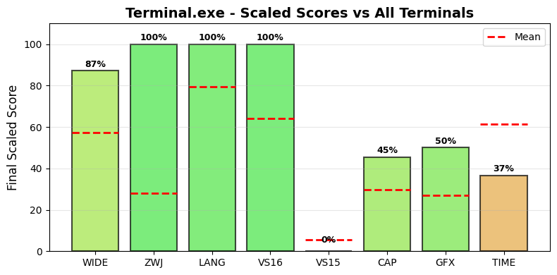

.. _terminalexe:

Terminal.exe
------------

Tested Software version 1.23.260121001 on Windows.
The homepage URL of this terminal is https://learn.microsoft.com/en-us/windows/terminal/.
Full results available at ucs-detect_ repository path
`data/terminalexe.yaml <https://github.com/jquast/ucs-detect/blob/master/data/terminalexe.yaml>`_.

.. _terminalexescores:

Score Breakdown
+++++++++++++++

Detailed breakdown of how scores are calculated for *Terminal.exe*:

.. table::
   :class: sphinx-datatable

   ===  =========================================  ===========  ====================
     #  Score Type                                 Raw Score    Final Scaled Score
   ===  =========================================  ===========  ====================
     1  :ref:`WIDE <terminalexewide>`              99.88%       87.1%
     2  :ref:`ZWJ <terminalexezwj>`                100.00%      100.0%
     3  :ref:`LANG <terminalexelang>`              99.94%       99.8%
     4  :ref:`VS16 <terminalexevs16>`              100.00%      100.0%
     5  :ref:`VS15 <terminalexevs15>`              0.00%        0.0%
     6  :ref:`Capabilities <terminalexedecmodes>`  41.67%       45.5%
     7  :ref:`Graphics <terminalexegraphics>`      50%          50.0%
     8  :ref:`TIME <terminalexetime>`              250.53s      36.5%
   ===  =========================================  ===========  ====================

**Score Comparison Plot:**

The following plot shows how this terminal's scores compare to all other terminals tested.

   Scaled scores comparison across all metrics (normalized 0-100%)

**Final Scaled Score Calculation:**

- Raw Final Score: 67.97%
  (weighted average: WIDE + ZWJ + LANG + VS16 + VS15 + CAP + GFX + 0.5*TIME)
  the categorized 'average' absolute support level of this terminal
  Note: TIME is normalized to 0-1 range before averaging.
  TIME is weighted at 0.5 (half as powerful as other metrics).
  CAP (Capabilities) is the fraction of 7 notable capabilities supported.
  GFX (Graphics) scores 100% for modern protocols (iTerm2, Kitty),
  50% for legacy only (Sixel, ReGIS), 0% for none.
  Sixel/ReGIS support contributes to the GFX score at 50%.

- Final Scaled Score: 57.2%
  (normalized across all terminals tested).
  *Final Scaled scores* are normalized (0-100%) relative to all terminals tested

**WIDE Score Details:**

Wide character support calculation:

- Total successful codepoints: 2562
- Total codepoints tested: 2565
- Formula: 2562 / 2565
- Result: 99.88%

**ZWJ Score Details:**

Emoji ZWJ (Zero-Width Joiner) support calculation:

- Total successful sequences: 1445
- Total sequences tested: 1445
- Formula: 1445 / 1445
- Result: 100.00%

**VS16 Score Details:**

Variation Selector-16 support calculation:

- Errors: 0 of 426 codepoints tested
- Success rate: 100.0%
- Formula: 100.0 / 100
- Result: 100.00%

**VS15 Score Details:**

Variation Selector-15 support calculation:

- Errors: 158 of 158 codepoints tested
- Success rate: 0.0%
- Formula: 0.0 / 100
- Result: 0.00%

**Capabilities Score Details:**

Notable terminal capabilities (5 / 12):

- Set bracketed paste mode (2004): **yes**
- Synchronized Output (2026): **yes**
- Send FocusIn/FocusOut events (1004): **yes**
- Enable SGR Mouse Mode (1006): **yes**
- Grapheme Clustering (2027): **yes**
- Bracketed Paste MIME (5522): **no**
- Kitty Keyboard: **no**
- XTGETTCAP: **no**
- Text Sizing (OSC 66): **no**
- Kitty Clipboard Protocol: **no**
- Kitty Pointer Shapes (OSC 22): **no**
- Kitty Notifications (OSC 99): **no**

Raw score: 41.67%

**Graphics Score Details:**

Graphics protocol support (50%):

- Sixel: **yes**
- ReGIS: **no**
- iTerm2: **no**
- Kitty: **no**

Scoring: 100% for modern (iTerm2/Kitty), 50% for legacy only (Sixel/ReGIS), 0% for none

**TIME Score Details:**

Test execution time:

- Elapsed time: 250.53 seconds
- Note: This is a raw measurement; lower is better
- Scaled score uses inverse log10 scaling across all terminals
- Scaled result: 36.5%

**LANG Score Details (Geometric Mean):**

Geometric mean calculation:

- Formula: (p₁ × p₂ × ... × pₙ)^(1/n) where n = 94 languages
- About `geometric mean <https://en.wikipedia.org/wiki/Geometric_mean>`_
- Result: 99.94%

.. _terminalexewide:

Wide character support
++++++++++++++++++++++

Wide character support of *Terminal.exe* is **99.9%** (3 errors of 2565 codepoints tested).

Sequence of a WIDE character, from midpoint of alignment failure records:

.. table::
   :class: sphinx-datatable

   ===  =================================================  =============  ==========  =========  ==================================
     #  Codepoint                                          Python         Category      wcwidth  Name
   ===  =================================================  =============  ==========  =========  ==================================
     1  `U+0001F1FA <https://codepoints.net/U+0001F1FA>`_  '\\U0001f1fa'  So                  2  REGIONAL INDICATOR SYMBOL LETTER U
   ===  =================================================  =============  ==========  =========  ==================================

Total codepoints: 1

- Shell test using `printf(1)`_, ``'|'`` should align in output::

        $ printf "\xf0\x9f\x87\xba|\\n12|\\n"
        🇺|
        12|

- python `wcwidth.wcswidth()`_ measures width 2,
  while *Terminal.exe* measures width 1.

.. _terminalexezwj:

Emoji ZWJ support
+++++++++++++++++

Compatibility of *Terminal.exe* with the Unicode Emoji ZWJ sequence table is **100.0%** (0 errors of 1445 sequences tested).

.. _terminalexevs16:

Variation Selector-16 support
+++++++++++++++++++++++++++++

Emoji VS-16 results for *Terminal.exe* is 0 errors
out of 426 total codepoints tested, 100.0% success.
All codepoint combinations with Variation Selector-16 tested were successful.

.. _terminalexevs15:

Variation Selector-15 support
+++++++++++++++++++++++++++++

Emoji VS-15 results for *Terminal.exe* is 158 errors
out of 158 total codepoints tested, 0.0% success.
Sequence of a WIDE Emoji made NARROW by *Variation Selector-15*, from midpoint of alignment failure records:

.. table::
   :class: sphinx-datatable

   ===  =================================================  =============  ==========  =========  =====================
     #  Codepoint                                          Python         Category      wcwidth  Name
   ===  =================================================  =============  ==========  =========  =====================
     1  `U+0001F3AE <https://codepoints.net/U+0001F3AE>`_  '\\U0001f3ae'  So                  2  VIDEO GAME
     2  `U+FE0E <https://codepoints.net/U+FE0E>`_          '\\ufe0e'      Mn                  0  VARIATION SELECTOR-15
   ===  =================================================  =============  ==========  =========  =====================

Total codepoints: 2

- Shell test using `printf(1)`_, ``'|'`` should align in output::

        $ printf "\xf0\x9f\x8e\xae\xef\xb8\x8e|\\n1|\\n"
        🎮︎|
        1|

- python `wcwidth.wcswidth()`_ measures width 1,
  while *Terminal.exe* measures width 2.

.. _terminalexegraphics:

Graphics Protocol Support
+++++++++++++++++++++++++

*Terminal.exe* supports the following graphics protocols: Sixel_, `iTerm2 inline images`_.

**Detection Methods:**

- **Sixel** and **ReGIS**: Detected via the Device Attributes (DA1) query
  ``CSI c`` (``\x1b[c``). Extension code ``4`` indicates Sixel_ support,
  ``3`` ReGIS_.
- **Kitty graphics**: Detected by sending a Kitty graphics query and
  checking for an ``OK`` response.
- **iTerm2 inline images**: Detected via the iTerm2 capabilities query
  ``OSC 1337 ; Capabilities``.

**Device Attributes Response:**

- Extensions reported: 4, 6, 7, 14, 21, 22, 23, 24, 28, 32, 42, 52
- Sixel_ indicator (``4``): present
- ReGIS_ indicator (``3``): not present

.. _Sixel: https://en.wikipedia.org/wiki/Sixel
.. _ReGIS: https://en.wikipedia.org/wiki/ReGIS
.. _`iTerm2 inline images`: https://iterm2.com/documentation-images.html
.. _`Kitty graphics protocol`: https://sw.kovidgoyal.net/kitty/graphics-protocol/

.. _terminalexelang:

Language Support
++++++++++++++++

The following 88 languages were tested with 100% success:

Aja, Amarakaeri, Arabic, Standard, Assyrian Neo-Aramaic, Baatonum, Bamun, Belanda Viri, Bhojpuri, Bora, Burmese, Catalan (2), Chakma, Chickasaw, Chinantec, Chiltepec, Dagaare, Southern, Dangme, Dari, Dendi, Dinka, Northeastern, Ditammari, Dzongkha, Evenki, Farsi, Western, Fon, French (Welche), Fur, Ga, Gen, Gilyak, Gujarati, Gumuz, Hindi, Javanese (Javanese), Kabyle, Kannada, Khmer, Central, Khün, Lamnso', Lao, Lingala (tones), Magahi, Maithili, Maldivian, Maori (2), Mazahua Central, Mirandese, Mixtec, Metlatónoc, Mon, Mòoré, Nanai, Navajo, Orok, Otomi, Mezquital, Panjabi, Eastern, Panjabi, Western, Pashto, Northern, Picard, Pular (Adlam), Saint Lucian Creole French, Sanskrit, Sanskrit (Grantha), Secoya, Seraiki, Shan, Shipibo-Conibo, Sinhala, Siona, South Azerbaijani, Tagalog (Tagalog), Tai Dam, Tamang, Eastern, Tamazight, Central Atlas, Tamil, Tamil (Sri Lanka), Telugu, Tem, Thai, Thai (2), Tibetan, Central, Ticuna, Uduk, Veps, Vietnamese, Waama, Yaneshaʼ, Yiddish, Eastern, Yoruba, Éwé.

The following 6 languages are not fully supported:

.. table::
   :class: sphinx-datatable

   ===========================================  ==========  =========  =============
   lang                                           n_errors    n_total  pct_success
   ===========================================  ==========  =========  =============
   :ref:`Malayalam <terminalexelangmalayalam>`          29        845  96.6%
   :ref:`Urdu (2) <terminalexelangurdu2>`                1         82  98.8%
   :ref:`Urdu <terminalexelangurdu>`                     1        110  99.1%
   :ref:`Bengali <terminalexelangbengali>`               2        385  99.5%
   :ref:`Nepali <terminalexelangnepali>`                 1        352  99.7%
   :ref:`Marathi <terminalexelangmarathi>`               1        391  99.7%
   ===========================================  ==========  =========  =============

.. _terminalexelangmalayalam:

Malayalam
^^^^^^^^^

Sequence of language *Malayalam* from midpoint of alignment failure records:

.. table::
   :class: sphinx-datatable

   ===  =========================================  =========  ==========  =========  ======================
     #  Codepoint                                  Python     Category      wcwidth  Name
   ===  =========================================  =========  ==========  =========  ======================
     1  `U+0D28 <https://codepoints.net/U+0D28>`_  '\\u0d28'  Lo                  1  MALAYALAM LETTER NA
     2  `U+0D4D <https://codepoints.net/U+0D4D>`_  '\\u0d4d'  Mn                  0  MALAYALAM SIGN VIRAMA
     3  `U+200D <https://codepoints.net/U+200D>`_  '\\u200d'  Cf                  0  ZERO WIDTH JOINER
     4  `U+0D2A <https://codepoints.net/U+0D2A>`_  '\\u0d2a'  Lo                  1  MALAYALAM LETTER PA
     5  `U+0D3F <https://codepoints.net/U+0D3F>`_  '\\u0d3f'  Mc                  0  MALAYALAM VOWEL SIGN I
   ===  =========================================  =========  ==========  =========  ======================

Total codepoints: 5

- Shell test using `printf(1)`_, ``'|'`` should align in output::

        $ printf "\xe0\xb4\xa8\xe0\xb5\x8d\xe2\x80\x8d\xe0\xb4\xaa\xe0\xb4\xbf|\\n12|\\n"
        ന്‍പി|
        12|

- python `wcwidth.wcswidth()`_ measures width 2,
  while *Terminal.exe* measures width 3.

.. _terminalexelangurdu2:

Urdu (2)
^^^^^^^^

Sequence of language *Urdu (2)* from midpoint of alignment failure records:

.. table::
   :class: sphinx-datatable

   ===  =========================================  =========  ==========  =========  ===============================
     #  Codepoint                                  Python     Category      wcwidth  Name
   ===  =========================================  =========  ==========  =========  ===============================
     1  `U+0601 <https://codepoints.net/U+0601>`_  '\\u0601'  Cf                  1  ARABIC SIGN SANAH
     2  `U+06F1 <https://codepoints.net/U+06F1>`_  '\\u06f1'  Nd                  1  EXTENDED ARABIC-INDIC DIGIT ONE
   ===  =========================================  =========  ==========  =========  ===============================

Total codepoints: 2

- Shell test using `printf(1)`_, ``'|'`` should align in output::

        $ printf "\xd8\x81\xdb\xb1|\\n12|\\n"
        ؁۱|
        12|

.. _terminalexelangurdu:

Urdu
^^^^

Sequence of language *Urdu* from midpoint of alignment failure records:

.. table::
   :class: sphinx-datatable

   ===  =========================================  =========  ==========  =========  ===============================
     #  Codepoint                                  Python     Category      wcwidth  Name
   ===  =========================================  =========  ==========  =========  ===============================
     1  `U+0601 <https://codepoints.net/U+0601>`_  '\\u0601'  Cf                  1  ARABIC SIGN SANAH
     2  `U+06F1 <https://codepoints.net/U+06F1>`_  '\\u06f1'  Nd                  1  EXTENDED ARABIC-INDIC DIGIT ONE
   ===  =========================================  =========  ==========  =========  ===============================

Total codepoints: 2

- Shell test using `printf(1)`_, ``'|'`` should align in output::

        $ printf "\xd8\x81\xdb\xb1|\\n12|\\n"
        ؁۱|
        12|

- python `wcwidth.wcswidth()`_ measures width 2,
  while *Terminal.exe* measures width 1.

.. _terminalexelangbengali:

Bengali
^^^^^^^

Sequence of language *Bengali* from midpoint of alignment failure records:

.. table::
   :class: sphinx-datatable

   ===  =========================================  =========  ==========  =========  =====================
     #  Codepoint                                  Python     Category      wcwidth  Name
   ===  =========================================  =========  ==========  =========  =====================
     1  `U+09A4 <https://codepoints.net/U+09A4>`_  '\\u09a4'  Lo                  1  BENGALI LETTER TA
     2  `U+09CD <https://codepoints.net/U+09CD>`_  '\\u09cd'  Mn                  0  BENGALI SIGN VIRAMA
     3  `U+200D <https://codepoints.net/U+200D>`_  '\\u200d'  Cf                  0  ZERO WIDTH JOINER
     4  `U+09AA <https://codepoints.net/U+09AA>`_  '\\u09aa'  Lo                  1  BENGALI LETTER PA
     5  `U+09C0 <https://codepoints.net/U+09C0>`_  '\\u09c0'  Mc                  0  BENGALI VOWEL SIGN II
   ===  =========================================  =========  ==========  =========  =====================

Total codepoints: 5

- Shell test using `printf(1)`_, ``'|'`` should align in output::

        $ printf "\xe0\xa6\xa4\xe0\xa7\x8d\xe2\x80\x8d\xe0\xa6\xaa\xe0\xa7\x80|\\n12|\\n"
        ত্‍পী|
        12|

- python `wcwidth.wcswidth()`_ measures width 2,
  while *Terminal.exe* measures width 3.

.. _terminalexelangnepali:

Nepali
^^^^^^

Sequence of language *Nepali* from midpoint of alignment failure records:

.. table::
   :class: sphinx-datatable

   ===  =========================================  =========  ==========  =========  ========================
     #  Codepoint                                  Python     Category      wcwidth  Name
   ===  =========================================  =========  ==========  =========  ========================
     1  `U+0930 <https://codepoints.net/U+0930>`_  '\\u0930'  Lo                  1  DEVANAGARI LETTER RA
     2  `U+094D <https://codepoints.net/U+094D>`_  '\\u094d'  Mn                  0  DEVANAGARI SIGN VIRAMA
     3  `U+200D <https://codepoints.net/U+200D>`_  '\\u200d'  Cf                  0  ZERO WIDTH JOINER
     4  `U+092F <https://codepoints.net/U+092F>`_  '\\u092f'  Lo                  1  DEVANAGARI LETTER YA
     5  `U+093E <https://codepoints.net/U+093E>`_  '\\u093e'  Mc                  0  DEVANAGARI VOWEL SIGN AA
   ===  =========================================  =========  ==========  =========  ========================

Total codepoints: 5

- Shell test using `printf(1)`_, ``'|'`` should align in output::

        $ printf "\xe0\xa4\xb0\xe0\xa5\x8d\xe2\x80\x8d\xe0\xa4\xaf\xe0\xa4\xbe|\\n12|\\n"
        र्‍या|
        12|

.. _terminalexelangmarathi:

Marathi
^^^^^^^

Sequence of language *Marathi* from midpoint of alignment failure records:

.. table::
   :class: sphinx-datatable

   ===  =========================================  =========  ==========  =========  ========================
     #  Codepoint                                  Python     Category      wcwidth  Name
   ===  =========================================  =========  ==========  =========  ========================
     1  `U+0930 <https://codepoints.net/U+0930>`_  '\\u0930'  Lo                  1  DEVANAGARI LETTER RA
     2  `U+094D <https://codepoints.net/U+094D>`_  '\\u094d'  Mn                  0  DEVANAGARI SIGN VIRAMA
     3  `U+200D <https://codepoints.net/U+200D>`_  '\\u200d'  Cf                  0  ZERO WIDTH JOINER
     4  `U+092F <https://codepoints.net/U+092F>`_  '\\u092f'  Lo                  1  DEVANAGARI LETTER YA
     5  `U+093E <https://codepoints.net/U+093E>`_  '\\u093e'  Mc                  0  DEVANAGARI VOWEL SIGN AA
   ===  =========================================  =========  ==========  =========  ========================

Total codepoints: 5

- Shell test using `printf(1)`_, ``'|'`` should align in output::

        $ printf "\xe0\xa4\xb0\xe0\xa5\x8d\xe2\x80\x8d\xe0\xa4\xaf\xe0\xa4\xbe|\\n12|\\n"
        र्‍या|
        12|

- python `wcwidth.wcswidth()`_ measures width 2,
  while *Terminal.exe* measures width 3.

.. _terminalexedecmodes:

DEC Private Modes Support
+++++++++++++++++++++++++

DEC private modes results for *Terminal.exe*: 4 changeable modes
of 5 supported out of 5 total modes tested (100.0% support, 80.0% changeable).

Complete list of DEC private modes tested:

.. table::
   :class: sphinx-datatable

   ======  ===================  ============================  ===========  ============  =========
     Mode  Name                 Description                   Supported    Changeable    Enabled
   ======  ===================  ============================  ===========  ============  =========
     1004  FOCUS_IN_OUT_EVENTS  Send FocusIn/FocusOut events  Yes          Yes           Yes
     1006  MOUSE_EXTENDED_SGR   Enable SGR Mouse Mode         Yes          Yes           No
     2004  BRACKETED_PASTE      Set bracketed paste mode      Yes          Yes           No
     2026  SYNCHRONIZED_OUTPUT  Synchronized Output           Yes          Yes           No
     2027  GRAPHEME_CLUSTERING  Grapheme Clustering           Yes          No            Yes
   ======  ===================  ============================  ===========  ============  =========

**Summary**: 4 changeable, 1 not changeable.

.. _terminalexekittykbd:

Kitty Keyboard Protocol
+++++++++++++++++++++++

*Terminal.exe* does not support the `Kitty keyboard protocol`_.

.. _`Kitty keyboard protocol`: https://sw.kovidgoyal.net/kitty/keyboard-protocol/

.. _terminalexextgettcap:

XTGETTCAP (Terminfo Capabilities)
+++++++++++++++++++++++++++++++++

*Terminal.exe* does not support the ``XTGETTCAP`` sequence.

.. _terminalexereproduce:

Reproduction
++++++++++++

To reproduce these results for *Terminal.exe*, install and run ucs-detect_
with the following commands::

    pip install ucs-detect
    ucs-detect --rerun data/terminalexe.yaml

.. _terminalexetime:

Test Execution Time
+++++++++++++++++++

The test suite completed in **250.53 seconds** (250s).

This time measurement represents the total duration of the test execution,
including all Unicode wide character tests, emoji ZWJ sequences, variation
selectors, language support checks, and DEC mode detection.

.. _`printf(1)`: https://www.man7.org/linux/man-pages/man1/printf.1.html
.. _`wcwidth.wcswidth()`: https://wcwidth.readthedocs.io/en/latest/intro.html
.. _`ucs-detect`: https://github.com/jquast/ucs-detect
.. _`DEC Private Modes`: https://blessed.readthedocs.io/en/latest/dec_modes.html
