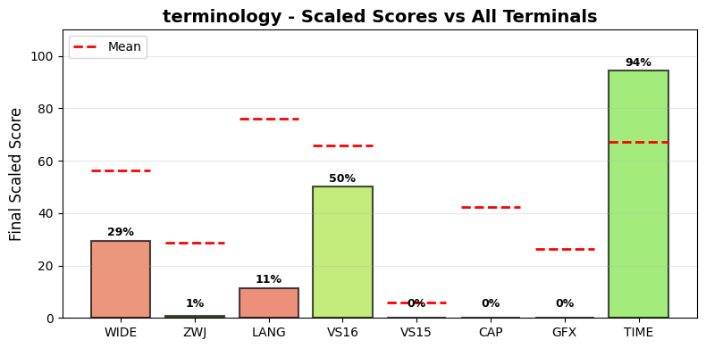

.. _terminology:

terminology
-----------

Tested Software version 1.13.0 on Linux.
The homepage URL of this terminal is https://www.enlightenment.org/about-terminology.
Full results available at ucs-detect_ repository path
`data/terminology.yaml <https://github.com/jquast/ucs-detect/blob/master/data/terminology.yaml>`_.

.. _terminologyscores:

Score Breakdown
+++++++++++++++

Detailed breakdown of how scores are calculated for *terminology*:

.. table::
   :class: sphinx-datatable

   ===  =========================================  ===========  ====================
     #  Score Type                                 Raw Score    Final Scaled Score
   ===  =========================================  ===========  ====================
     1  :ref:`WIDE <terminologywide>`              99.36%       29.3%
     2  :ref:`ZWJ <terminologyzwj>`                0.69%        0.7%
     3  :ref:`LANG <terminologylang>`              73.54%       11.3%
     4  :ref:`VS16 <terminologyvs16>`              50.00%       50.0%
     5  :ref:`VS15 <terminologyvs15>`              0.00%        0.0%
     6  :ref:`Capabilities <terminologydecmodes>`  0.00%        0.0%
     7  :ref:`Graphics <terminologygraphics>`      0%           0.0%
     8  :ref:`TIME <terminologytime>`              8.40s        94.3%
   ===  =========================================  ===========  ====================

**Score Comparison Plot:**

The following plot shows how this terminal's scores compare to all other terminals tested.

   Scaled scores comparison across all metrics (normalized 0-100%)

**Final Scaled Score Calculation:**

- Raw Final Score: 36.10%
  (weighted average: WIDE + ZWJ + LANG + VS16 + VS15 + CAP + GFX + 0.5*TIME)
  the categorized 'average' absolute support level of this terminal
  Note: TIME is normalized to 0-1 range before averaging.
  TIME is weighted at 0.5 (half as powerful as other metrics).
  CAP (Capabilities) is the fraction of 7 notable capabilities supported.
  GFX (Graphics) scores 100% for modern protocols (iTerm2, Kitty),
  50% for legacy only (Sixel, ReGIS), 0% for none.
  Sixel/ReGIS support contributes to the GFX score at 50%.

- Final Scaled Score: 1.4%
  (normalized across all terminals tested).
  *Final Scaled scores* are normalized (0-100%) relative to all terminals tested

**WIDE Score Details:**

Wide character support calculation:

- Total successful codepoints: 5414
- Total codepoints tested: 5449
- Formula: 5414 / 5449
- Result: 99.36%

**ZWJ Score Details:**

Emoji ZWJ (Zero-Width Joiner) support calculation:

- Total successful sequences: 10
- Total sequences tested: 1445
- Formula: 10 / 1445
- Result: 0.69%

**VS16 Score Details:**

Variation Selector-16 support calculation:

- Errors: 213 of 426 codepoints tested
- Success rate: 50.0%
- Formula: 50.0 / 100
- Result: 50.00%

**VS15 Score Details:**

Variation Selector-15 support calculation:

- Errors: 158 of 158 codepoints tested
- Success rate: 0.0%
- Formula: 0.0 / 100
- Result: 0.00%

**Capabilities Score Details:**

Notable terminal capabilities (0 / 7):

- Bracketed Paste (2004): **no**
- Synced Output (2026): **no**
- Focus Events (1004): **no**
- Mouse SGR (1006): **no**
- Graphemes (2027): **no**
- Kitty Keyboard: **no**
- XTGETTCAP: **no**

Raw score: 0.00%

**Graphics Score Details:**

Graphics protocol support (0%):

- Sixel: **no**
- ReGIS: **no**
- iTerm2: **no**
- Kitty: **no**

Scoring: 100% for modern (iTerm2/Kitty), 50% for legacy only (Sixel/ReGIS), 0% for none

**TIME Score Details:**

Test execution time:

- Elapsed time: 8.40 seconds
- Note: This is a raw measurement; lower is better
- Scaled score uses inverse log10 scaling across all terminals
- Scaled result: 94.3%

**LANG Score Details (Geometric Mean):**

Geometric mean calculation:

- Formula: (p₁ × p₂ × ... × pₙ)^(1/n) where n = 94 languages
- About `geometric mean <https://en.wikipedia.org/wiki/Geometric_mean>`_
- Result: 73.54%

.. _terminologywide:

Wide character support
++++++++++++++++++++++

Wide character support of *terminology* is **99.4%** (35 errors of 5449 codepoints tested).

Sequence of a WIDE character, from midpoint of alignment failure records:

.. table::
   :class: sphinx-datatable

   ===  =================================================  =============  ==========  =========  ========================
     #  Codepoint                                          Python         Category      wcwidth  Name
   ===  =================================================  =============  ==========  =========  ========================
     1  `U+0001D310 <https://codepoints.net/U+0001D310>`_  '\\U0001d310'  So                  2  TETRAGRAM FOR DIVERGENCE
   ===  =================================================  =============  ==========  =========  ========================

Total codepoints: 1

- Shell test using `printf(1)`_, ``'|'`` should align in output::

        $ printf "\xf0\x9d\x8c\x90|\\n12|\\n"
        𝌐|
        12|

- python `wcwidth.wcswidth()`_ measures width 2,
  while *terminology* measures width 1.

.. _terminologyzwj:

Emoji ZWJ support
+++++++++++++++++

Compatibility of *terminology* with the Unicode Emoji ZWJ sequence table is **0.7%** (1435 errors of 1445 sequences tested).

Sequence of an Emoji ZWJ Sequence, from midpoint of alignment failure records:

.. table::
   :class: sphinx-datatable

   ===  =================================================  =============  ==========  =========  =================================
     #  Codepoint                                          Python         Category      wcwidth  Name
   ===  =================================================  =============  ==========  =========  =================================
     1  `U+0001F3C3 <https://codepoints.net/U+0001F3C3>`_  '\\U0001f3c3'  So                  2  RUNNER
     2  `U+0001F3FE <https://codepoints.net/U+0001F3FE>`_  '\\U0001f3fe'  Sk                  2  EMOJI MODIFIER FITZPATRICK TYPE-5
     3  `U+200D <https://codepoints.net/U+200D>`_          '\\u200d'      Cf                  0  ZERO WIDTH JOINER
     4  `U+2640 <https://codepoints.net/U+2640>`_          '\\u2640'      So                  1  FEMALE SIGN
     5  `U+FE0F <https://codepoints.net/U+FE0F>`_          '\\ufe0f'      Mn                  0  VARIATION SELECTOR-16
     6  `U+200D <https://codepoints.net/U+200D>`_          '\\u200d'      Cf                  0  ZERO WIDTH JOINER
     7  `U+27A1 <https://codepoints.net/U+27A1>`_          '\\u27a1'      So                  1  BLACK RIGHTWARDS ARROW
     8  `U+FE0F <https://codepoints.net/U+FE0F>`_          '\\ufe0f'      Mn                  0  VARIATION SELECTOR-16
   ===  =================================================  =============  ==========  =========  =================================

Total codepoints: 8

- Shell test using `printf(1)`_, ``'|'`` should align in output::

        $ printf "\xf0\x9f\x8f\x83\xf0\x9f\x8f\xbe\xe2\x80\x8d\xe2\x99\x80\xef\xb8\x8f\xe2\x80\x8d\xe2\x9e\xa1\xef\xb8\x8f|\\n12|\\n"
        🏃🏾‍♀️‍➡️|
        12|

- python `wcwidth.wcswidth()`_ measures width 2,
  while *terminology* measures width 6.

.. _terminologyvs16:

Variation Selector-16 support
+++++++++++++++++++++++++++++

Emoji VS-16 results for *terminology* is 213 errors
out of 426 total codepoints tested, 50.0% success.
Sequence of a NARROW Emoji made WIDE by *Variation Selector-16*, from midpoint of alignment failure records:

.. table::
   :class: sphinx-datatable

   ===  =========================================  =========  ==========  =========  =====================
     #  Codepoint                                  Python     Category      wcwidth  Name
   ===  =========================================  =========  ==========  =========  =====================
     1  `U+2733 <https://codepoints.net/U+2733>`_  '\\u2733'  So                  1  EIGHT SPOKED ASTERISK
     2  `U+FE0F <https://codepoints.net/U+FE0F>`_  '\\ufe0f'  Mn                  0  VARIATION SELECTOR-16
   ===  =========================================  =========  ==========  =========  =====================

Total codepoints: 2

- Shell test using `printf(1)`_, ``'|'`` should align in output::

        $ printf "\xe2\x9c\xb3\xef\xb8\x8f|\\n12|\\n"
        ✳️|
        12|

- python `wcwidth.wcswidth()`_ measures width 2,
  while *terminology* measures width 1.

.. _terminologyvs15:

Variation Selector-15 support
+++++++++++++++++++++++++++++

Emoji VS-15 results for *terminology* is 158 errors
out of 158 total codepoints tested, 0.0% success.
Sequence of a WIDE Emoji made NARROW by *Variation Selector-15*, from midpoint of alignment failure records:

.. table::
   :class: sphinx-datatable

   ===  =================================================  =============  ==========  =========  =====================
     #  Codepoint                                          Python         Category      wcwidth  Name
   ===  =================================================  =============  ==========  =========  =====================
     1  `U+0001F3AE <https://codepoints.net/U+0001F3AE>`_  '\\U0001f3ae'  So                  2  VIDEO GAME
     2  `U+FE0E <https://codepoints.net/U+FE0E>`_          '\\ufe0e'      Mn                  0  VARIATION SELECTOR-15
   ===  =================================================  =============  ==========  =========  =====================

Total codepoints: 2

- Shell test using `printf(1)`_, ``'|'`` should align in output::

        $ printf "\xf0\x9f\x8e\xae\xef\xb8\x8e|\\n1|\\n"
        🎮︎|
        1|

- python `wcwidth.wcswidth()`_ measures width 1,
  while *terminology* measures width 2.

.. _terminologygraphics:

Graphics Protocol Support
+++++++++++++++++++++++++

*terminology* does not report support for any graphics protocols.

**Detection Methods:**

- **Sixel** and **ReGIS**: Detected via the Device Attributes (DA1) query
  ``CSI c`` (``\x1b[c``). Extension code ``4`` indicates Sixel_ support,
  ``3`` ReGIS_.
- **Kitty graphics**: Detected by sending a Kitty graphics query and
  checking for an ``OK`` response.
- **iTerm2 inline images**: Detected via the iTerm2 capabilities query
  ``OSC 1337 ; Capabilities``.

**Device Attributes Response:**

- Extensions reported: 1, 9, 15, 18, 21, 22
- Sixel_ indicator (``4``): not present
- ReGIS_ indicator (``3``): not present

.. _Sixel: https://en.wikipedia.org/wiki/Sixel
.. _ReGIS: https://en.wikipedia.org/wiki/ReGIS
.. _`iTerm2 inline images`: https://iterm2.com/documentation-images.html
.. _`Kitty graphics protocol`: https://sw.kovidgoyal.net/kitty/graphics-protocol/

.. _terminologylang:

Language Support
++++++++++++++++

The following 50 languages were tested with 100% success:

Aja, Amarakaeri, Baatonum, Bamun, Belanda Viri, Bora, Catalan (2), Chickasaw, Chinantec, Chiltepec, Dagaare, Southern, Dangme, Dendi, Dinka, Northeastern, Ditammari, Evenki, Fon, French (Welche), Fur, Ga, Gen, Gilyak, Gumuz, Kabyle, Lamnso', Lingala (tones), Maori (2), Mazahua Central, Mirandese, Mixtec, Metlatónoc, Mòoré, Nanai, Navajo, Orok, Otomi, Mezquital, Picard, Saint Lucian Creole French, Secoya, Shipibo-Conibo, Siona, South Azerbaijani, Tamazight, Central Atlas, Tem, Ticuna, Uduk, Veps, Vietnamese, Waama, Yaneshaʼ, Yoruba, Éwé.

The following 44 languages are not fully supported:

.. table::
   :class: sphinx-datatable

   ===============================================================  ==========  =========  =============
   lang                                                               n_errors    n_total  pct_success
   ===============================================================  ==========  =========  =============
   :ref:`Maldivian <terminologylangmaldivian>`                             209        226  7.5%
   :ref:`Khün <terminologylangkhn>`                                        337        396  14.9%
   :ref:`Tibetan, Central <terminologylangtibetancentral>`                 179        214  16.4%
   :ref:`Dzongkha <terminologylangdzongkha>`                               160        200  20.0%
   :ref:`Lao <terminologylanglao>`                                         217        277  21.7%
   :ref:`Mon <terminologylangmon>`                                         258        332  22.3%
   :ref:`Chakma <terminologylangchakma>`                                   200        267  25.1%
   :ref:`Telugu <terminologylangtelugu>`                                   286        384  25.5%
   :ref:`Thai (2) <terminologylangthai2>`                                  186        252  26.2%
   :ref:`Thai <terminologylangthai>`                                       193        262  26.3%
   :ref:`Shan <terminologylangshan>`                                       132        181  27.1%
   :ref:`Sanskrit <terminologylangsanskrit>`                               354        493  28.2%
   :ref:`Burmese <terminologylangburmese>`                                 192        268  28.4%
   :ref:`Khmer, Central <terminologylangkhmercentral>`                     294        443  33.6%
   :ref:`Tai Dam <terminologylangtaidam>`                                  120        189  36.5%
   :ref:`Hindi <terminologylanghindi>`                                     247        390  36.7%
   :ref:`Maithili <terminologylangmaithili>`                               224        357  37.3%
   :ref:`Marathi <terminologylangmarathi>`                                 245        391  37.3%
   :ref:`Javanese (Javanese) <terminologylangjavanesejavanese>`            332        530  37.4%
   :ref:`Nepali <terminologylangnepali>`                                   218        352  38.1%
   :ref:`Malayalam <terminologylangmalayalam>`                             479        845  43.3%
   :ref:`Gujarati <terminologylanggujarati>`                               191        343  44.3%
   :ref:`Panjabi, Eastern <terminologylangpanjabieastern>`                 165        302  45.4%
   :ref:`Magahi <terminologylangmagahi>`                                   171        314  45.5%
   :ref:`Bhojpuri <terminologylangbhojpuri>`                               167        313  46.6%
   :ref:`Bengali <terminologylangbengali>`                                 205        385  46.8%
   :ref:`Tagalog (Tagalog) <terminologylangtagalogtagalog>`                 16         34  52.9%
   :ref:`Tamang, Eastern <terminologylangtamangeastern>`                    28         70  60.0%
   :ref:`Sinhala <terminologylangsinhala>`                                  99        258  61.6%
   :ref:`Kannada <terminologylangkannada>`                                 104        287  63.8%
   :ref:`Urdu (2) <terminologylangurdu2>`                                   23         82  72.0%
   :ref:`Pular (Adlam) <terminologylangpularadlam>`                         24         93  74.2%
   :ref:`Urdu <terminologylangurdu>`                                        25        110  77.3%
   :ref:`Sanskrit (Grantha) <terminologylangsanskritgrantha>`               57        293  80.5%
   :ref:`Yiddish, Eastern <terminologylangyiddisheastern>`                  10         58  82.8%
   :ref:`Tamil <terminologylangtamil>`                                      26        175  85.1%
   :ref:`Tamil (Sri Lanka) <terminologylangtamilsrilanka>`                  26        175  85.1%
   :ref:`Assyrian Neo-Aramaic <terminologylangassyrianneoaramaic>`           6         42  85.7%
   :ref:`Arabic, Standard <terminologylangarabicstandard>`                   8         60  86.7%
   :ref:`Farsi, Western <terminologylangfarsiwestern>`                       6         49  87.8%
   :ref:`Dari <terminologylangdari>`                                         3         54  94.4%
   :ref:`Panjabi, Western <terminologylangpanjabiwestern>`                   3         62  95.2%
   :ref:`Pashto, Northern <terminologylangpashtonorthern>`                   2         62  96.8%
   :ref:`Seraiki <terminologylangseraiki>`                                   2         64  96.9%
   ===============================================================  ==========  =========  =============

.. _terminologylangmaldivian:

Maldivian
^^^^^^^^^

Sequence of language *Maldivian* from midpoint of alignment failure records:

.. table::
   :class: sphinx-datatable

   ===  =========================================  =========  ==========  =========  =================
     #  Codepoint                                  Python     Category      wcwidth  Name
   ===  =========================================  =========  ==========  =========  =================
     1  `U+0780 <https://codepoints.net/U+0780>`_  '\\u0780'  Lo                  1  THAANA LETTER HAA
     2  `U+07A6 <https://codepoints.net/U+07A6>`_  '\\u07a6'  Mn                  0  THAANA ABAFILI
   ===  =========================================  =========  ==========  =========  =================

Total codepoints: 2

- Shell test using `printf(1)`_, ``'|'`` should align in output::

        $ printf "\xde\x80\xde\xa6|\\n1|\\n"
        ހަ|
        1|

- python `wcwidth.wcswidth()`_ measures width 1,
  while *terminology* measures width 2.

.. _terminologylangkhn:

Khün
^^^^

Sequence of language *Khün* from midpoint of alignment failure records:

.. table::
   :class: sphinx-datatable

   ===  =========================================  =========  ==========  =========  ===========================
     #  Codepoint                                  Python     Category      wcwidth  Name
   ===  =========================================  =========  ==========  =========  ===========================
     1  `U+1A2F <https://codepoints.net/U+1A2F>`_  '\\u1a2f'  Lo                  1  TAI THAM LETTER DA
     2  `U+1A60 <https://codepoints.net/U+1A60>`_  '\\u1a60'  Mn                  0  TAI THAM SIGN SAKOT
     3  `U+1A45 <https://codepoints.net/U+1A45>`_  '\\u1a45'  Lo                  1  TAI THAM LETTER WA
     4  `U+1A60 <https://codepoints.net/U+1A60>`_  '\\u1a60'  Mn                  0  TAI THAM SIGN SAKOT
     5  `U+1A3F <https://codepoints.net/U+1A3F>`_  '\\u1a3f'  Lo                  1  TAI THAM LETTER LOW YA
     6  `U+1A62 <https://codepoints.net/U+1A62>`_  '\\u1a62'  Mn                  0  TAI THAM VOWEL SIGN MAI SAT
   ===  =========================================  =========  ==========  =========  ===========================

Total codepoints: 6

- Shell test using `printf(1)`_, ``'|'`` should align in output::

        $ printf "\xe1\xa8\xaf\xe1\xa9\xa0\xe1\xa9\x85\xe1\xa9\xa0\xe1\xa8\xbf\xe1\xa9\xa2|\\n123|\\n"
        ᨯ᩠ᩅ᩠ᨿᩢ|
        123|

- python `wcwidth.wcswidth()`_ measures width 3,
  while *terminology* measures width 6.

.. _terminologylangtibetancentral:

Tibetan, Central
^^^^^^^^^^^^^^^^

Sequence of language *Tibetan, Central* from midpoint of alignment failure records:

.. table::
   :class: sphinx-datatable

   ===  =========================================  =========  ==========  =========  ====================
     #  Codepoint                                  Python     Category      wcwidth  Name
   ===  =========================================  =========  ==========  =========  ====================
     1  `U+0F40 <https://codepoints.net/U+0F40>`_  '\\u0f40'  Lo                  1  TIBETAN LETTER KA
     2  `U+0F74 <https://codepoints.net/U+0F74>`_  '\\u0f74'  Mn                  0  TIBETAN VOWEL SIGN U
   ===  =========================================  =========  ==========  =========  ====================

Total codepoints: 2

- Shell test using `printf(1)`_, ``'|'`` should align in output::

        $ printf "\xe0\xbd\x80\xe0\xbd\xb4|\\n1|\\n"
        ཀུ|
        1|

.. _terminologylangdzongkha:

Dzongkha
^^^^^^^^

Sequence of language *Dzongkha* from midpoint of alignment failure records:

.. table::
   :class: sphinx-datatable

   ===  =========================================  =========  ==========  =========  ====================
     #  Codepoint                                  Python     Category      wcwidth  Name
   ===  =========================================  =========  ==========  =========  ====================
     1  `U+0F40 <https://codepoints.net/U+0F40>`_  '\\u0f40'  Lo                  1  TIBETAN LETTER KA
     2  `U+0F74 <https://codepoints.net/U+0F74>`_  '\\u0f74'  Mn                  0  TIBETAN VOWEL SIGN U
   ===  =========================================  =========  ==========  =========  ====================

Total codepoints: 2

- Shell test using `printf(1)`_, ``'|'`` should align in output::

        $ printf "\xe0\xbd\x80\xe0\xbd\xb4|\\n1|\\n"
        ཀུ|
        1|

- python `wcwidth.wcswidth()`_ measures width 1,
  while *terminology* measures width 2.

.. _terminologylanglao:

Lao
^^^

Sequence of language *Lao* from midpoint of alignment failure records:

.. table::
   :class: sphinx-datatable

   ===  =========================================  =========  ==========  =========  ======================
     #  Codepoint                                  Python     Category      wcwidth  Name
   ===  =========================================  =========  ==========  =========  ======================
     1  `U+0E81 <https://codepoints.net/U+0E81>`_  '\\u0e81'  Lo                  1  LAO LETTER KO
     2  `U+0EB1 <https://codepoints.net/U+0EB1>`_  '\\u0eb1'  Mn                  0  LAO VOWEL SIGN MAI KAN
   ===  =========================================  =========  ==========  =========  ======================

Total codepoints: 2

- Shell test using `printf(1)`_, ``'|'`` should align in output::

        $ printf "\xe0\xba\x81\xe0\xba\xb1|\\n1|\\n"
        ກັ|
        1|

- python `wcwidth.wcswidth()`_ measures width 1,
  while *terminology* measures width 2.

.. _terminologylangmon:

Mon
^^^

Sequence of language *Mon* from midpoint of alignment failure records:

.. table::
   :class: sphinx-datatable

   ===  =========================================  =========  ==========  =========  ====================
     #  Codepoint                                  Python     Category      wcwidth  Name
   ===  =========================================  =========  ==========  =========  ====================
     1  `U+1012 <https://codepoints.net/U+1012>`_  '\\u1012'  Lo                  1  MYANMAR LETTER DA
     2  `U+1039 <https://codepoints.net/U+1039>`_  '\\u1039'  Mn                  0  MYANMAR SIGN VIRAMA
     3  `U+1002 <https://codepoints.net/U+1002>`_  '\\u1002'  Lo                  1  MYANMAR LETTER GA
     4  `U+1031 <https://codepoints.net/U+1031>`_  '\\u1031'  Mc                  0  MYANMAR VOWEL SIGN E
   ===  =========================================  =========  ==========  =========  ====================

Total codepoints: 4

- Shell test using `printf(1)`_, ``'|'`` should align in output::

        $ printf "\xe1\x80\x92\xe1\x80\xb9\xe1\x80\x82\xe1\x80\xb1|\\n123|\\n"
        ဒ္ဂေ|
        123|

- python `wcwidth.wcswidth()`_ measures width 3,
  while *terminology* measures width 4.

.. _terminologylangchakma:

Chakma
^^^^^^

Sequence of language *Chakma* from midpoint of alignment failure records:

.. table::
   :class: sphinx-datatable

   ===  =================================================  =============  ==========  =========  ===================
     #  Codepoint                                          Python         Category      wcwidth  Name
   ===  =================================================  =============  ==========  =========  ===================
     1  `U+00011107 <https://codepoints.net/U+00011107>`_  '\\U00011107'  Lo                  1  CHAKMA LETTER KAA
     2  `U+00011133 <https://codepoints.net/U+00011133>`_  '\\U00011133'  Mn                  0  CHAKMA VIRAMA
     3  `U+00011120 <https://codepoints.net/U+00011120>`_  '\\U00011120'  Lo                  1  CHAKMA LETTER YYAA
     4  `U+0001112C <https://codepoints.net/U+0001112C>`_  '\\U0001112c'  Mc                  0  CHAKMA VOWEL SIGN E
   ===  =================================================  =============  ==========  =========  ===================

Total codepoints: 4

- Shell test using `printf(1)`_, ``'|'`` should align in output::

        $ printf "\xf0\x91\x84\x87\xf0\x91\x84\xb3\xf0\x91\x84\xa0\xf0\x91\x84\xac|\\n123|\\n"
        𑄇𑄳𑄠𑄬|
        123|

- python `wcwidth.wcswidth()`_ measures width 3,
  while *terminology* measures width 4.

.. _terminologylangtelugu:

Telugu
^^^^^^

Sequence of language *Telugu* from midpoint of alignment failure records:

.. table::
   :class: sphinx-datatable

   ===  =========================================  =========  ==========  =========  ====================
     #  Codepoint                                  Python     Category      wcwidth  Name
   ===  =========================================  =========  ==========  =========  ====================
     1  `U+0C15 <https://codepoints.net/U+0C15>`_  '\\u0c15'  Lo                  1  TELUGU LETTER KA
     2  `U+0C3E <https://codepoints.net/U+0C3E>`_  '\\u0c3e'  Mn                  0  TELUGU VOWEL SIGN AA
     3  `U+0C02 <https://codepoints.net/U+0C02>`_  '\\u0c02'  Mc                  0  TELUGU SIGN ANUSVARA
   ===  =========================================  =========  ==========  =========  ====================

Total codepoints: 3

- Shell test using `printf(1)`_, ``'|'`` should align in output::

        $ printf "\xe0\xb0\x95\xe0\xb0\xbe\xe0\xb0\x82|\\n12|\\n"
        కాం|
        12|

- python `wcwidth.wcswidth()`_ measures width 2,
  while *terminology* measures width 3.

.. _terminologylangthai2:

Thai (2)
^^^^^^^^

Sequence of language *Thai (2)* from midpoint of alignment failure records:

.. table::
   :class: sphinx-datatable

   ===  =========================================  =========  ==========  =========  ======================
     #  Codepoint                                  Python     Category      wcwidth  Name
   ===  =========================================  =========  ==========  =========  ======================
     1  `U+0E22 <https://codepoints.net/U+0E22>`_  '\\u0e22'  Lo                  1  THAI CHARACTER YO YAK
     2  `U+0E48 <https://codepoints.net/U+0E48>`_  '\\u0e48'  Mn                  0  THAI CHARACTER MAI EK
     3  `U+0E33 <https://codepoints.net/U+0E33>`_  '\\u0e33'  Lo                  1  THAI CHARACTER SARA AM
   ===  =========================================  =========  ==========  =========  ======================

Total codepoints: 3

- Shell test using `printf(1)`_, ``'|'`` should align in output::

        $ printf "\xe0\xb8\xa2\xe0\xb9\x88\xe0\xb8\xb3|\\n12|\\n"
        ย่ำ|
        12|

- python `wcwidth.wcswidth()`_ measures width 2,
  while *terminology* measures width 3.

.. _terminologylangthai:

Thai
^^^^

Sequence of language *Thai* from midpoint of alignment failure records:

.. table::
   :class: sphinx-datatable

   ===  =========================================  =========  ==========  =========  ======================
     #  Codepoint                                  Python     Category      wcwidth  Name
   ===  =========================================  =========  ==========  =========  ======================
     1  `U+0E15 <https://codepoints.net/U+0E15>`_  '\\u0e15'  Lo                  1  THAI CHARACTER TO TAO
     2  `U+0E48 <https://codepoints.net/U+0E48>`_  '\\u0e48'  Mn                  0  THAI CHARACTER MAI EK
     3  `U+0E33 <https://codepoints.net/U+0E33>`_  '\\u0e33'  Lo                  1  THAI CHARACTER SARA AM
   ===  =========================================  =========  ==========  =========  ======================

Total codepoints: 3

- Shell test using `printf(1)`_, ``'|'`` should align in output::

        $ printf "\xe0\xb8\x95\xe0\xb9\x88\xe0\xb8\xb3|\\n12|\\n"
        ต่ำ|
        12|

- python `wcwidth.wcswidth()`_ measures width 2,
  while *terminology* measures width 3.

.. _terminologylangshan:

Shan
^^^^

Sequence of language *Shan* from midpoint of alignment failure records:

.. table::
   :class: sphinx-datatable

   ===  =========================================  =========  ==========  =========  ==================
     #  Codepoint                                  Python     Category      wcwidth  Name
   ===  =========================================  =========  ==========  =========  ==================
     1  `U+1004 <https://codepoints.net/U+1004>`_  '\\u1004'  Lo                  1  MYANMAR LETTER NGA
     2  `U+103A <https://codepoints.net/U+103A>`_  '\\u103a'  Mn                  0  MYANMAR SIGN ASAT
   ===  =========================================  =========  ==========  =========  ==================

Total codepoints: 2

- Shell test using `printf(1)`_, ``'|'`` should align in output::

        $ printf "\xe1\x80\x84\xe1\x80\xba|\\n1|\\n"
        င်|
        1|

.. _terminologylangsanskrit:

Sanskrit
^^^^^^^^

Sequence of language *Sanskrit* from midpoint of alignment failure records:

.. table::
   :class: sphinx-datatable

   ===  =========================================  =========  ==========  =========  ========================
     #  Codepoint                                  Python     Category      wcwidth  Name
   ===  =========================================  =========  ==========  =========  ========================
     1  `U+0915 <https://codepoints.net/U+0915>`_  '\\u0915'  Lo                  1  DEVANAGARI LETTER KA
     2  `U+093E <https://codepoints.net/U+093E>`_  '\\u093e'  Mc                  0  DEVANAGARI VOWEL SIGN AA
     3  `U+0902 <https://codepoints.net/U+0902>`_  '\\u0902'  Mn                  0  DEVANAGARI SIGN ANUSVARA
   ===  =========================================  =========  ==========  =========  ========================

Total codepoints: 3

- Shell test using `printf(1)`_, ``'|'`` should align in output::

        $ printf "\xe0\xa4\x95\xe0\xa4\xbe\xe0\xa4\x82|\\n12|\\n"
        कां|
        12|

.. _terminologylangburmese:

Burmese
^^^^^^^

Sequence of language *Burmese* from midpoint of alignment failure records:

.. table::
   :class: sphinx-datatable

   ===  =========================================  =========  ==========  =========  ===================
     #  Codepoint                                  Python     Category      wcwidth  Name
   ===  =========================================  =========  ==========  =========  ===================
     1  `U+1000 <https://codepoints.net/U+1000>`_  '\\u1000'  Lo                  1  MYANMAR LETTER KA
     2  `U+1039 <https://codepoints.net/U+1039>`_  '\\u1039'  Mn                  0  MYANMAR SIGN VIRAMA
     3  `U+1001 <https://codepoints.net/U+1001>`_  '\\u1001'  Lo                  1  MYANMAR LETTER KHA
   ===  =========================================  =========  ==========  =========  ===================

Total codepoints: 3

- Shell test using `printf(1)`_, ``'|'`` should align in output::

        $ printf "\xe1\x80\x80\xe1\x80\xb9\xe1\x80\x81|\\n12|\\n"
        က္ခ|
        12|

- python `wcwidth.wcswidth()`_ measures width 2,
  while *terminology* measures width 3.

.. _terminologylangkhmercentral:

Khmer, Central
^^^^^^^^^^^^^^

Sequence of language *Khmer, Central* from midpoint of alignment failure records:

.. table::
   :class: sphinx-datatable

   ===  =========================================  =========  ==========  =========  ===================
     #  Codepoint                                  Python     Category      wcwidth  Name
   ===  =========================================  =========  ==========  =========  ===================
     1  `U+1780 <https://codepoints.net/U+1780>`_  '\\u1780'  Lo                  1  KHMER LETTER KA
     2  `U+17D2 <https://codepoints.net/U+17D2>`_  '\\u17d2'  Mn                  0  KHMER SIGN COENG
     3  `U+178A <https://codepoints.net/U+178A>`_  '\\u178a'  Lo                  1  KHMER LETTER DA
     4  `U+17C5 <https://codepoints.net/U+17C5>`_  '\\u17c5'  Mc                  0  KHMER VOWEL SIGN AU
   ===  =========================================  =========  ==========  =========  ===================

Total codepoints: 4

- Shell test using `printf(1)`_, ``'|'`` should align in output::

        $ printf "\xe1\x9e\x80\xe1\x9f\x92\xe1\x9e\x8a\xe1\x9f\x85|\\n123|\\n"
        ក្ដៅ|
        123|

- python `wcwidth.wcswidth()`_ measures width 3,
  while *terminology* measures width 4.

.. _terminologylangtaidam:

Tai Dam
^^^^^^^

Sequence of language *Tai Dam* from midpoint of alignment failure records:

.. table::
   :class: sphinx-datatable

   ===  =========================================  =========  ==========  =========  ======================
     #  Codepoint                                  Python     Category      wcwidth  Name
   ===  =========================================  =========  ==========  =========  ======================
     1  `U+AA80 <https://codepoints.net/U+AA80>`_  '\\uaa80'  Lo                  1  TAI VIET LETTER LOW KO
     2  `U+AAB0 <https://codepoints.net/U+AAB0>`_  '\\uaab0'  Mn                  0  TAI VIET MAI KANG
   ===  =========================================  =========  ==========  =========  ======================

Total codepoints: 2

- Shell test using `printf(1)`_, ``'|'`` should align in output::

        $ printf "\xea\xaa\x80\xea\xaa\xb0|\\n1|\\n"
        ꪀꪰ|
        1|

- python `wcwidth.wcswidth()`_ measures width 1,
  while *terminology* measures width 2.

.. _terminologylanghindi:

Hindi
^^^^^

Sequence of language *Hindi* from midpoint of alignment failure records:

.. table::
   :class: sphinx-datatable

   ===  =========================================  =========  ==========  =========  ======================
     #  Codepoint                                  Python     Category      wcwidth  Name
   ===  =========================================  =========  ==========  =========  ======================
     1  `U+0915 <https://codepoints.net/U+0915>`_  '\\u0915'  Lo                  1  DEVANAGARI LETTER KA
     2  `U+094D <https://codepoints.net/U+094D>`_  '\\u094d'  Mn                  0  DEVANAGARI SIGN VIRAMA
     3  `U+0924 <https://codepoints.net/U+0924>`_  '\\u0924'  Lo                  1  DEVANAGARI LETTER TA
   ===  =========================================  =========  ==========  =========  ======================

Total codepoints: 3

- Shell test using `printf(1)`_, ``'|'`` should align in output::

        $ printf "\xe0\xa4\x95\xe0\xa5\x8d\xe0\xa4\xa4|\\n12|\\n"
        क्त|
        12|

.. _terminologylangmaithili:

Maithili
^^^^^^^^

Sequence of language *Maithili* from midpoint of alignment failure records:

.. table::
   :class: sphinx-datatable

   ===  =========================================  =========  ==========  =========  ========================
     #  Codepoint                                  Python     Category      wcwidth  Name
   ===  =========================================  =========  ==========  =========  ========================
     1  `U+0915 <https://codepoints.net/U+0915>`_  '\\u0915'  Lo                  1  DEVANAGARI LETTER KA
     2  `U+093E <https://codepoints.net/U+093E>`_  '\\u093e'  Mc                  0  DEVANAGARI VOWEL SIGN AA
     3  `U+0902 <https://codepoints.net/U+0902>`_  '\\u0902'  Mn                  0  DEVANAGARI SIGN ANUSVARA
   ===  =========================================  =========  ==========  =========  ========================

Total codepoints: 3

- Shell test using `printf(1)`_, ``'|'`` should align in output::

        $ printf "\xe0\xa4\x95\xe0\xa4\xbe\xe0\xa4\x82|\\n12|\\n"
        कां|
        12|

.. _terminologylangmarathi:

Marathi
^^^^^^^

Sequence of language *Marathi* from midpoint of alignment failure records:

.. table::
   :class: sphinx-datatable

   ===  =========================================  =========  ==========  =========  ========================
     #  Codepoint                                  Python     Category      wcwidth  Name
   ===  =========================================  =========  ==========  =========  ========================
     1  `U+0915 <https://codepoints.net/U+0915>`_  '\\u0915'  Lo                  1  DEVANAGARI LETTER KA
     2  `U+093E <https://codepoints.net/U+093E>`_  '\\u093e'  Mc                  0  DEVANAGARI VOWEL SIGN AA
     3  `U+0902 <https://codepoints.net/U+0902>`_  '\\u0902'  Mn                  0  DEVANAGARI SIGN ANUSVARA
   ===  =========================================  =========  ==========  =========  ========================

Total codepoints: 3

- Shell test using `printf(1)`_, ``'|'`` should align in output::

        $ printf "\xe0\xa4\x95\xe0\xa4\xbe\xe0\xa4\x82|\\n12|\\n"
        कां|
        12|

.. _terminologylangjavanesejavanese:

Javanese (Javanese)
^^^^^^^^^^^^^^^^^^^

Sequence of language *Javanese (Javanese)* from midpoint of alignment failure records:

.. table::
   :class: sphinx-datatable

   ===  =========================================  =========  ==========  =========  =============================
     #  Codepoint                                  Python     Category      wcwidth  Name
   ===  =========================================  =========  ==========  =========  =============================
     1  `U+A98F <https://codepoints.net/U+A98F>`_  '\\ua98f'  Lo                  1  JAVANESE LETTER KA
     2  `U+A9C0 <https://codepoints.net/U+A9C0>`_  '\\ua9c0'  Mc                  0  JAVANESE PANGKON
     3  `U+A9A5 <https://codepoints.net/U+A9A5>`_  '\\ua9a5'  Lo                  1  JAVANESE LETTER PA
     4  `U+A9BF <https://codepoints.net/U+A9BF>`_  '\\ua9bf'  Mc                  0  JAVANESE CONSONANT SIGN CAKRA
     5  `U+A9B6 <https://codepoints.net/U+A9B6>`_  '\\ua9b6'  Mn                  0  JAVANESE VOWEL SIGN WULU
   ===  =========================================  =========  ==========  =========  =============================

Total codepoints: 5

- Shell test using `printf(1)`_, ``'|'`` should align in output::

        $ printf "\xea\xa6\x8f\xea\xa7\x80\xea\xa6\xa5\xea\xa6\xbf\xea\xa6\xb6|\\n1234|\\n"
        ꦏ꧀ꦥꦿꦶ|
        1234|

- python `wcwidth.wcswidth()`_ measures width 4,
  while *terminology* measures width 5.

.. _terminologylangnepali:

Nepali
^^^^^^

Sequence of language *Nepali* from midpoint of alignment failure records:

.. table::
   :class: sphinx-datatable

   ===  =========================================  =========  ==========  =========  ========================
     #  Codepoint                                  Python     Category      wcwidth  Name
   ===  =========================================  =========  ==========  =========  ========================
     1  `U+0915 <https://codepoints.net/U+0915>`_  '\\u0915'  Lo                  1  DEVANAGARI LETTER KA
     2  `U+093E <https://codepoints.net/U+093E>`_  '\\u093e'  Mc                  0  DEVANAGARI VOWEL SIGN AA
     3  `U+0902 <https://codepoints.net/U+0902>`_  '\\u0902'  Mn                  0  DEVANAGARI SIGN ANUSVARA
   ===  =========================================  =========  ==========  =========  ========================

Total codepoints: 3

- Shell test using `printf(1)`_, ``'|'`` should align in output::

        $ printf "\xe0\xa4\x95\xe0\xa4\xbe\xe0\xa4\x82|\\n12|\\n"
        कां|
        12|

.. _terminologylangmalayalam:

Malayalam
^^^^^^^^^

Sequence of language *Malayalam* from midpoint of alignment failure records:

.. table::
   :class: sphinx-datatable

   ===  =========================================  =========  ==========  =========  =====================
     #  Codepoint                                  Python     Category      wcwidth  Name
   ===  =========================================  =========  ==========  =========  =====================
     1  `U+0D15 <https://codepoints.net/U+0D15>`_  '\\u0d15'  Lo                  1  MALAYALAM LETTER KA
     2  `U+0D4D <https://codepoints.net/U+0D4D>`_  '\\u0d4d'  Mn                  0  MALAYALAM SIGN VIRAMA
     3  `U+0D15 <https://codepoints.net/U+0D15>`_  '\\u0d15'  Lo                  1  MALAYALAM LETTER KA
   ===  =========================================  =========  ==========  =========  =====================

Total codepoints: 3

- Shell test using `printf(1)`_, ``'|'`` should align in output::

        $ printf "\xe0\xb4\x95\xe0\xb5\x8d\xe0\xb4\x95|\\n12|\\n"
        ക്ക|
        12|

- python `wcwidth.wcswidth()`_ measures width 2,
  while *terminology* measures width 3.

.. _terminologylanggujarati:

Gujarati
^^^^^^^^

Sequence of language *Gujarati* from midpoint of alignment failure records:

.. table::
   :class: sphinx-datatable

   ===  =========================================  =========  ==========  =========  ======================
     #  Codepoint                                  Python     Category      wcwidth  Name
   ===  =========================================  =========  ==========  =========  ======================
     1  `U+0A95 <https://codepoints.net/U+0A95>`_  '\\u0a95'  Lo                  1  GUJARATI LETTER KA
     2  `U+0ABE <https://codepoints.net/U+0ABE>`_  '\\u0abe'  Mc                  0  GUJARATI VOWEL SIGN AA
     3  `U+0A82 <https://codepoints.net/U+0A82>`_  '\\u0a82'  Mn                  0  GUJARATI SIGN ANUSVARA
   ===  =========================================  =========  ==========  =========  ======================

Total codepoints: 3

- Shell test using `printf(1)`_, ``'|'`` should align in output::

        $ printf "\xe0\xaa\x95\xe0\xaa\xbe\xe0\xaa\x82|\\n12|\\n"
        કાં|
        12|

- python `wcwidth.wcswidth()`_ measures width 2,
  while *terminology* measures width 3.

.. _terminologylangpanjabieastern:

Panjabi, Eastern
^^^^^^^^^^^^^^^^

Sequence of language *Panjabi, Eastern* from midpoint of alignment failure records:

.. table::
   :class: sphinx-datatable

   ===  =========================================  =========  ==========  =========  ======================
     #  Codepoint                                  Python     Category      wcwidth  Name
   ===  =========================================  =========  ==========  =========  ======================
     1  `U+0A15 <https://codepoints.net/U+0A15>`_  '\\u0a15'  Lo                  1  GURMUKHI LETTER KA
     2  `U+0A3E <https://codepoints.net/U+0A3E>`_  '\\u0a3e'  Mc                  0  GURMUKHI VOWEL SIGN AA
     3  `U+0A02 <https://codepoints.net/U+0A02>`_  '\\u0a02'  Mn                  0  GURMUKHI SIGN BINDI
   ===  =========================================  =========  ==========  =========  ======================

Total codepoints: 3

- Shell test using `printf(1)`_, ``'|'`` should align in output::

        $ printf "\xe0\xa8\x95\xe0\xa8\xbe\xe0\xa8\x82|\\n12|\\n"
        ਕਾਂ|
        12|

- python `wcwidth.wcswidth()`_ measures width 2,
  while *terminology* measures width 3.

.. _terminologylangmagahi:

Magahi
^^^^^^

Sequence of language *Magahi* from midpoint of alignment failure records:

.. table::
   :class: sphinx-datatable

   ===  =========================================  =========  ==========  =========  ======================
     #  Codepoint                                  Python     Category      wcwidth  Name
   ===  =========================================  =========  ==========  =========  ======================
     1  `U+0915 <https://codepoints.net/U+0915>`_  '\\u0915'  Lo                  1  DEVANAGARI LETTER KA
     2  `U+094D <https://codepoints.net/U+094D>`_  '\\u094d'  Mn                  0  DEVANAGARI SIGN VIRAMA
     3  `U+0915 <https://codepoints.net/U+0915>`_  '\\u0915'  Lo                  1  DEVANAGARI LETTER KA
   ===  =========================================  =========  ==========  =========  ======================

Total codepoints: 3

- Shell test using `printf(1)`_, ``'|'`` should align in output::

        $ printf "\xe0\xa4\x95\xe0\xa5\x8d\xe0\xa4\x95|\\n12|\\n"
        क्क|
        12|

.. _terminologylangbhojpuri:

Bhojpuri
^^^^^^^^

Sequence of language *Bhojpuri* from midpoint of alignment failure records:

.. table::
   :class: sphinx-datatable

   ===  =========================================  =========  ==========  =========  ======================
     #  Codepoint                                  Python     Category      wcwidth  Name
   ===  =========================================  =========  ==========  =========  ======================
     1  `U+0915 <https://codepoints.net/U+0915>`_  '\\u0915'  Lo                  1  DEVANAGARI LETTER KA
     2  `U+094D <https://codepoints.net/U+094D>`_  '\\u094d'  Mn                  0  DEVANAGARI SIGN VIRAMA
     3  `U+0915 <https://codepoints.net/U+0915>`_  '\\u0915'  Lo                  1  DEVANAGARI LETTER KA
   ===  =========================================  =========  ==========  =========  ======================

Total codepoints: 3

- Shell test using `printf(1)`_, ``'|'`` should align in output::

        $ printf "\xe0\xa4\x95\xe0\xa5\x8d\xe0\xa4\x95|\\n12|\\n"
        क्क|
        12|

- python `wcwidth.wcswidth()`_ measures width 2,
  while *terminology* measures width 3.

.. _terminologylangbengali:

Bengali
^^^^^^^

Sequence of language *Bengali* from midpoint of alignment failure records:

.. table::
   :class: sphinx-datatable

   ===  =========================================  =========  ==========  =========  =====================
     #  Codepoint                                  Python     Category      wcwidth  Name
   ===  =========================================  =========  ==========  =========  =====================
     1  `U+0995 <https://codepoints.net/U+0995>`_  '\\u0995'  Lo                  1  BENGALI LETTER KA
     2  `U+09BF <https://codepoints.net/U+09BF>`_  '\\u09bf'  Mc                  0  BENGALI VOWEL SIGN I
     3  `U+0982 <https://codepoints.net/U+0982>`_  '\\u0982'  Mc                  0  BENGALI SIGN ANUSVARA
   ===  =========================================  =========  ==========  =========  =====================

Total codepoints: 3

- Shell test using `printf(1)`_, ``'|'`` should align in output::

        $ printf "\xe0\xa6\x95\xe0\xa6\xbf\xe0\xa6\x82|\\n12|\\n"
        কিং|
        12|

- python `wcwidth.wcswidth()`_ measures width 2,
  while *terminology* measures width 3.

.. _terminologylangtagalogtagalog:

Tagalog (Tagalog)
^^^^^^^^^^^^^^^^^

Sequence of language *Tagalog (Tagalog)* from midpoint of alignment failure records:

.. table::
   :class: sphinx-datatable

   ===  =========================================  =========  ==========  =========  ===================
     #  Codepoint                                  Python     Category      wcwidth  Name
   ===  =========================================  =========  ==========  =========  ===================
     1  `U+1704 <https://codepoints.net/U+1704>`_  '\\u1704'  Lo                  1  TAGALOG LETTER GA
     2  `U+1714 <https://codepoints.net/U+1714>`_  '\\u1714'  Mn                  0  TAGALOG SIGN VIRAMA
   ===  =========================================  =========  ==========  =========  ===================

Total codepoints: 2

- Shell test using `printf(1)`_, ``'|'`` should align in output::

        $ printf "\xe1\x9c\x84\xe1\x9c\x94|\\n1|\\n"
        ᜄ᜔|
        1|

- python `wcwidth.wcswidth()`_ measures width 1,
  while *terminology* measures width 2.

.. _terminologylangtamangeastern:

Tamang, Eastern
^^^^^^^^^^^^^^^

Sequence of language *Tamang, Eastern* from midpoint of alignment failure records:

.. table::
   :class: sphinx-datatable

   ===  =========================================  =========  ==========  =========  =======================
     #  Codepoint                                  Python     Category      wcwidth  Name
   ===  =========================================  =========  ==========  =========  =======================
     1  `U+0915 <https://codepoints.net/U+0915>`_  '\\u0915'  Lo                  1  DEVANAGARI LETTER KA
     2  `U+094D <https://codepoints.net/U+094D>`_  '\\u094d'  Mn                  0  DEVANAGARI SIGN VIRAMA
     3  `U+0924 <https://codepoints.net/U+0924>`_  '\\u0924'  Lo                  1  DEVANAGARI LETTER TA
     4  `U+093F <https://codepoints.net/U+093F>`_  '\\u093f'  Mc                  0  DEVANAGARI VOWEL SIGN I
   ===  =========================================  =========  ==========  =========  =======================

Total codepoints: 4

- Shell test using `printf(1)`_, ``'|'`` should align in output::

        $ printf "\xe0\xa4\x95\xe0\xa5\x8d\xe0\xa4\xa4\xe0\xa4\xbf|\\n12|\\n"
        क्ति|
        12|

.. _terminologylangsinhala:

Sinhala
^^^^^^^

Sequence of language *Sinhala* from midpoint of alignment failure records:

.. table::
   :class: sphinx-datatable

   ===  =========================================  =========  ==========  =========  =================================
     #  Codepoint                                  Python     Category      wcwidth  Name
   ===  =========================================  =========  ==========  =========  =================================
     1  `U+0DAF <https://codepoints.net/U+0DAF>`_  '\\u0daf'  Lo                  1  SINHALA LETTER ALPAPRAANA DAYANNA
     2  `U+0DD2 <https://codepoints.net/U+0DD2>`_  '\\u0dd2'  Mn                  0  SINHALA VOWEL SIGN KETTI IS-PILLA
     3  `U+0D82 <https://codepoints.net/U+0D82>`_  '\\u0d82'  Mc                  0  SINHALA SIGN ANUSVARAYA
   ===  =========================================  =========  ==========  =========  =================================

Total codepoints: 3

- Shell test using `printf(1)`_, ``'|'`` should align in output::

        $ printf "\xe0\xb6\xaf\xe0\xb7\x92\xe0\xb6\x82|\\n12|\\n"
        දිං|
        12|

- python `wcwidth.wcswidth()`_ measures width 2,
  while *terminology* measures width 3.

.. _terminologylangkannada:

Kannada
^^^^^^^

Sequence of language *Kannada* from midpoint of alignment failure records:

.. table::
   :class: sphinx-datatable

   ===  =========================================  =========  ==========  =========  =====================
     #  Codepoint                                  Python     Category      wcwidth  Name
   ===  =========================================  =========  ==========  =========  =====================
     1  `U+0C95 <https://codepoints.net/U+0C95>`_  '\\u0c95'  Lo                  1  KANNADA LETTER KA
     2  `U+0CBE <https://codepoints.net/U+0CBE>`_  '\\u0cbe'  Mc                  0  KANNADA VOWEL SIGN AA
     3  `U+0C82 <https://codepoints.net/U+0C82>`_  '\\u0c82'  Mc                  0  KANNADA SIGN ANUSVARA
   ===  =========================================  =========  ==========  =========  =====================

Total codepoints: 3

- Shell test using `printf(1)`_, ``'|'`` should align in output::

        $ printf "\xe0\xb2\x95\xe0\xb2\xbe\xe0\xb2\x82|\\n12|\\n"
        ಕಾಂ|
        12|

- python `wcwidth.wcswidth()`_ measures width 2,
  while *terminology* measures width 3.

.. _terminologylangurdu2:

Urdu (2)
^^^^^^^^

Sequence of language *Urdu (2)* from midpoint of alignment failure records:

.. table::
   :class: sphinx-datatable

   ===  =========================================  =========  ==========  =========  ==================
     #  Codepoint                                  Python     Category      wcwidth  Name
   ===  =========================================  =========  ==========  =========  ==================
     1  `U+0627 <https://codepoints.net/U+0627>`_  '\\u0627'  Lo                  1  ARABIC LETTER ALEF
     2  `U+064B <https://codepoints.net/U+064B>`_  '\\u064b'  Mn                  0  ARABIC FATHATAN
   ===  =========================================  =========  ==========  =========  ==================

Total codepoints: 2

- Shell test using `printf(1)`_, ``'|'`` should align in output::

        $ printf "\xd8\xa7\xd9\x8b|\\n1|\\n"
        اً|
        1|

.. _terminologylangpularadlam:

Pular (Adlam)
^^^^^^^^^^^^^

Sequence of language *Pular (Adlam)* from midpoint of alignment failure records:

.. table::
   :class: sphinx-datatable

   ===  =================================================  =============  ==========  =========  =========================
     #  Codepoint                                          Python         Category      wcwidth  Name
   ===  =================================================  =============  ==========  =========  =========================
     1  `U+0001E900 <https://codepoints.net/U+0001E900>`_  '\\U0001e900'  Lu                  1  ADLAM CAPITAL LETTER ALIF
     2  `U+0001E944 <https://codepoints.net/U+0001E944>`_  '\\U0001e944'  Mn                  0  ADLAM ALIF LENGTHENER
   ===  =================================================  =============  ==========  =========  =========================

Total codepoints: 2

- Shell test using `printf(1)`_, ``'|'`` should align in output::

        $ printf "\xf0\x9e\xa4\x80\xf0\x9e\xa5\x84|\\n1|\\n"
        𞤀𞥄|
        1|

- python `wcwidth.wcswidth()`_ measures width 1,
  while *terminology* measures width 2.

.. _terminologylangurdu:

Urdu
^^^^

Sequence of language *Urdu* from midpoint of alignment failure records:

.. table::
   :class: sphinx-datatable

   ===  =========================================  =========  ==========  =========  ==================
     #  Codepoint                                  Python     Category      wcwidth  Name
   ===  =========================================  =========  ==========  =========  ==================
     1  `U+0627 <https://codepoints.net/U+0627>`_  '\\u0627'  Lo                  1  ARABIC LETTER ALEF
     2  `U+064B <https://codepoints.net/U+064B>`_  '\\u064b'  Mn                  0  ARABIC FATHATAN
   ===  =========================================  =========  ==========  =========  ==================

Total codepoints: 2

- Shell test using `printf(1)`_, ``'|'`` should align in output::

        $ printf "\xd8\xa7\xd9\x8b|\\n1|\\n"
        اً|
        1|

.. _terminologylangsanskritgrantha:

Sanskrit (Grantha)
^^^^^^^^^^^^^^^^^^

Sequence of language *Sanskrit (Grantha)* from midpoint of alignment failure records:

.. table::
   :class: sphinx-datatable

   ===  =================================================  =============  ==========  =========  =====================
     #  Codepoint                                          Python         Category      wcwidth  Name
   ===  =================================================  =============  ==========  =========  =====================
     1  `U+00011315 <https://codepoints.net/U+00011315>`_  '\\U00011315'  Lo                  1  GRANTHA LETTER KA
     2  `U+0001133E <https://codepoints.net/U+0001133E>`_  '\\U0001133e'  Mc                  0  GRANTHA VOWEL SIGN AA
     3  `U+00011302 <https://codepoints.net/U+00011302>`_  '\\U00011302'  Mc                  0  GRANTHA SIGN ANUSVARA
   ===  =================================================  =============  ==========  =========  =====================

Total codepoints: 3

- Shell test using `printf(1)`_, ``'|'`` should align in output::

        $ printf "\xf0\x91\x8c\x95\xf0\x91\x8c\xbe\xf0\x91\x8c\x82|\\n12|\\n"
        𑌕𑌾𑌂|
        12|

- python `wcwidth.wcswidth()`_ measures width 2,
  while *terminology* measures width 3.

.. _terminologylangyiddisheastern:

Yiddish, Eastern
^^^^^^^^^^^^^^^^

Sequence of language *Yiddish, Eastern* from midpoint of alignment failure records:

.. table::
   :class: sphinx-datatable

   ===  =========================================  =========  ==========  =========  ==================
     #  Codepoint                                  Python     Category      wcwidth  Name
   ===  =========================================  =========  ==========  =========  ==================
     1  `U+05D0 <https://codepoints.net/U+05D0>`_  '\\u05d0'  Lo                  1  HEBREW LETTER ALEF
     2  `U+05B7 <https://codepoints.net/U+05B7>`_  '\\u05b7'  Mn                  0  HEBREW POINT PATAH
   ===  =========================================  =========  ==========  =========  ==================

Total codepoints: 2

- Shell test using `printf(1)`_, ``'|'`` should align in output::

        $ printf "\xd7\x90\xd6\xb7|\\n1|\\n"
        אַ|
        1|

- python `wcwidth.wcswidth()`_ measures width 1,
  while *terminology* measures width 2.

.. _terminologylangtamil:

Tamil
^^^^^

Sequence of language *Tamil* from midpoint of alignment failure records:

.. table::
   :class: sphinx-datatable

   ===  =========================================  =========  ==========  =========  ===================
     #  Codepoint                                  Python     Category      wcwidth  Name
   ===  =========================================  =========  ==========  =========  ===================
     1  `U+0B95 <https://codepoints.net/U+0B95>`_  '\\u0b95'  Lo                  1  TAMIL LETTER KA
     2  `U+0BC0 <https://codepoints.net/U+0BC0>`_  '\\u0bc0'  Mn                  0  TAMIL VOWEL SIGN II
   ===  =========================================  =========  ==========  =========  ===================

Total codepoints: 2

- Shell test using `printf(1)`_, ``'|'`` should align in output::

        $ printf "\xe0\xae\x95\xe0\xaf\x80|\\n1|\\n"
        கீ|
        1|

- python `wcwidth.wcswidth()`_ measures width 1,
  while *terminology* measures width 2.

.. _terminologylangtamilsrilanka:

Tamil (Sri Lanka)
^^^^^^^^^^^^^^^^^

Sequence of language *Tamil (Sri Lanka)* from midpoint of alignment failure records:

.. table::
   :class: sphinx-datatable

   ===  =========================================  =========  ==========  =========  ===================
     #  Codepoint                                  Python     Category      wcwidth  Name
   ===  =========================================  =========  ==========  =========  ===================
     1  `U+0B95 <https://codepoints.net/U+0B95>`_  '\\u0b95'  Lo                  1  TAMIL LETTER KA
     2  `U+0BC0 <https://codepoints.net/U+0BC0>`_  '\\u0bc0'  Mn                  0  TAMIL VOWEL SIGN II
   ===  =========================================  =========  ==========  =========  ===================

Total codepoints: 2

- Shell test using `printf(1)`_, ``'|'`` should align in output::

        $ printf "\xe0\xae\x95\xe0\xaf\x80|\\n1|\\n"
        கீ|
        1|

.. _terminologylangassyrianneoaramaic:

Assyrian Neo-Aramaic
^^^^^^^^^^^^^^^^^^^^

Sequence of language *Assyrian Neo-Aramaic* from midpoint of alignment failure records:

.. table::
   :class: sphinx-datatable

   ===  =========================================  =========  ==========  =========  ==================
     #  Codepoint                                  Python     Category      wcwidth  Name
   ===  =========================================  =========  ==========  =========  ==================
     1  `U+0712 <https://codepoints.net/U+0712>`_  '\\u0712'  Lo                  1  SYRIAC LETTER BETH
     2  `U+0742 <https://codepoints.net/U+0742>`_  '\\u0742'  Mn                  0  SYRIAC RUKKAKHA
   ===  =========================================  =========  ==========  =========  ==================

Total codepoints: 2

- Shell test using `printf(1)`_, ``'|'`` should align in output::

        $ printf "\xdc\x92\xdd\x82|\\n1|\\n"
        ܒ݂|
        1|

- python `wcwidth.wcswidth()`_ measures width 1,
  while *terminology* measures width 2.

.. _terminologylangarabicstandard:

Arabic, Standard
^^^^^^^^^^^^^^^^

Sequence of language *Arabic, Standard* from midpoint of alignment failure records:

.. table::
   :class: sphinx-datatable

   ===  =========================================  =========  ==========  =========  ==================
     #  Codepoint                                  Python     Category      wcwidth  Name
   ===  =========================================  =========  ==========  =========  ==================
     1  `U+0627 <https://codepoints.net/U+0627>`_  '\\u0627'  Lo                  1  ARABIC LETTER ALEF
     2  `U+064B <https://codepoints.net/U+064B>`_  '\\u064b'  Mn                  0  ARABIC FATHATAN
   ===  =========================================  =========  ==========  =========  ==================

Total codepoints: 2

- Shell test using `printf(1)`_, ``'|'`` should align in output::

        $ printf "\xd8\xa7\xd9\x8b|\\n1|\\n"
        اً|
        1|

- python `wcwidth.wcswidth()`_ measures width 1,
  while *terminology* measures width 2.

.. _terminologylangfarsiwestern:

Farsi, Western
^^^^^^^^^^^^^^

Sequence of language *Farsi, Western* from midpoint of alignment failure records:

.. table::
   :class: sphinx-datatable

   ===  =========================================  =========  ==========  =========  ==================
     #  Codepoint                                  Python     Category      wcwidth  Name
   ===  =========================================  =========  ==========  =========  ==================
     1  `U+0627 <https://codepoints.net/U+0627>`_  '\\u0627'  Lo                  1  ARABIC LETTER ALEF
     2  `U+064B <https://codepoints.net/U+064B>`_  '\\u064b'  Mn                  0  ARABIC FATHATAN
   ===  =========================================  =========  ==========  =========  ==================

Total codepoints: 2

- Shell test using `printf(1)`_, ``'|'`` should align in output::

        $ printf "\xd8\xa7\xd9\x8b|\\n1|\\n"
        اً|
        1|

.. _terminologylangdari:

Dari
^^^^

Sequence of language *Dari* from midpoint of alignment failure records:

.. table::
   :class: sphinx-datatable

   ===  =========================================  =========  ==========  =========  ==================
     #  Codepoint                                  Python     Category      wcwidth  Name
   ===  =========================================  =========  ==========  =========  ==================
     1  `U+0627 <https://codepoints.net/U+0627>`_  '\\u0627'  Lo                  1  ARABIC LETTER ALEF
     2  `U+064B <https://codepoints.net/U+064B>`_  '\\u064b'  Mn                  0  ARABIC FATHATAN
   ===  =========================================  =========  ==========  =========  ==================

Total codepoints: 2

- Shell test using `printf(1)`_, ``'|'`` should align in output::

        $ printf "\xd8\xa7\xd9\x8b|\\n1|\\n"
        اً|
        1|

.. _terminologylangpanjabiwestern:

Panjabi, Western
^^^^^^^^^^^^^^^^

Sequence of language *Panjabi, Western* from midpoint of alignment failure records:

.. table::
   :class: sphinx-datatable

   ===  =========================================  =========  ==========  =========  ==================
     #  Codepoint                                  Python     Category      wcwidth  Name
   ===  =========================================  =========  ==========  =========  ==================
     1  `U+0627 <https://codepoints.net/U+0627>`_  '\\u0627'  Lo                  1  ARABIC LETTER ALEF
     2  `U+0654 <https://codepoints.net/U+0654>`_  '\\u0654'  Mn                  0  ARABIC HAMZA ABOVE
   ===  =========================================  =========  ==========  =========  ==================

Total codepoints: 2

- Shell test using `printf(1)`_, ``'|'`` should align in output::

        $ printf "\xd8\xa7\xd9\x94|\\n1|\\n"
        أ|
        1|

.. _terminologylangpashtonorthern:

Pashto, Northern
^^^^^^^^^^^^^^^^

Sequence of language *Pashto, Northern* from midpoint of alignment failure records:

.. table::
   :class: sphinx-datatable

   ===  =========================================  =========  ==========  =========  ==================
     #  Codepoint                                  Python     Category      wcwidth  Name
   ===  =========================================  =========  ==========  =========  ==================
     1  `U+0627 <https://codepoints.net/U+0627>`_  '\\u0627'  Lo                  1  ARABIC LETTER ALEF
     2  `U+064B <https://codepoints.net/U+064B>`_  '\\u064b'  Mn                  0  ARABIC FATHATAN
   ===  =========================================  =========  ==========  =========  ==================

Total codepoints: 2

- Shell test using `printf(1)`_, ``'|'`` should align in output::

        $ printf "\xd8\xa7\xd9\x8b|\\n1|\\n"
        اً|
        1|

.. _terminologylangseraiki:

Seraiki
^^^^^^^

Sequence of language *Seraiki* from midpoint of alignment failure records:

.. table::
   :class: sphinx-datatable

   ===  =========================================  =========  ==========  =========  ==================
     #  Codepoint                                  Python     Category      wcwidth  Name
   ===  =========================================  =========  ==========  =========  ==================
     1  `U+0627 <https://codepoints.net/U+0627>`_  '\\u0627'  Lo                  1  ARABIC LETTER ALEF
     2  `U+064F <https://codepoints.net/U+064F>`_  '\\u064f'  Mn                  0  ARABIC DAMMA
   ===  =========================================  =========  ==========  =========  ==================

Total codepoints: 2

- Shell test using `printf(1)`_, ``'|'`` should align in output::

        $ printf "\xd8\xa7\xd9\x8f|\\n1|\\n"
        اُ|
        1|

.. _terminologydecmodes:

DEC Private Modes Support
+++++++++++++++++++++++++

This Terminal does not appear capable of reporting about any DEC Private modes.

.. _terminologykittykbd:

Kitty Keyboard Protocol
+++++++++++++++++++++++

*terminology* does not support the `Kitty keyboard protocol`_.

.. _`Kitty keyboard protocol`: https://sw.kovidgoyal.net/kitty/keyboard-protocol/

.. _terminologyxtgettcap:

XTGETTCAP (Terminfo Capabilities)
+++++++++++++++++++++++++++++++++

*terminology* supports the ``XTGETTCAP`` sequence but returned no capabilities.

.. _terminologyreproduce:

Reproduction
++++++++++++

To reproduce these results for *terminology*, install and run ucs-detect_
with the following commands::

    pip install ucs-detect
    ucs-detect --rerun data/terminology.yaml

.. _terminologytime:

Test Execution Time
+++++++++++++++++++

The test suite completed in **8.40 seconds** (8s).

This time measurement represents the total duration of the test execution,
including all Unicode wide character tests, emoji ZWJ sequences, variation
selectors, language support checks, and DEC mode detection.

.. _`printf(1)`: https://www.man7.org/linux/man-pages/man1/printf.1.html
.. _`wcwidth.wcswidth()`: https://wcwidth.readthedocs.io/en/latest/intro.html
.. _`ucs-detect`: https://github.com/jquast/ucs-detect
.. _`DEC Private Modes`: https://blessed.readthedocs.io/en/latest/dec_modes.html
