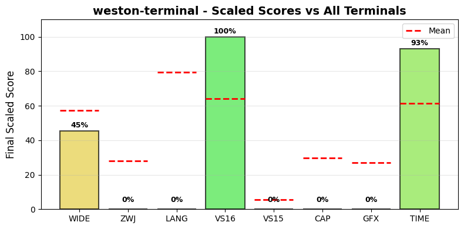

.. _westonterminal:

weston-terminal
---------------

Tested Software version 13.0.0 on Linux.
The homepage URL of this terminal is https://gitlab.freedesktop.org/wayland/weston.
Full results available at ucs-detect_ repository path
`data/westonterminal.yaml <https://github.com/jquast/ucs-detect/blob/master/data/westonterminal.yaml>`_.

.. _westonterminalscores:

Score Breakdown
+++++++++++++++

Detailed breakdown of how scores are calculated for *weston-terminal*:

.. table::
   :class: sphinx-datatable

   ===  ============================================  ===========  ====================
     #  Score Type                                    Raw Score    Final Scaled Score
   ===  ============================================  ===========  ====================
     1  :ref:`WIDE <westonterminalwide>`              99.50%       45.5%
     2  :ref:`ZWJ <westonterminalzwj>`                0.00%        0.0%
     3  :ref:`LANG <westonterminallang>`              70.15%       0.0%
     4  :ref:`VS16 <westonterminalvs16>`              100.00%      100.0%
     5  :ref:`VS15 <westonterminalvs15>`              0.00%        0.0%
     6  :ref:`Capabilities <westonterminaldecmodes>`  0.00%        0.0%
     7  :ref:`Graphics <westonterminalgraphics>`      0%           0.0%
     8  :ref:`TIME <westonterminaltime>`              8.71s        93.2%
   ===  ============================================  ===========  ====================

**Score Comparison Plot:**

The following plot shows how this terminal's scores compare to all other terminals tested.

   Scaled scores comparison across all metrics (normalized 0-100%)

**Final Scaled Score Calculation:**

- Raw Final Score: 42.17%
  (weighted average: WIDE + ZWJ + LANG + VS16 + VS15 + CAP + GFX + 0.5*TIME)
  the categorized 'average' absolute support level of this terminal
  Note: TIME is normalized to 0-1 range before averaging.
  TIME is weighted at 0.5 (half as powerful as other metrics).
  CAP (Capabilities) is the fraction of 7 notable capabilities supported.
  GFX (Graphics) scores 100% for modern protocols (iTerm2, Kitty),
  50% for legacy only (Sixel, ReGIS), 0% for none.
  Sixel/ReGIS support contributes to the GFX score at 50%.

- Final Scaled Score: 12.8%
  (normalized across all terminals tested).
  *Final Scaled scores* are normalized (0-100%) relative to all terminals tested

**WIDE Score Details:**

Wide character support calculation:

- Total successful codepoints: 5422
- Total codepoints tested: 5449
- Formula: 5422 / 5449
- Result: 99.50%

**ZWJ Score Details:**

Emoji ZWJ (Zero-Width Joiner) support calculation:

- Total successful sequences: 0
- Total sequences tested: 1445
- Formula: 0 / 1445
- Result: 0.00%

**VS16 Score Details:**

Variation Selector-16 support calculation:

- Errors: 0 of 426 codepoints tested
- Success rate: 100.0%
- Formula: 100.0 / 100
- Result: 100.00%

**VS15 Score Details:**

Variation Selector-15 support calculation:

- Errors: 158 of 158 codepoints tested
- Success rate: 0.0%
- Formula: 0.0 / 100
- Result: 0.00%

**Capabilities Score Details:**

Notable terminal capabilities (0 / 12):

- Set bracketed paste mode (2004): **no**
- Synchronized Output (2026): **no**
- Send FocusIn/FocusOut events (1004): **no**
- Enable SGR Mouse Mode (1006): **no**
- Grapheme Clustering (2027): **no**
- Bracketed Paste MIME (5522): **no**
- Kitty Keyboard: **no**
- XTGETTCAP: **no**
- Text Sizing (OSC 66): **no**
- Kitty Clipboard Protocol: **no**
- Kitty Pointer Shapes (OSC 22): **no**
- Kitty Notifications (OSC 99): **no**

Raw score: 0.00%

**Graphics Score Details:**

Graphics protocol support (0%):

- Sixel: **no**
- ReGIS: **no**
- iTerm2: **no**
- Kitty: **no**

Scoring: 100% for modern (iTerm2/Kitty), 50% for legacy only (Sixel/ReGIS), 0% for none

**TIME Score Details:**

Test execution time:

- Elapsed time: 8.71 seconds
- Note: This is a raw measurement; lower is better
- Scaled score uses inverse log10 scaling across all terminals
- Scaled result: 93.2%

**LANG Score Details (Geometric Mean):**

Geometric mean calculation:

- Formula: (p₁ × p₂ × ... × pₙ)^(1/n) where n = 94 languages
- About `geometric mean <https://en.wikipedia.org/wiki/Geometric_mean>`_
- Result: 70.15%

.. _westonterminalwide:

Wide character support
++++++++++++++++++++++

Wide character support of *weston-terminal* is **99.5%** (27 errors of 5449 codepoints tested).

Sequence of a WIDE character, from midpoint of alignment failure records:

.. table::
   :class: sphinx-datatable

   ===  =================================================  =============  ==========  =========  ========================
     #  Codepoint                                          Python         Category      wcwidth  Name
   ===  =================================================  =============  ==========  =========  ========================
     1  `U+0001D330 <https://codepoints.net/U+0001D330>`_  '\\U0001d330'  So                  2  TETRAGRAM FOR ENCOUNTERS
   ===  =================================================  =============  ==========  =========  ========================

Total codepoints: 1

- Shell test using `printf(1)`_, ``'|'`` should align in output::

        $ printf "\xf0\x9d\x8c\xb0|\\n12|\\n"
        𝌰|
        12|

- python `wcwidth.wcswidth()`_ measures width 2,
  while *weston-terminal* measures width 1.

.. _westonterminalzwj:

Emoji ZWJ support
+++++++++++++++++

Compatibility of *weston-terminal* with the Unicode Emoji ZWJ sequence table is **0.0%** (1445 errors of 1445 sequences tested).

Sequence of an Emoji ZWJ Sequence, from midpoint of alignment failure records:

.. table::
   :class: sphinx-datatable

   ===  =================================================  =============  ==========  =========  =================================
     #  Codepoint                                          Python         Category      wcwidth  Name
   ===  =================================================  =============  ==========  =========  =================================
     1  `U+0001F3C3 <https://codepoints.net/U+0001F3C3>`_  '\\U0001f3c3'  So                  2  RUNNER
     2  `U+0001F3FF <https://codepoints.net/U+0001F3FF>`_  '\\U0001f3ff'  Sk                  2  EMOJI MODIFIER FITZPATRICK TYPE-6
     3  `U+200D <https://codepoints.net/U+200D>`_          '\\u200d'      Cf                  0  ZERO WIDTH JOINER
     4  `U+2640 <https://codepoints.net/U+2640>`_          '\\u2640'      So                  1  FEMALE SIGN
     5  `U+FE0F <https://codepoints.net/U+FE0F>`_          '\\ufe0f'      Mn                  0  VARIATION SELECTOR-16
   ===  =================================================  =============  ==========  =========  =================================

Total codepoints: 5

- Shell test using `printf(1)`_, ``'|'`` should align in output::

        $ printf "\xf0\x9f\x8f\x83\xf0\x9f\x8f\xbf\xe2\x80\x8d\xe2\x99\x80\xef\xb8\x8f|\\n12|\\n"
        🏃🏿‍♀️|
        12|

- python `wcwidth.wcswidth()`_ measures width 2,
  while *weston-terminal* measures width 7.

.. _westonterminalvs16:

Variation Selector-16 support
+++++++++++++++++++++++++++++

Emoji VS-16 results for *weston-terminal* is 0 errors
out of 426 total codepoints tested, 100.0% success.
All codepoint combinations with Variation Selector-16 tested were successful.

.. _westonterminalvs15:

Variation Selector-15 support
+++++++++++++++++++++++++++++

Emoji VS-15 results for *weston-terminal* is 158 errors
out of 158 total codepoints tested, 0.0% success.
Sequence of a WIDE Emoji made NARROW by *Variation Selector-15*, from midpoint of alignment failure records:

.. table::
   :class: sphinx-datatable

   ===  =================================================  =============  ==========  =========  =====================
     #  Codepoint                                          Python         Category      wcwidth  Name
   ===  =================================================  =============  ==========  =========  =====================
     1  `U+0001F3AE <https://codepoints.net/U+0001F3AE>`_  '\\U0001f3ae'  So                  2  VIDEO GAME
     2  `U+FE0E <https://codepoints.net/U+FE0E>`_          '\\ufe0e'      Mn                  0  VARIATION SELECTOR-15
   ===  =================================================  =============  ==========  =========  =====================

Total codepoints: 2

- Shell test using `printf(1)`_, ``'|'`` should align in output::

        $ printf "\xf0\x9f\x8e\xae\xef\xb8\x8e|\\n1|\\n"
        🎮︎|
        1|

- python `wcwidth.wcswidth()`_ measures width 1,
  while *weston-terminal* measures width 3.

.. _westonterminalgraphics:

Graphics Protocol Support
+++++++++++++++++++++++++

*weston-terminal* supports the following graphics protocols: `iTerm2 inline images`_.

**Detection Methods:**

- **Sixel** and **ReGIS**: Detected via the Device Attributes (DA1) query
  ``CSI c`` (``\x1b[c``). Extension code ``4`` indicates Sixel_ support,
  ``3`` ReGIS_.
- **Kitty graphics**: Detected by sending a Kitty graphics query and
  checking for an ``OK`` response.
- **iTerm2 inline images**: Detected via the iTerm2 capabilities query
  ``OSC 1337 ; Capabilities``.

**Device Attributes Response:**

- Extensions reported: none
- Sixel_ indicator (``4``): not present
- ReGIS_ indicator (``3``): not present

.. _Sixel: https://en.wikipedia.org/wiki/Sixel
.. _ReGIS: https://en.wikipedia.org/wiki/ReGIS
.. _`iTerm2 inline images`: https://iterm2.com/documentation-images.html
.. _`Kitty graphics protocol`: https://sw.kovidgoyal.net/kitty/graphics-protocol/

.. _westonterminallang:

Language Support
++++++++++++++++

No languages were tested with 100% success.

The following 94 languages are not fully supported:

.. table::
   :class: sphinx-datatable

   =============================================================================  ==========  =========  =============
   lang                                                                             n_errors    n_total  pct_success
   =============================================================================  ==========  =========  =============
   :ref:`Maldivian <westonterminallangmaldivian>`                                        209        226  7.5%
   :ref:`Khün <westonterminallangkhn>`                                                   337        396  14.9%
   :ref:`Tibetan, Central <westonterminallangtibetancentral>`                            179        214  16.4%
   :ref:`Dzongkha <westonterminallangdzongkha>`                                          160        200  20.0%
   :ref:`Lao <westonterminallanglao>`                                                    217        277  21.7%
   :ref:`Mon <westonterminallangmon>`                                                    258        332  22.3%
   :ref:`Chakma <westonterminallangchakma>`                                              200        267  25.1%
   :ref:`Telugu <westonterminallangtelugu>`                                              286        384  25.5%
   :ref:`Thai (2) <westonterminallangthai2>`                                             186        252  26.2%
   :ref:`Thai <westonterminallangthai>`                                                  193        262  26.3%
   :ref:`Shan <westonterminallangshan>`                                                  132        181  27.1%
   :ref:`Sanskrit <westonterminallangsanskrit>`                                          354        493  28.2%
   :ref:`Burmese <westonterminallangburmese>`                                            192        268  28.4%
   :ref:`Khmer, Central <westonterminallangkhmercentral>`                                294        443  33.6%
   :ref:`Tai Dam <westonterminallangtaidam>`                                             120        189  36.5%
   :ref:`Hindi <westonterminallanghindi>`                                                247        390  36.7%
   :ref:`Marathi <westonterminallangmarathi>`                                            246        391  37.1%
   :ref:`Maithili <westonterminallangmaithili>`                                          224        357  37.3%
   :ref:`Javanese (Javanese) <westonterminallangjavanesejavanese>`                       332        530  37.4%
   :ref:`Nepali <westonterminallangnepali>`                                              218        352  38.1%
   :ref:`Bengali <westonterminallangbengali>`                                            224        385  41.8%
   :ref:`Malayalam <westonterminallangmalayalam>`                                        479        845  43.3%
   :ref:`Gujarati <westonterminallanggujarati>`                                          191        343  44.3%
   :ref:`Panjabi, Eastern <westonterminallangpanjabieastern>`                            165        302  45.4%
   :ref:`Magahi <westonterminallangmagahi>`                                              171        314  45.5%
   :ref:`Bhojpuri <westonterminallangbhojpuri>`                                          167        313  46.6%
   :ref:`Vietnamese <westonterminallangvietnamese>`                                       57        117  51.3%
   :ref:`Tagalog (Tagalog) <westonterminallangtagalogtagalog>`                            16         34  52.9%
   :ref:`Tamang, Eastern <westonterminallangtamangeastern>`                               28         70  60.0%
   :ref:`Sinhala <westonterminallangsinhala>`                                             99        258  61.6%
   :ref:`Kannada <westonterminallangkannada>`                                            104        287  63.8%
   :ref:`Urdu (2) <westonterminallangurdu2>`                                              23         82  72.0%
   :ref:`Lingala (tones) <westonterminallanglingalatones>`                                19         71  73.2%
   :ref:`Pular (Adlam) <westonterminallangpularadlam>`                                    24         93  74.2%
   :ref:`Urdu <westonterminallangurdu>`                                                   25        110  77.3%
   :ref:`Bamun <westonterminallangbamun>`                                                 17         75  77.3%
   :ref:`Ticuna <westonterminallangticuna>`                                               18         88  79.5%
   :ref:`Farsi, Western <westonterminallangfarsiwestern>`                                 10         49  79.6%
   :ref:`Sanskrit (Grantha) <westonterminallangsanskritgrantha>`                          57        293  80.5%
   :ref:`Assyrian Neo-Aramaic <westonterminallangassyrianneoaramaic>`                      8         42  81.0%
   :ref:`Yiddish, Eastern <westonterminallangyiddisheastern>`                             10         58  82.8%
   :ref:`Evenki <westonterminallangevenki>`                                               13         77  83.1%
   :ref:`Yaneshaʼ <westonterminallangyanesha>`                                            12         75  84.0%
   :ref:`Fur <westonterminallangfur>`                                                     14         90  84.4%
   :ref:`South Azerbaijani <westonterminallangsouthazerbaijani>`                          10         67  85.1%
   :ref:`Tamil <westonterminallangtamil>`                                                 26        175  85.1%
   :ref:`Tamil (Sri Lanka) <westonterminallangtamilsrilanka>`                             26        175  85.1%
   :ref:`Catalan (2) <westonterminallangcatalan2>`                                        10         68  85.3%
   :ref:`Chinantec, Chiltepec <westonterminallangchinantecchiltepec>`                     11         78  85.9%
   :ref:`Arabic, Standard <westonterminallangarabicstandard>`                              8         60  86.7%
   :ref:`Chickasaw <westonterminallangchickasaw>`                                          8         61  86.9%
   :ref:`Dari <westonterminallangdari>`                                                    7         54  87.0%
   :ref:`Kabyle <westonterminallangkabyle>`                                                8         62  87.1%
   :ref:`Tamazight, Central Atlas <westonterminallangtamazightcentralatlas>`               9         70  87.1%
   :ref:`Maori (2) <westonterminallangmaori2>`                                             6         48  87.5%
   :ref:`Mirandese <westonterminallangmirandese>`                                          7         62  88.7%
   :ref:`Gumuz <westonterminallanggumuz>`                                                  6         54  88.9%
   :ref:`Yoruba <westonterminallangyoruba>`                                                8         73  89.0%
   :ref:`Siona <westonterminallangsiona>`                                                  7         67  89.6%
   :ref:`Secoya <westonterminallangsecoya>`                                                5         53  90.6%
   :ref:`Amarakaeri <westonterminallangamarakaeri>`                                        6         64  90.6%
   :ref:`Nanai <westonterminallangnanai>`                                                  6         65  90.8%
   :ref:`Orok <westonterminallangorok>`                                                    6         65  90.8%
   :ref:`French (Welche) <westonterminallangfrenchwelche>`                                 5         60  91.7%
   :ref:`Navajo <westonterminallangnavajo>`                                                4         53  92.5%
   :ref:`Otomi, Mezquital <westonterminallangotomimezquital>`                              5         72  93.1%
   :ref:`Saint Lucian Creole French <westonterminallangsaintluciancreolefrench>`           4         58  93.1%
   :ref:`Baatonum <westonterminallangbaatonum>`                                            4         59  93.2%
   :ref:`Panjabi, Western <westonterminallangpanjabiwestern>`                              4         62  93.5%
   :ref:`Éwé <westonterminallangw>`                                                        5         79  93.7%
   :ref:`Mixtec, Metlatónoc <westonterminallangmixtecmetlatnoc>`                           4         65  93.8%
   :ref:`Mazahua Central <westonterminallangmazahuacentral>`                               4         66  93.9%
   :ref:`Tem <westonterminallangtem>`                                                      4         67  94.0%
   :ref:`Gen <westonterminallanggen>`                                                      5         87  94.3%
   :ref:`Waama <westonterminallangwaama>`                                                  3         56  94.6%
   :ref:`Uduk <westonterminallanguduk>`                                                    3         57  94.7%
   :ref:`Ga <westonterminallangga>`                                                        3         62  95.2%
   :ref:`Dagaare, Southern <westonterminallangdagaaresouthern>`                            3         63  95.2%
   :ref:`Fon <westonterminallangfon>`                                                      4         88  95.5%
   :ref:`Lamnso' <westonterminallanglamnso>`                                               3         74  95.9%
   :ref:`Aja <westonterminallangaja>`                                                      3         79  96.2%
   :ref:`Dinka, Northeastern <westonterminallangdinkanortheastern>`                        2         55  96.4%
   :ref:`Belanda Viri <westonterminallangbelandaviri>`                                     3         85  96.5%
   :ref:`Bora <westonterminallangbora>`                                                    2         59  96.6%
   :ref:`Ditammari <westonterminallangditammari>`                                          2         60  96.7%
   :ref:`Pashto, Northern <westonterminallangpashtonorthern>`                              2         62  96.8%
   :ref:`Seraiki <westonterminallangseraiki>`                                              2         64  96.9%
   :ref:`Shipibo-Conibo <westonterminallangshipiboconibo>`                                 2         64  96.9%
   :ref:`Dendi <westonterminallangdendi>`                                                  2         73  97.3%
   :ref:`Gilyak <westonterminallanggilyak>`                                                2         84  97.6%
   :ref:`Picard <westonterminallangpicard>`                                                1         53  98.1%
   :ref:`Dangme <westonterminallangdangme>`                                                1         58  98.3%
   :ref:`Veps <westonterminallangveps>`                                                    1         59  98.3%
   :ref:`Mòoré <westonterminallangmor>`                                                    1         63  98.4%
   =============================================================================  ==========  =========  =============

.. _westonterminallangmaldivian:

Maldivian
^^^^^^^^^

Sequence of language *Maldivian* from midpoint of alignment failure records:

.. table::
   :class: sphinx-datatable

   ===  =========================================  =========  ==========  =========  =================
     #  Codepoint                                  Python     Category      wcwidth  Name
   ===  =========================================  =========  ==========  =========  =================
     1  `U+0780 <https://codepoints.net/U+0780>`_  '\\u0780'  Lo                  1  THAANA LETTER HAA
     2  `U+07A6 <https://codepoints.net/U+07A6>`_  '\\u07a6'  Mn                  0  THAANA ABAFILI
   ===  =========================================  =========  ==========  =========  =================

Total codepoints: 2

- Shell test using `printf(1)`_, ``'|'`` should align in output::

        $ printf "\xde\x80\xde\xa6|\\n1|\\n"
        ހަ|
        1|

- python `wcwidth.wcswidth()`_ measures width 1,
  while *weston-terminal* measures width 2.

.. _westonterminallangkhn:

Khün
^^^^

Sequence of language *Khün* from midpoint of alignment failure records:

.. table::
   :class: sphinx-datatable

   ===  =========================================  =========  ==========  =========  ===========================
     #  Codepoint                                  Python     Category      wcwidth  Name
   ===  =========================================  =========  ==========  =========  ===========================
     1  `U+1A2F <https://codepoints.net/U+1A2F>`_  '\\u1a2f'  Lo                  1  TAI THAM LETTER DA
     2  `U+1A60 <https://codepoints.net/U+1A60>`_  '\\u1a60'  Mn                  0  TAI THAM SIGN SAKOT
     3  `U+1A45 <https://codepoints.net/U+1A45>`_  '\\u1a45'  Lo                  1  TAI THAM LETTER WA
     4  `U+1A60 <https://codepoints.net/U+1A60>`_  '\\u1a60'  Mn                  0  TAI THAM SIGN SAKOT
     5  `U+1A3F <https://codepoints.net/U+1A3F>`_  '\\u1a3f'  Lo                  1  TAI THAM LETTER LOW YA
     6  `U+1A62 <https://codepoints.net/U+1A62>`_  '\\u1a62'  Mn                  0  TAI THAM VOWEL SIGN MAI SAT
   ===  =========================================  =========  ==========  =========  ===========================

Total codepoints: 6

- Shell test using `printf(1)`_, ``'|'`` should align in output::

        $ printf "\xe1\xa8\xaf\xe1\xa9\xa0\xe1\xa9\x85\xe1\xa9\xa0\xe1\xa8\xbf\xe1\xa9\xa2|\\n123|\\n"
        ᨯ᩠ᩅ᩠ᨿᩢ|
        123|

- python `wcwidth.wcswidth()`_ measures width 3,
  while *weston-terminal* measures width 6.

.. _westonterminallangtibetancentral:

Tibetan, Central
^^^^^^^^^^^^^^^^

Sequence of language *Tibetan, Central* from midpoint of alignment failure records:

.. table::
   :class: sphinx-datatable

   ===  =========================================  =========  ==========  =========  ====================
     #  Codepoint                                  Python     Category      wcwidth  Name
   ===  =========================================  =========  ==========  =========  ====================
     1  `U+0F40 <https://codepoints.net/U+0F40>`_  '\\u0f40'  Lo                  1  TIBETAN LETTER KA
     2  `U+0F74 <https://codepoints.net/U+0F74>`_  '\\u0f74'  Mn                  0  TIBETAN VOWEL SIGN U
   ===  =========================================  =========  ==========  =========  ====================

Total codepoints: 2

- Shell test using `printf(1)`_, ``'|'`` should align in output::

        $ printf "\xe0\xbd\x80\xe0\xbd\xb4|\\n1|\\n"
        ཀུ|
        1|

.. _westonterminallangdzongkha:

Dzongkha
^^^^^^^^

Sequence of language *Dzongkha* from midpoint of alignment failure records:

.. table::
   :class: sphinx-datatable

   ===  =========================================  =========  ==========  =========  ====================
     #  Codepoint                                  Python     Category      wcwidth  Name
   ===  =========================================  =========  ==========  =========  ====================
     1  `U+0F40 <https://codepoints.net/U+0F40>`_  '\\u0f40'  Lo                  1  TIBETAN LETTER KA
     2  `U+0F74 <https://codepoints.net/U+0F74>`_  '\\u0f74'  Mn                  0  TIBETAN VOWEL SIGN U
   ===  =========================================  =========  ==========  =========  ====================

Total codepoints: 2

- Shell test using `printf(1)`_, ``'|'`` should align in output::

        $ printf "\xe0\xbd\x80\xe0\xbd\xb4|\\n1|\\n"
        ཀུ|
        1|

- python `wcwidth.wcswidth()`_ measures width 1,
  while *weston-terminal* measures width 2.

.. _westonterminallanglao:

Lao
^^^

Sequence of language *Lao* from midpoint of alignment failure records:

.. table::
   :class: sphinx-datatable

   ===  =========================================  =========  ==========  =========  ======================
     #  Codepoint                                  Python     Category      wcwidth  Name
   ===  =========================================  =========  ==========  =========  ======================
     1  `U+0E81 <https://codepoints.net/U+0E81>`_  '\\u0e81'  Lo                  1  LAO LETTER KO
     2  `U+0EB1 <https://codepoints.net/U+0EB1>`_  '\\u0eb1'  Mn                  0  LAO VOWEL SIGN MAI KAN
   ===  =========================================  =========  ==========  =========  ======================

Total codepoints: 2

- Shell test using `printf(1)`_, ``'|'`` should align in output::

        $ printf "\xe0\xba\x81\xe0\xba\xb1|\\n1|\\n"
        ກັ|
        1|

- python `wcwidth.wcswidth()`_ measures width 1,
  while *weston-terminal* measures width 2.

.. _westonterminallangmon:

Mon
^^^

Sequence of language *Mon* from midpoint of alignment failure records:

.. table::
   :class: sphinx-datatable

   ===  =========================================  =========  ==========  =========  ====================
     #  Codepoint                                  Python     Category      wcwidth  Name
   ===  =========================================  =========  ==========  =========  ====================
     1  `U+1012 <https://codepoints.net/U+1012>`_  '\\u1012'  Lo                  1  MYANMAR LETTER DA
     2  `U+1039 <https://codepoints.net/U+1039>`_  '\\u1039'  Mn                  0  MYANMAR SIGN VIRAMA
     3  `U+1002 <https://codepoints.net/U+1002>`_  '\\u1002'  Lo                  1  MYANMAR LETTER GA
     4  `U+1031 <https://codepoints.net/U+1031>`_  '\\u1031'  Mc                  0  MYANMAR VOWEL SIGN E
   ===  =========================================  =========  ==========  =========  ====================

Total codepoints: 4

- Shell test using `printf(1)`_, ``'|'`` should align in output::

        $ printf "\xe1\x80\x92\xe1\x80\xb9\xe1\x80\x82\xe1\x80\xb1|\\n123|\\n"
        ဒ္ဂေ|
        123|

- python `wcwidth.wcswidth()`_ measures width 3,
  while *weston-terminal* measures width 4.

.. _westonterminallangchakma:

Chakma
^^^^^^

Sequence of language *Chakma* from midpoint of alignment failure records:

.. table::
   :class: sphinx-datatable

   ===  =================================================  =============  ==========  =========  ===================
     #  Codepoint                                          Python         Category      wcwidth  Name
   ===  =================================================  =============  ==========  =========  ===================
     1  `U+00011107 <https://codepoints.net/U+00011107>`_  '\\U00011107'  Lo                  1  CHAKMA LETTER KAA
     2  `U+00011133 <https://codepoints.net/U+00011133>`_  '\\U00011133'  Mn                  0  CHAKMA VIRAMA
     3  `U+00011120 <https://codepoints.net/U+00011120>`_  '\\U00011120'  Lo                  1  CHAKMA LETTER YYAA
     4  `U+0001112C <https://codepoints.net/U+0001112C>`_  '\\U0001112c'  Mc                  0  CHAKMA VOWEL SIGN E
   ===  =================================================  =============  ==========  =========  ===================

Total codepoints: 4

- Shell test using `printf(1)`_, ``'|'`` should align in output::

        $ printf "\xf0\x91\x84\x87\xf0\x91\x84\xb3\xf0\x91\x84\xa0\xf0\x91\x84\xac|\\n123|\\n"
        𑄇𑄳𑄠𑄬|
        123|

- python `wcwidth.wcswidth()`_ measures width 3,
  while *weston-terminal* measures width 4.

.. _westonterminallangtelugu:

Telugu
^^^^^^

Sequence of language *Telugu* from midpoint of alignment failure records:

.. table::
   :class: sphinx-datatable

   ===  =========================================  =========  ==========  =========  ====================
     #  Codepoint                                  Python     Category      wcwidth  Name
   ===  =========================================  =========  ==========  =========  ====================
     1  `U+0C15 <https://codepoints.net/U+0C15>`_  '\\u0c15'  Lo                  1  TELUGU LETTER KA
     2  `U+0C3E <https://codepoints.net/U+0C3E>`_  '\\u0c3e'  Mn                  0  TELUGU VOWEL SIGN AA
     3  `U+0C02 <https://codepoints.net/U+0C02>`_  '\\u0c02'  Mc                  0  TELUGU SIGN ANUSVARA
   ===  =========================================  =========  ==========  =========  ====================

Total codepoints: 3

- Shell test using `printf(1)`_, ``'|'`` should align in output::

        $ printf "\xe0\xb0\x95\xe0\xb0\xbe\xe0\xb0\x82|\\n12|\\n"
        కాం|
        12|

- python `wcwidth.wcswidth()`_ measures width 2,
  while *weston-terminal* measures width 3.

.. _westonterminallangthai2:

Thai (2)
^^^^^^^^

Sequence of language *Thai (2)* from midpoint of alignment failure records:

.. table::
   :class: sphinx-datatable

   ===  =========================================  =========  ==========  =========  ======================
     #  Codepoint                                  Python     Category      wcwidth  Name
   ===  =========================================  =========  ==========  =========  ======================
     1  `U+0E22 <https://codepoints.net/U+0E22>`_  '\\u0e22'  Lo                  1  THAI CHARACTER YO YAK
     2  `U+0E48 <https://codepoints.net/U+0E48>`_  '\\u0e48'  Mn                  0  THAI CHARACTER MAI EK
     3  `U+0E33 <https://codepoints.net/U+0E33>`_  '\\u0e33'  Lo                  1  THAI CHARACTER SARA AM
   ===  =========================================  =========  ==========  =========  ======================

Total codepoints: 3

- Shell test using `printf(1)`_, ``'|'`` should align in output::

        $ printf "\xe0\xb8\xa2\xe0\xb9\x88\xe0\xb8\xb3|\\n12|\\n"
        ย่ำ|
        12|

- python `wcwidth.wcswidth()`_ measures width 2,
  while *weston-terminal* measures width 3.

.. _westonterminallangthai:

Thai
^^^^

Sequence of language *Thai* from midpoint of alignment failure records:

.. table::
   :class: sphinx-datatable

   ===  =========================================  =========  ==========  =========  ======================
     #  Codepoint                                  Python     Category      wcwidth  Name
   ===  =========================================  =========  ==========  =========  ======================
     1  `U+0E15 <https://codepoints.net/U+0E15>`_  '\\u0e15'  Lo                  1  THAI CHARACTER TO TAO
     2  `U+0E48 <https://codepoints.net/U+0E48>`_  '\\u0e48'  Mn                  0  THAI CHARACTER MAI EK
     3  `U+0E33 <https://codepoints.net/U+0E33>`_  '\\u0e33'  Lo                  1  THAI CHARACTER SARA AM
   ===  =========================================  =========  ==========  =========  ======================

Total codepoints: 3

- Shell test using `printf(1)`_, ``'|'`` should align in output::

        $ printf "\xe0\xb8\x95\xe0\xb9\x88\xe0\xb8\xb3|\\n12|\\n"
        ต่ำ|
        12|

- python `wcwidth.wcswidth()`_ measures width 2,
  while *weston-terminal* measures width 3.

.. _westonterminallangshan:

Shan
^^^^

Sequence of language *Shan* from midpoint of alignment failure records:

.. table::
   :class: sphinx-datatable

   ===  =========================================  =========  ==========  =========  ==================
     #  Codepoint                                  Python     Category      wcwidth  Name
   ===  =========================================  =========  ==========  =========  ==================
     1  `U+1004 <https://codepoints.net/U+1004>`_  '\\u1004'  Lo                  1  MYANMAR LETTER NGA
     2  `U+103A <https://codepoints.net/U+103A>`_  '\\u103a'  Mn                  0  MYANMAR SIGN ASAT
   ===  =========================================  =========  ==========  =========  ==================

Total codepoints: 2

- Shell test using `printf(1)`_, ``'|'`` should align in output::

        $ printf "\xe1\x80\x84\xe1\x80\xba|\\n1|\\n"
        င်|
        1|

.. _westonterminallangsanskrit:

Sanskrit
^^^^^^^^

Sequence of language *Sanskrit* from midpoint of alignment failure records:

.. table::
   :class: sphinx-datatable

   ===  =========================================  =========  ==========  =========  ========================
     #  Codepoint                                  Python     Category      wcwidth  Name
   ===  =========================================  =========  ==========  =========  ========================
     1  `U+0915 <https://codepoints.net/U+0915>`_  '\\u0915'  Lo                  1  DEVANAGARI LETTER KA
     2  `U+093E <https://codepoints.net/U+093E>`_  '\\u093e'  Mc                  0  DEVANAGARI VOWEL SIGN AA
     3  `U+0902 <https://codepoints.net/U+0902>`_  '\\u0902'  Mn                  0  DEVANAGARI SIGN ANUSVARA
   ===  =========================================  =========  ==========  =========  ========================

Total codepoints: 3

- Shell test using `printf(1)`_, ``'|'`` should align in output::

        $ printf "\xe0\xa4\x95\xe0\xa4\xbe\xe0\xa4\x82|\\n12|\\n"
        कां|
        12|

.. _westonterminallangburmese:

Burmese
^^^^^^^

Sequence of language *Burmese* from midpoint of alignment failure records:

.. table::
   :class: sphinx-datatable

   ===  =========================================  =========  ==========  =========  ===================
     #  Codepoint                                  Python     Category      wcwidth  Name
   ===  =========================================  =========  ==========  =========  ===================
     1  `U+1000 <https://codepoints.net/U+1000>`_  '\\u1000'  Lo                  1  MYANMAR LETTER KA
     2  `U+1039 <https://codepoints.net/U+1039>`_  '\\u1039'  Mn                  0  MYANMAR SIGN VIRAMA
     3  `U+1001 <https://codepoints.net/U+1001>`_  '\\u1001'  Lo                  1  MYANMAR LETTER KHA
   ===  =========================================  =========  ==========  =========  ===================

Total codepoints: 3

- Shell test using `printf(1)`_, ``'|'`` should align in output::

        $ printf "\xe1\x80\x80\xe1\x80\xb9\xe1\x80\x81|\\n12|\\n"
        က္ခ|
        12|

- python `wcwidth.wcswidth()`_ measures width 2,
  while *weston-terminal* measures width 3.

.. _westonterminallangkhmercentral:

Khmer, Central
^^^^^^^^^^^^^^

Sequence of language *Khmer, Central* from midpoint of alignment failure records:

.. table::
   :class: sphinx-datatable

   ===  =========================================  =========  ==========  =========  ===================
     #  Codepoint                                  Python     Category      wcwidth  Name
   ===  =========================================  =========  ==========  =========  ===================
     1  `U+1780 <https://codepoints.net/U+1780>`_  '\\u1780'  Lo                  1  KHMER LETTER KA
     2  `U+17D2 <https://codepoints.net/U+17D2>`_  '\\u17d2'  Mn                  0  KHMER SIGN COENG
     3  `U+178A <https://codepoints.net/U+178A>`_  '\\u178a'  Lo                  1  KHMER LETTER DA
     4  `U+17C5 <https://codepoints.net/U+17C5>`_  '\\u17c5'  Mc                  0  KHMER VOWEL SIGN AU
   ===  =========================================  =========  ==========  =========  ===================

Total codepoints: 4

- Shell test using `printf(1)`_, ``'|'`` should align in output::

        $ printf "\xe1\x9e\x80\xe1\x9f\x92\xe1\x9e\x8a\xe1\x9f\x85|\\n123|\\n"
        ក្ដៅ|
        123|

- python `wcwidth.wcswidth()`_ measures width 3,
  while *weston-terminal* measures width 4.

.. _westonterminallangtaidam:

Tai Dam
^^^^^^^

Sequence of language *Tai Dam* from midpoint of alignment failure records:

.. table::
   :class: sphinx-datatable

   ===  =========================================  =========  ==========  =========  ======================
     #  Codepoint                                  Python     Category      wcwidth  Name
   ===  =========================================  =========  ==========  =========  ======================
     1  `U+AA80 <https://codepoints.net/U+AA80>`_  '\\uaa80'  Lo                  1  TAI VIET LETTER LOW KO
     2  `U+AAB0 <https://codepoints.net/U+AAB0>`_  '\\uaab0'  Mn                  0  TAI VIET MAI KANG
   ===  =========================================  =========  ==========  =========  ======================

Total codepoints: 2

- Shell test using `printf(1)`_, ``'|'`` should align in output::

        $ printf "\xea\xaa\x80\xea\xaa\xb0|\\n1|\\n"
        ꪀꪰ|
        1|

- python `wcwidth.wcswidth()`_ measures width 1,
  while *weston-terminal* measures width 2.

.. _westonterminallanghindi:

Hindi
^^^^^

Sequence of language *Hindi* from midpoint of alignment failure records:

.. table::
   :class: sphinx-datatable

   ===  =========================================  =========  ==========  =========  ======================
     #  Codepoint                                  Python     Category      wcwidth  Name
   ===  =========================================  =========  ==========  =========  ======================
     1  `U+0915 <https://codepoints.net/U+0915>`_  '\\u0915'  Lo                  1  DEVANAGARI LETTER KA
     2  `U+094D <https://codepoints.net/U+094D>`_  '\\u094d'  Mn                  0  DEVANAGARI SIGN VIRAMA
     3  `U+0924 <https://codepoints.net/U+0924>`_  '\\u0924'  Lo                  1  DEVANAGARI LETTER TA
   ===  =========================================  =========  ==========  =========  ======================

Total codepoints: 3

- Shell test using `printf(1)`_, ``'|'`` should align in output::

        $ printf "\xe0\xa4\x95\xe0\xa5\x8d\xe0\xa4\xa4|\\n12|\\n"
        क्त|
        12|

.. _westonterminallangmarathi:

Marathi
^^^^^^^

Sequence of language *Marathi* from midpoint of alignment failure records:

.. table::
   :class: sphinx-datatable

   ===  =========================================  =========  ==========  =========  ========================
     #  Codepoint                                  Python     Category      wcwidth  Name
   ===  =========================================  =========  ==========  =========  ========================
     1  `U+0915 <https://codepoints.net/U+0915>`_  '\\u0915'  Lo                  1  DEVANAGARI LETTER KA
     2  `U+093E <https://codepoints.net/U+093E>`_  '\\u093e'  Mc                  0  DEVANAGARI VOWEL SIGN AA
     3  `U+0902 <https://codepoints.net/U+0902>`_  '\\u0902'  Mn                  0  DEVANAGARI SIGN ANUSVARA
   ===  =========================================  =========  ==========  =========  ========================

Total codepoints: 3

- Shell test using `printf(1)`_, ``'|'`` should align in output::

        $ printf "\xe0\xa4\x95\xe0\xa4\xbe\xe0\xa4\x82|\\n12|\\n"
        कां|
        12|

.. _westonterminallangmaithili:

Maithili
^^^^^^^^

Sequence of language *Maithili* from midpoint of alignment failure records:

.. table::
   :class: sphinx-datatable

   ===  =========================================  =========  ==========  =========  ========================
     #  Codepoint                                  Python     Category      wcwidth  Name
   ===  =========================================  =========  ==========  =========  ========================
     1  `U+0915 <https://codepoints.net/U+0915>`_  '\\u0915'  Lo                  1  DEVANAGARI LETTER KA
     2  `U+093E <https://codepoints.net/U+093E>`_  '\\u093e'  Mc                  0  DEVANAGARI VOWEL SIGN AA
     3  `U+0902 <https://codepoints.net/U+0902>`_  '\\u0902'  Mn                  0  DEVANAGARI SIGN ANUSVARA
   ===  =========================================  =========  ==========  =========  ========================

Total codepoints: 3

- Shell test using `printf(1)`_, ``'|'`` should align in output::

        $ printf "\xe0\xa4\x95\xe0\xa4\xbe\xe0\xa4\x82|\\n12|\\n"
        कां|
        12|

.. _westonterminallangjavanesejavanese:

Javanese (Javanese)
^^^^^^^^^^^^^^^^^^^

Sequence of language *Javanese (Javanese)* from midpoint of alignment failure records:

.. table::
   :class: sphinx-datatable

   ===  =========================================  =========  ==========  =========  =============================
     #  Codepoint                                  Python     Category      wcwidth  Name
   ===  =========================================  =========  ==========  =========  =============================
     1  `U+A98F <https://codepoints.net/U+A98F>`_  '\\ua98f'  Lo                  1  JAVANESE LETTER KA
     2  `U+A9C0 <https://codepoints.net/U+A9C0>`_  '\\ua9c0'  Mc                  0  JAVANESE PANGKON
     3  `U+A9A5 <https://codepoints.net/U+A9A5>`_  '\\ua9a5'  Lo                  1  JAVANESE LETTER PA
     4  `U+A9BF <https://codepoints.net/U+A9BF>`_  '\\ua9bf'  Mc                  0  JAVANESE CONSONANT SIGN CAKRA
     5  `U+A9B6 <https://codepoints.net/U+A9B6>`_  '\\ua9b6'  Mn                  0  JAVANESE VOWEL SIGN WULU
   ===  =========================================  =========  ==========  =========  =============================

Total codepoints: 5

- Shell test using `printf(1)`_, ``'|'`` should align in output::

        $ printf "\xea\xa6\x8f\xea\xa7\x80\xea\xa6\xa5\xea\xa6\xbf\xea\xa6\xb6|\\n1234|\\n"
        ꦏ꧀ꦥꦿꦶ|
        1234|

- python `wcwidth.wcswidth()`_ measures width 4,
  while *weston-terminal* measures width 5.

.. _westonterminallangnepali:

Nepali
^^^^^^

Sequence of language *Nepali* from midpoint of alignment failure records:

.. table::
   :class: sphinx-datatable

   ===  =========================================  =========  ==========  =========  ========================
     #  Codepoint                                  Python     Category      wcwidth  Name
   ===  =========================================  =========  ==========  =========  ========================
     1  `U+0915 <https://codepoints.net/U+0915>`_  '\\u0915'  Lo                  1  DEVANAGARI LETTER KA
     2  `U+093E <https://codepoints.net/U+093E>`_  '\\u093e'  Mc                  0  DEVANAGARI VOWEL SIGN AA
     3  `U+0902 <https://codepoints.net/U+0902>`_  '\\u0902'  Mn                  0  DEVANAGARI SIGN ANUSVARA
   ===  =========================================  =========  ==========  =========  ========================

Total codepoints: 3

- Shell test using `printf(1)`_, ``'|'`` should align in output::

        $ printf "\xe0\xa4\x95\xe0\xa4\xbe\xe0\xa4\x82|\\n12|\\n"
        कां|
        12|

.. _westonterminallangbengali:

Bengali
^^^^^^^

Sequence of language *Bengali* from midpoint of alignment failure records:

.. table::
   :class: sphinx-datatable

   ===  =========================================  =========  ==========  =========  =====================
     #  Codepoint                                  Python     Category      wcwidth  Name
   ===  =========================================  =========  ==========  =========  =====================
     1  `U+0995 <https://codepoints.net/U+0995>`_  '\\u0995'  Lo                  1  BENGALI LETTER KA
     2  `U+09BE <https://codepoints.net/U+09BE>`_  '\\u09be'  Mc                  0  BENGALI VOWEL SIGN AA
     3  `U+200C <https://codepoints.net/U+200C>`_  '\\u200c'  Cf                  0  ZERO WIDTH NON-JOINER
   ===  =========================================  =========  ==========  =========  =====================

Total codepoints: 3

- Shell test using `printf(1)`_, ``'|'`` should align in output::

        $ printf "\xe0\xa6\x95\xe0\xa6\xbe\xe2\x80\x8c|\\n12|\\n"
        কা‌|
        12|

- python `wcwidth.wcswidth()`_ measures width 2,
  while *weston-terminal* measures width 3.

.. _westonterminallangmalayalam:

Malayalam
^^^^^^^^^

Sequence of language *Malayalam* from midpoint of alignment failure records:

.. table::
   :class: sphinx-datatable

   ===  =========================================  =========  ==========  =========  =====================
     #  Codepoint                                  Python     Category      wcwidth  Name
   ===  =========================================  =========  ==========  =========  =====================
     1  `U+0D15 <https://codepoints.net/U+0D15>`_  '\\u0d15'  Lo                  1  MALAYALAM LETTER KA
     2  `U+0D4D <https://codepoints.net/U+0D4D>`_  '\\u0d4d'  Mn                  0  MALAYALAM SIGN VIRAMA
     3  `U+0D15 <https://codepoints.net/U+0D15>`_  '\\u0d15'  Lo                  1  MALAYALAM LETTER KA
   ===  =========================================  =========  ==========  =========  =====================

Total codepoints: 3

- Shell test using `printf(1)`_, ``'|'`` should align in output::

        $ printf "\xe0\xb4\x95\xe0\xb5\x8d\xe0\xb4\x95|\\n12|\\n"
        ക്ക|
        12|

- python `wcwidth.wcswidth()`_ measures width 2,
  while *weston-terminal* measures width 3.

.. _westonterminallanggujarati:

Gujarati
^^^^^^^^

Sequence of language *Gujarati* from midpoint of alignment failure records:

.. table::
   :class: sphinx-datatable

   ===  =========================================  =========  ==========  =========  ======================
     #  Codepoint                                  Python     Category      wcwidth  Name
   ===  =========================================  =========  ==========  =========  ======================
     1  `U+0A95 <https://codepoints.net/U+0A95>`_  '\\u0a95'  Lo                  1  GUJARATI LETTER KA
     2  `U+0ABE <https://codepoints.net/U+0ABE>`_  '\\u0abe'  Mc                  0  GUJARATI VOWEL SIGN AA
     3  `U+0A82 <https://codepoints.net/U+0A82>`_  '\\u0a82'  Mn                  0  GUJARATI SIGN ANUSVARA
   ===  =========================================  =========  ==========  =========  ======================

Total codepoints: 3

- Shell test using `printf(1)`_, ``'|'`` should align in output::

        $ printf "\xe0\xaa\x95\xe0\xaa\xbe\xe0\xaa\x82|\\n12|\\n"
        કાં|
        12|

- python `wcwidth.wcswidth()`_ measures width 2,
  while *weston-terminal* measures width 3.

.. _westonterminallangpanjabieastern:

Panjabi, Eastern
^^^^^^^^^^^^^^^^

Sequence of language *Panjabi, Eastern* from midpoint of alignment failure records:

.. table::
   :class: sphinx-datatable

   ===  =========================================  =========  ==========  =========  ======================
     #  Codepoint                                  Python     Category      wcwidth  Name
   ===  =========================================  =========  ==========  =========  ======================
     1  `U+0A15 <https://codepoints.net/U+0A15>`_  '\\u0a15'  Lo                  1  GURMUKHI LETTER KA
     2  `U+0A3E <https://codepoints.net/U+0A3E>`_  '\\u0a3e'  Mc                  0  GURMUKHI VOWEL SIGN AA
     3  `U+0A02 <https://codepoints.net/U+0A02>`_  '\\u0a02'  Mn                  0  GURMUKHI SIGN BINDI
   ===  =========================================  =========  ==========  =========  ======================

Total codepoints: 3

- Shell test using `printf(1)`_, ``'|'`` should align in output::

        $ printf "\xe0\xa8\x95\xe0\xa8\xbe\xe0\xa8\x82|\\n12|\\n"
        ਕਾਂ|
        12|

- python `wcwidth.wcswidth()`_ measures width 2,
  while *weston-terminal* measures width 3.

.. _westonterminallangmagahi:

Magahi
^^^^^^

Sequence of language *Magahi* from midpoint of alignment failure records:

.. table::
   :class: sphinx-datatable

   ===  =========================================  =========  ==========  =========  ======================
     #  Codepoint                                  Python     Category      wcwidth  Name
   ===  =========================================  =========  ==========  =========  ======================
     1  `U+0915 <https://codepoints.net/U+0915>`_  '\\u0915'  Lo                  1  DEVANAGARI LETTER KA
     2  `U+094D <https://codepoints.net/U+094D>`_  '\\u094d'  Mn                  0  DEVANAGARI SIGN VIRAMA
     3  `U+0915 <https://codepoints.net/U+0915>`_  '\\u0915'  Lo                  1  DEVANAGARI LETTER KA
   ===  =========================================  =========  ==========  =========  ======================

Total codepoints: 3

- Shell test using `printf(1)`_, ``'|'`` should align in output::

        $ printf "\xe0\xa4\x95\xe0\xa5\x8d\xe0\xa4\x95|\\n12|\\n"
        क्क|
        12|

.. _westonterminallangbhojpuri:

Bhojpuri
^^^^^^^^

Sequence of language *Bhojpuri* from midpoint of alignment failure records:

.. table::
   :class: sphinx-datatable

   ===  =========================================  =========  ==========  =========  ======================
     #  Codepoint                                  Python     Category      wcwidth  Name
   ===  =========================================  =========  ==========  =========  ======================
     1  `U+0915 <https://codepoints.net/U+0915>`_  '\\u0915'  Lo                  1  DEVANAGARI LETTER KA
     2  `U+094D <https://codepoints.net/U+094D>`_  '\\u094d'  Mn                  0  DEVANAGARI SIGN VIRAMA
     3  `U+0915 <https://codepoints.net/U+0915>`_  '\\u0915'  Lo                  1  DEVANAGARI LETTER KA
   ===  =========================================  =========  ==========  =========  ======================

Total codepoints: 3

- Shell test using `printf(1)`_, ``'|'`` should align in output::

        $ printf "\xe0\xa4\x95\xe0\xa5\x8d\xe0\xa4\x95|\\n12|\\n"
        क्क|
        12|

- python `wcwidth.wcswidth()`_ measures width 2,
  while *weston-terminal* measures width 3.

.. _westonterminallangvietnamese:

Vietnamese
^^^^^^^^^^

Sequence of language *Vietnamese* from midpoint of alignment failure records:

.. table::
   :class: sphinx-datatable

   ===  =========================================  =========  ==========  =========  ======================
     #  Codepoint                                  Python     Category      wcwidth  Name
   ===  =========================================  =========  ==========  =========  ======================
     1  `U+0061 <https://codepoints.net/U+0061>`_  'a'        Ll                  1  LATIN SMALL LETTER A
     2  `U+0300 <https://codepoints.net/U+0300>`_  '\\u0300'  Mn                  0  COMBINING GRAVE ACCENT
   ===  =========================================  =========  ==========  =========  ======================

Total codepoints: 2

- Shell test using `printf(1)`_, ``'|'`` should align in output::

        $ printf "a\xcc\x80|\\n1|\\n"
        à|
        1|

.. _westonterminallangtagalogtagalog:

Tagalog (Tagalog)
^^^^^^^^^^^^^^^^^

Sequence of language *Tagalog (Tagalog)* from midpoint of alignment failure records:

.. table::
   :class: sphinx-datatable

   ===  =========================================  =========  ==========  =========  ===================
     #  Codepoint                                  Python     Category      wcwidth  Name
   ===  =========================================  =========  ==========  =========  ===================
     1  `U+1704 <https://codepoints.net/U+1704>`_  '\\u1704'  Lo                  1  TAGALOG LETTER GA
     2  `U+1714 <https://codepoints.net/U+1714>`_  '\\u1714'  Mn                  0  TAGALOG SIGN VIRAMA
   ===  =========================================  =========  ==========  =========  ===================

Total codepoints: 2

- Shell test using `printf(1)`_, ``'|'`` should align in output::

        $ printf "\xe1\x9c\x84\xe1\x9c\x94|\\n1|\\n"
        ᜄ᜔|
        1|

- python `wcwidth.wcswidth()`_ measures width 1,
  while *weston-terminal* measures width 2.

.. _westonterminallangtamangeastern:

Tamang, Eastern
^^^^^^^^^^^^^^^

Sequence of language *Tamang, Eastern* from midpoint of alignment failure records:

.. table::
   :class: sphinx-datatable

   ===  =========================================  =========  ==========  =========  =======================
     #  Codepoint                                  Python     Category      wcwidth  Name
   ===  =========================================  =========  ==========  =========  =======================
     1  `U+0915 <https://codepoints.net/U+0915>`_  '\\u0915'  Lo                  1  DEVANAGARI LETTER KA
     2  `U+094D <https://codepoints.net/U+094D>`_  '\\u094d'  Mn                  0  DEVANAGARI SIGN VIRAMA
     3  `U+0924 <https://codepoints.net/U+0924>`_  '\\u0924'  Lo                  1  DEVANAGARI LETTER TA
     4  `U+093F <https://codepoints.net/U+093F>`_  '\\u093f'  Mc                  0  DEVANAGARI VOWEL SIGN I
   ===  =========================================  =========  ==========  =========  =======================

Total codepoints: 4

- Shell test using `printf(1)`_, ``'|'`` should align in output::

        $ printf "\xe0\xa4\x95\xe0\xa5\x8d\xe0\xa4\xa4\xe0\xa4\xbf|\\n12|\\n"
        क्ति|
        12|

.. _westonterminallangsinhala:

Sinhala
^^^^^^^

Sequence of language *Sinhala* from midpoint of alignment failure records:

.. table::
   :class: sphinx-datatable

   ===  =========================================  =========  ==========  =========  =================================
     #  Codepoint                                  Python     Category      wcwidth  Name
   ===  =========================================  =========  ==========  =========  =================================
     1  `U+0DAF <https://codepoints.net/U+0DAF>`_  '\\u0daf'  Lo                  1  SINHALA LETTER ALPAPRAANA DAYANNA
     2  `U+0DD2 <https://codepoints.net/U+0DD2>`_  '\\u0dd2'  Mn                  0  SINHALA VOWEL SIGN KETTI IS-PILLA
     3  `U+0D82 <https://codepoints.net/U+0D82>`_  '\\u0d82'  Mc                  0  SINHALA SIGN ANUSVARAYA
   ===  =========================================  =========  ==========  =========  =================================

Total codepoints: 3

- Shell test using `printf(1)`_, ``'|'`` should align in output::

        $ printf "\xe0\xb6\xaf\xe0\xb7\x92\xe0\xb6\x82|\\n12|\\n"
        දිං|
        12|

- python `wcwidth.wcswidth()`_ measures width 2,
  while *weston-terminal* measures width 3.

.. _westonterminallangkannada:

Kannada
^^^^^^^

Sequence of language *Kannada* from midpoint of alignment failure records:

.. table::
   :class: sphinx-datatable

   ===  =========================================  =========  ==========  =========  =====================
     #  Codepoint                                  Python     Category      wcwidth  Name
   ===  =========================================  =========  ==========  =========  =====================
     1  `U+0C95 <https://codepoints.net/U+0C95>`_  '\\u0c95'  Lo                  1  KANNADA LETTER KA
     2  `U+0CBE <https://codepoints.net/U+0CBE>`_  '\\u0cbe'  Mc                  0  KANNADA VOWEL SIGN AA
     3  `U+0C82 <https://codepoints.net/U+0C82>`_  '\\u0c82'  Mc                  0  KANNADA SIGN ANUSVARA
   ===  =========================================  =========  ==========  =========  =====================

Total codepoints: 3

- Shell test using `printf(1)`_, ``'|'`` should align in output::

        $ printf "\xe0\xb2\x95\xe0\xb2\xbe\xe0\xb2\x82|\\n12|\\n"
        ಕಾಂ|
        12|

- python `wcwidth.wcswidth()`_ measures width 2,
  while *weston-terminal* measures width 3.

.. _westonterminallangurdu2:

Urdu (2)
^^^^^^^^

Sequence of language *Urdu (2)* from midpoint of alignment failure records:

.. table::
   :class: sphinx-datatable

   ===  =========================================  =========  ==========  =========  ==================
     #  Codepoint                                  Python     Category      wcwidth  Name
   ===  =========================================  =========  ==========  =========  ==================
     1  `U+0627 <https://codepoints.net/U+0627>`_  '\\u0627'  Lo                  1  ARABIC LETTER ALEF
     2  `U+064B <https://codepoints.net/U+064B>`_  '\\u064b'  Mn                  0  ARABIC FATHATAN
   ===  =========================================  =========  ==========  =========  ==================

Total codepoints: 2

- Shell test using `printf(1)`_, ``'|'`` should align in output::

        $ printf "\xd8\xa7\xd9\x8b|\\n1|\\n"
        اً|
        1|

.. _westonterminallanglingalatones:

Lingala (tones)
^^^^^^^^^^^^^^^

Sequence of language *Lingala (tones)* from midpoint of alignment failure records:

.. table::
   :class: sphinx-datatable

   ===  =========================================  =========  ==========  =========  ======================
     #  Codepoint                                  Python     Category      wcwidth  Name
   ===  =========================================  =========  ==========  =========  ======================
     1  `U+0045 <https://codepoints.net/U+0045>`_  'E'        Lu                  1  LATIN CAPITAL LETTER E
     2  `U+0301 <https://codepoints.net/U+0301>`_  '\\u0301'  Mn                  0  COMBINING ACUTE ACCENT
   ===  =========================================  =========  ==========  =========  ======================

Total codepoints: 2

- Shell test using `printf(1)`_, ``'|'`` should align in output::

        $ printf "E\xcc\x81|\\n1|\\n"
        É|
        1|

.. _westonterminallangpularadlam:

Pular (Adlam)
^^^^^^^^^^^^^

Sequence of language *Pular (Adlam)* from midpoint of alignment failure records:

.. table::
   :class: sphinx-datatable

   ===  =================================================  =============  ==========  =========  =========================
     #  Codepoint                                          Python         Category      wcwidth  Name
   ===  =================================================  =============  ==========  =========  =========================
     1  `U+0001E900 <https://codepoints.net/U+0001E900>`_  '\\U0001e900'  Lu                  1  ADLAM CAPITAL LETTER ALIF
     2  `U+0001E944 <https://codepoints.net/U+0001E944>`_  '\\U0001e944'  Mn                  0  ADLAM ALIF LENGTHENER
   ===  =================================================  =============  ==========  =========  =========================

Total codepoints: 2

- Shell test using `printf(1)`_, ``'|'`` should align in output::

        $ printf "\xf0\x9e\xa4\x80\xf0\x9e\xa5\x84|\\n1|\\n"
        𞤀𞥄|
        1|

- python `wcwidth.wcswidth()`_ measures width 1,
  while *weston-terminal* measures width 2.

.. _westonterminallangurdu:

Urdu
^^^^

Sequence of language *Urdu* from midpoint of alignment failure records:

.. table::
   :class: sphinx-datatable

   ===  =========================================  =========  ==========  =========  ==================
     #  Codepoint                                  Python     Category      wcwidth  Name
   ===  =========================================  =========  ==========  =========  ==================
     1  `U+0627 <https://codepoints.net/U+0627>`_  '\\u0627'  Lo                  1  ARABIC LETTER ALEF
     2  `U+064B <https://codepoints.net/U+064B>`_  '\\u064b'  Mn                  0  ARABIC FATHATAN
   ===  =========================================  =========  ==========  =========  ==================

Total codepoints: 2

- Shell test using `printf(1)`_, ``'|'`` should align in output::

        $ printf "\xd8\xa7\xd9\x8b|\\n1|\\n"
        اً|
        1|

.. _westonterminallangbamun:

Bamun
^^^^^

Sequence of language *Bamun* from midpoint of alignment failure records:

.. table::
   :class: sphinx-datatable

   ===  =========================================  =========  ==========  =========  ======================
     #  Codepoint                                  Python     Category      wcwidth  Name
   ===  =========================================  =========  ==========  =========  ======================
     1  `U+0045 <https://codepoints.net/U+0045>`_  'E'        Lu                  1  LATIN CAPITAL LETTER E
     2  `U+0301 <https://codepoints.net/U+0301>`_  '\\u0301'  Mn                  0  COMBINING ACUTE ACCENT
   ===  =========================================  =========  ==========  =========  ======================

Total codepoints: 2

- Shell test using `printf(1)`_, ``'|'`` should align in output::

        $ printf "E\xcc\x81|\\n1|\\n"
        É|
        1|

- python `wcwidth.wcswidth()`_ measures width 1,
  while *weston-terminal* measures width 2.

.. _westonterminallangticuna:

Ticuna
^^^^^^

Sequence of language *Ticuna* from midpoint of alignment failure records:

.. table::
   :class: sphinx-datatable

   ===  =========================================  =========  ==========  =========  ====================
     #  Codepoint                                  Python     Category      wcwidth  Name
   ===  =========================================  =========  ==========  =========  ====================
     1  `U+0061 <https://codepoints.net/U+0061>`_  'a'        Ll                  1  LATIN SMALL LETTER A
     2  `U+0303 <https://codepoints.net/U+0303>`_  '\\u0303'  Mn                  0  COMBINING TILDE
   ===  =========================================  =========  ==========  =========  ====================

Total codepoints: 2

- Shell test using `printf(1)`_, ``'|'`` should align in output::

        $ printf "a\xcc\x83|\\n1|\\n"
        ã|
        1|

.. _westonterminallangfarsiwestern:

Farsi, Western
^^^^^^^^^^^^^^

Sequence of language *Farsi, Western* from midpoint of alignment failure records:

.. table::
   :class: sphinx-datatable

   ===  =========================================  =========  ==========  =========  ==================
     #  Codepoint                                  Python     Category      wcwidth  Name
   ===  =========================================  =========  ==========  =========  ==================
     1  `U+0627 <https://codepoints.net/U+0627>`_  '\\u0627'  Lo                  1  ARABIC LETTER ALEF
     2  `U+064B <https://codepoints.net/U+064B>`_  '\\u064b'  Mn                  0  ARABIC FATHATAN
   ===  =========================================  =========  ==========  =========  ==================

Total codepoints: 2

- Shell test using `printf(1)`_, ``'|'`` should align in output::

        $ printf "\xd8\xa7\xd9\x8b|\\n1|\\n"
        اً|
        1|

.. _westonterminallangsanskritgrantha:

Sanskrit (Grantha)
^^^^^^^^^^^^^^^^^^

Sequence of language *Sanskrit (Grantha)* from midpoint of alignment failure records:

.. table::
   :class: sphinx-datatable

   ===  =================================================  =============  ==========  =========  =====================
     #  Codepoint                                          Python         Category      wcwidth  Name
   ===  =================================================  =============  ==========  =========  =====================
     1  `U+00011315 <https://codepoints.net/U+00011315>`_  '\\U00011315'  Lo                  1  GRANTHA LETTER KA
     2  `U+0001133E <https://codepoints.net/U+0001133E>`_  '\\U0001133e'  Mc                  0  GRANTHA VOWEL SIGN AA
     3  `U+00011302 <https://codepoints.net/U+00011302>`_  '\\U00011302'  Mc                  0  GRANTHA SIGN ANUSVARA
   ===  =================================================  =============  ==========  =========  =====================

Total codepoints: 3

- Shell test using `printf(1)`_, ``'|'`` should align in output::

        $ printf "\xf0\x91\x8c\x95\xf0\x91\x8c\xbe\xf0\x91\x8c\x82|\\n12|\\n"
        𑌕𑌾𑌂|
        12|

- python `wcwidth.wcswidth()`_ measures width 2,
  while *weston-terminal* measures width 3.

.. _westonterminallangassyrianneoaramaic:

Assyrian Neo-Aramaic
^^^^^^^^^^^^^^^^^^^^

Sequence of language *Assyrian Neo-Aramaic* from midpoint of alignment failure records:

.. table::
   :class: sphinx-datatable

   ===  =========================================  =========  ==========  =========  ==================
     #  Codepoint                                  Python     Category      wcwidth  Name
   ===  =========================================  =========  ==========  =========  ==================
     1  `U+0712 <https://codepoints.net/U+0712>`_  '\\u0712'  Lo                  1  SYRIAC LETTER BETH
     2  `U+0742 <https://codepoints.net/U+0742>`_  '\\u0742'  Mn                  0  SYRIAC RUKKAKHA
   ===  =========================================  =========  ==========  =========  ==================

Total codepoints: 2

- Shell test using `printf(1)`_, ``'|'`` should align in output::

        $ printf "\xdc\x92\xdd\x82|\\n1|\\n"
        ܒ݂|
        1|

- python `wcwidth.wcswidth()`_ measures width 1,
  while *weston-terminal* measures width 2.

.. _westonterminallangyiddisheastern:

Yiddish, Eastern
^^^^^^^^^^^^^^^^

Sequence of language *Yiddish, Eastern* from midpoint of alignment failure records:

.. table::
   :class: sphinx-datatable

   ===  =========================================  =========  ==========  =========  ==================
     #  Codepoint                                  Python     Category      wcwidth  Name
   ===  =========================================  =========  ==========  =========  ==================
     1  `U+05D0 <https://codepoints.net/U+05D0>`_  '\\u05d0'  Lo                  1  HEBREW LETTER ALEF
     2  `U+05B7 <https://codepoints.net/U+05B7>`_  '\\u05b7'  Mn                  0  HEBREW POINT PATAH
   ===  =========================================  =========  ==========  =========  ==================

Total codepoints: 2

- Shell test using `printf(1)`_, ``'|'`` should align in output::

        $ printf "\xd7\x90\xd6\xb7|\\n1|\\n"
        אַ|
        1|

- python `wcwidth.wcswidth()`_ measures width 1,
  while *weston-terminal* measures width 2.

.. _westonterminallangevenki:

Evenki
^^^^^^

Sequence of language *Evenki* from midpoint of alignment failure records:

.. table::
   :class: sphinx-datatable

   ===  =========================================  =========  ==========  =========  =======================
     #  Codepoint                                  Python     Category      wcwidth  Name
   ===  =========================================  =========  ==========  =========  =======================
     1  `U+0430 <https://codepoints.net/U+0430>`_  '\\u0430'  Ll                  1  CYRILLIC SMALL LETTER A
     2  `U+0304 <https://codepoints.net/U+0304>`_  '\\u0304'  Mn                  0  COMBINING MACRON
   ===  =========================================  =========  ==========  =========  =======================

Total codepoints: 2

- Shell test using `printf(1)`_, ``'|'`` should align in output::

        $ printf "\xd0\xb0\xcc\x84|\\n1|\\n"
        а̄|
        1|

- python `wcwidth.wcswidth()`_ measures width 1,
  while *weston-terminal* measures width 2.

.. _westonterminallangyanesha:

Yaneshaʼ
^^^^^^^^

Sequence of language *Yaneshaʼ* from midpoint of alignment failure records:

.. table::
   :class: sphinx-datatable

   ===  =========================================  =========  ==========  =========  ====================
     #  Codepoint                                  Python     Category      wcwidth  Name
   ===  =========================================  =========  ==========  =========  ====================
     1  `U+0061 <https://codepoints.net/U+0061>`_  'a'        Ll                  1  LATIN SMALL LETTER A
     2  `U+0303 <https://codepoints.net/U+0303>`_  '\\u0303'  Mn                  0  COMBINING TILDE
   ===  =========================================  =========  ==========  =========  ====================

Total codepoints: 2

- Shell test using `printf(1)`_, ``'|'`` should align in output::

        $ printf "a\xcc\x83|\\n1|\\n"
        ã|
        1|

.. _westonterminallangfur:

Fur
^^^

Sequence of language *Fur* from midpoint of alignment failure records:

.. table::
   :class: sphinx-datatable

   ===  =========================================  =========  ==========  =========  ======================
     #  Codepoint                                  Python     Category      wcwidth  Name
   ===  =========================================  =========  ==========  =========  ======================
     1  `U+0061 <https://codepoints.net/U+0061>`_  'a'        Ll                  1  LATIN SMALL LETTER A
     2  `U+0331 <https://codepoints.net/U+0331>`_  '\\u0331'  Mn                  0  COMBINING MACRON BELOW
   ===  =========================================  =========  ==========  =========  ======================

Total codepoints: 2

- Shell test using `printf(1)`_, ``'|'`` should align in output::

        $ printf "a\xcc\xb1|\\n1|\\n"
        a̱|
        1|

.. _westonterminallangsouthazerbaijani:

South Azerbaijani
^^^^^^^^^^^^^^^^^

Sequence of language *South Azerbaijani* from midpoint of alignment failure records:

.. table::
   :class: sphinx-datatable

   ===  =========================================  =========  ==========  =========  ======================
     #  Codepoint                                  Python     Category      wcwidth  Name
   ===  =========================================  =========  ==========  =========  ======================
     1  `U+0043 <https://codepoints.net/U+0043>`_  'C'        Lu                  1  LATIN CAPITAL LETTER C
     2  `U+0327 <https://codepoints.net/U+0327>`_  '\\u0327'  Mn                  0  COMBINING CEDILLA
   ===  =========================================  =========  ==========  =========  ======================

Total codepoints: 2

- Shell test using `printf(1)`_, ``'|'`` should align in output::

        $ printf "C\xcc\xa7|\\n1|\\n"
        Ç|
        1|

.. _westonterminallangtamil:

Tamil
^^^^^

Sequence of language *Tamil* from midpoint of alignment failure records:

.. table::
   :class: sphinx-datatable

   ===  =========================================  =========  ==========  =========  ===================
     #  Codepoint                                  Python     Category      wcwidth  Name
   ===  =========================================  =========  ==========  =========  ===================
     1  `U+0B95 <https://codepoints.net/U+0B95>`_  '\\u0b95'  Lo                  1  TAMIL LETTER KA
     2  `U+0BC0 <https://codepoints.net/U+0BC0>`_  '\\u0bc0'  Mn                  0  TAMIL VOWEL SIGN II
   ===  =========================================  =========  ==========  =========  ===================

Total codepoints: 2

- Shell test using `printf(1)`_, ``'|'`` should align in output::

        $ printf "\xe0\xae\x95\xe0\xaf\x80|\\n1|\\n"
        கீ|
        1|

- python `wcwidth.wcswidth()`_ measures width 1,
  while *weston-terminal* measures width 2.

.. _westonterminallangtamilsrilanka:

Tamil (Sri Lanka)
^^^^^^^^^^^^^^^^^

Sequence of language *Tamil (Sri Lanka)* from midpoint of alignment failure records:

.. table::
   :class: sphinx-datatable

   ===  =========================================  =========  ==========  =========  ===================
     #  Codepoint                                  Python     Category      wcwidth  Name
   ===  =========================================  =========  ==========  =========  ===================
     1  `U+0B95 <https://codepoints.net/U+0B95>`_  '\\u0b95'  Lo                  1  TAMIL LETTER KA
     2  `U+0BC0 <https://codepoints.net/U+0BC0>`_  '\\u0bc0'  Mn                  0  TAMIL VOWEL SIGN II
   ===  =========================================  =========  ==========  =========  ===================

Total codepoints: 2

- Shell test using `printf(1)`_, ``'|'`` should align in output::

        $ printf "\xe0\xae\x95\xe0\xaf\x80|\\n1|\\n"
        கீ|
        1|

.. _westonterminallangcatalan2:

Catalan (2)
^^^^^^^^^^^

Sequence of language *Catalan (2)* from midpoint of alignment failure records:

.. table::
   :class: sphinx-datatable

   ===  =========================================  =========  ==========  =========  ======================
     #  Codepoint                                  Python     Category      wcwidth  Name
   ===  =========================================  =========  ==========  =========  ======================
     1  `U+0061 <https://codepoints.net/U+0061>`_  'a'        Ll                  1  LATIN SMALL LETTER A
     2  `U+0300 <https://codepoints.net/U+0300>`_  '\\u0300'  Mn                  0  COMBINING GRAVE ACCENT
   ===  =========================================  =========  ==========  =========  ======================

Total codepoints: 2

- Shell test using `printf(1)`_, ``'|'`` should align in output::

        $ printf "a\xcc\x80|\\n1|\\n"
        à|
        1|

.. _westonterminallangchinantecchiltepec:

Chinantec, Chiltepec
^^^^^^^^^^^^^^^^^^^^

Sequence of language *Chinantec, Chiltepec* from midpoint of alignment failure records:

.. table::
   :class: sphinx-datatable

   ===  =========================================  =========  ==========  =========  ======================
     #  Codepoint                                  Python     Category      wcwidth  Name
   ===  =========================================  =========  ==========  =========  ======================
     1  `U+0061 <https://codepoints.net/U+0061>`_  'a'        Ll                  1  LATIN SMALL LETTER A
     2  `U+0331 <https://codepoints.net/U+0331>`_  '\\u0331'  Mn                  0  COMBINING MACRON BELOW
   ===  =========================================  =========  ==========  =========  ======================

Total codepoints: 2

- Shell test using `printf(1)`_, ``'|'`` should align in output::

        $ printf "a\xcc\xb1|\\n1|\\n"
        a̱|
        1|

.. _westonterminallangarabicstandard:

Arabic, Standard
^^^^^^^^^^^^^^^^

Sequence of language *Arabic, Standard* from midpoint of alignment failure records:

.. table::
   :class: sphinx-datatable

   ===  =========================================  =========  ==========  =========  ==================
     #  Codepoint                                  Python     Category      wcwidth  Name
   ===  =========================================  =========  ==========  =========  ==================
     1  `U+0627 <https://codepoints.net/U+0627>`_  '\\u0627'  Lo                  1  ARABIC LETTER ALEF
     2  `U+064B <https://codepoints.net/U+064B>`_  '\\u064b'  Mn                  0  ARABIC FATHATAN
   ===  =========================================  =========  ==========  =========  ==================

Total codepoints: 2

- Shell test using `printf(1)`_, ``'|'`` should align in output::

        $ printf "\xd8\xa7\xd9\x8b|\\n1|\\n"
        اً|
        1|

- python `wcwidth.wcswidth()`_ measures width 1,
  while *weston-terminal* measures width 2.

.. _westonterminallangchickasaw:

Chickasaw
^^^^^^^^^

Sequence of language *Chickasaw* from midpoint of alignment failure records:

.. table::
   :class: sphinx-datatable

   ===  =========================================  =========  ==========  =========  ======================
     #  Codepoint                                  Python     Category      wcwidth  Name
   ===  =========================================  =========  ==========  =========  ======================
     1  `U+0049 <https://codepoints.net/U+0049>`_  'I'        Lu                  1  LATIN CAPITAL LETTER I
     2  `U+0331 <https://codepoints.net/U+0331>`_  '\\u0331'  Mn                  0  COMBINING MACRON BELOW
   ===  =========================================  =========  ==========  =========  ======================

Total codepoints: 2

- Shell test using `printf(1)`_, ``'|'`` should align in output::

        $ printf "I\xcc\xb1|\\n1|\\n"
        I̱|
        1|

.. _westonterminallangdari:

Dari
^^^^

Sequence of language *Dari* from midpoint of alignment failure records:

.. table::
   :class: sphinx-datatable

   ===  =========================================  =========  ==========  =========  ==================
     #  Codepoint                                  Python     Category      wcwidth  Name
   ===  =========================================  =========  ==========  =========  ==================
     1  `U+0627 <https://codepoints.net/U+0627>`_  '\\u0627'  Lo                  1  ARABIC LETTER ALEF
     2  `U+064B <https://codepoints.net/U+064B>`_  '\\u064b'  Mn                  0  ARABIC FATHATAN
   ===  =========================================  =========  ==========  =========  ==================

Total codepoints: 2

- Shell test using `printf(1)`_, ``'|'`` should align in output::

        $ printf "\xd8\xa7\xd9\x8b|\\n1|\\n"
        اً|
        1|

.. _westonterminallangkabyle:

Kabyle
^^^^^^

Sequence of language *Kabyle* from midpoint of alignment failure records:

.. table::
   :class: sphinx-datatable

   ===  =========================================  =========  ==========  =========  ===================
     #  Codepoint                                  Python     Category      wcwidth  Name
   ===  =========================================  =========  ==========  =========  ===================
     1  `U+0020 <https://codepoints.net/U+0020>`_  ' '        Zs                  1  SPACE
     2  `U+0323 <https://codepoints.net/U+0323>`_  '\\u0323'  Mn                  0  COMBINING DOT BELOW
   ===  =========================================  =========  ==========  =========  ===================

Total codepoints: 2

- Shell test using `printf(1)`_, ``'|'`` should align in output::

        $ printf " \xcc\xa3|\\n1|\\n"
         ̣|
        1|

- python `wcwidth.wcswidth()`_ measures width 1,
  while *weston-terminal* measures width 2.

.. _westonterminallangtamazightcentralatlas:

Tamazight, Central Atlas
^^^^^^^^^^^^^^^^^^^^^^^^

Sequence of language *Tamazight, Central Atlas* from midpoint of alignment failure records:

.. table::
   :class: sphinx-datatable

   ===  =========================================  =========  ==========  =========  ====================
     #  Codepoint                                  Python     Category      wcwidth  Name
   ===  =========================================  =========  ==========  =========  ====================
     1  `U+0068 <https://codepoints.net/U+0068>`_  'h'        Ll                  1  LATIN SMALL LETTER H
     2  `U+0323 <https://codepoints.net/U+0323>`_  '\\u0323'  Mn                  0  COMBINING DOT BELOW
   ===  =========================================  =========  ==========  =========  ====================

Total codepoints: 2

- Shell test using `printf(1)`_, ``'|'`` should align in output::

        $ printf "h\xcc\xa3|\\n1|\\n"
        ḥ|
        1|

.. _westonterminallangmaori2:

Maori (2)
^^^^^^^^^

Sequence of language *Maori (2)* from midpoint of alignment failure records:

.. table::
   :class: sphinx-datatable

   ===  =========================================  =========  ==========  =========  ======================
     #  Codepoint                                  Python     Category      wcwidth  Name
   ===  =========================================  =========  ==========  =========  ======================
     1  `U+0041 <https://codepoints.net/U+0041>`_  'A'        Lu                  1  LATIN CAPITAL LETTER A
     2  `U+0304 <https://codepoints.net/U+0304>`_  '\\u0304'  Mn                  0  COMBINING MACRON
   ===  =========================================  =========  ==========  =========  ======================

Total codepoints: 2

- Shell test using `printf(1)`_, ``'|'`` should align in output::

        $ printf "A\xcc\x84|\\n1|\\n"
        Ā|
        1|

- python `wcwidth.wcswidth()`_ measures width 1,
  while *weston-terminal* measures width 2.

.. _westonterminallangmirandese:

Mirandese
^^^^^^^^^

Sequence of language *Mirandese* from midpoint of alignment failure records:

.. table::
   :class: sphinx-datatable

   ===  =========================================  =========  ==========  =========  ======================
     #  Codepoint                                  Python     Category      wcwidth  Name
   ===  =========================================  =========  ==========  =========  ======================
     1  `U+0043 <https://codepoints.net/U+0043>`_  'C'        Lu                  1  LATIN CAPITAL LETTER C
     2  `U+0327 <https://codepoints.net/U+0327>`_  '\\u0327'  Mn                  0  COMBINING CEDILLA
   ===  =========================================  =========  ==========  =========  ======================

Total codepoints: 2

- Shell test using `printf(1)`_, ``'|'`` should align in output::

        $ printf "C\xcc\xa7|\\n1|\\n"
        Ç|
        1|

.. _westonterminallanggumuz:

Gumuz
^^^^^

Sequence of language *Gumuz* from midpoint of alignment failure records:

.. table::
   :class: sphinx-datatable

   ===  =========================================  =========  ==========  =========  ======================
     #  Codepoint                                  Python     Category      wcwidth  Name
   ===  =========================================  =========  ==========  =========  ======================
     1  `U+0061 <https://codepoints.net/U+0061>`_  'a'        Ll                  1  LATIN SMALL LETTER A
     2  `U+0301 <https://codepoints.net/U+0301>`_  '\\u0301'  Mn                  0  COMBINING ACUTE ACCENT
   ===  =========================================  =========  ==========  =========  ======================

Total codepoints: 2

- Shell test using `printf(1)`_, ``'|'`` should align in output::

        $ printf "a\xcc\x81|\\n1|\\n"
        á|
        1|

.. _westonterminallangyoruba:

Yoruba
^^^^^^

Sequence of language *Yoruba* from midpoint of alignment failure records:

.. table::
   :class: sphinx-datatable

   ===  =========================================  =========  ==========  =========  ====================
     #  Codepoint                                  Python     Category      wcwidth  Name
   ===  =========================================  =========  ==========  =========  ====================
     1  `U+006E <https://codepoints.net/U+006E>`_  'n'        Ll                  1  LATIN SMALL LETTER N
     2  `U+0304 <https://codepoints.net/U+0304>`_  '\\u0304'  Mn                  0  COMBINING MACRON
   ===  =========================================  =========  ==========  =========  ====================

Total codepoints: 2

- Shell test using `printf(1)`_, ``'|'`` should align in output::

        $ printf "n\xcc\x84|\\n1|\\n"
        n̄|
        1|

- python `wcwidth.wcswidth()`_ measures width 1,
  while *weston-terminal* measures width 2.

.. _westonterminallangsiona:

Siona
^^^^^

Sequence of language *Siona* from midpoint of alignment failure records:

.. table::
   :class: sphinx-datatable

   ===  =========================================  =========  ==========  =========  ======================
     #  Codepoint                                  Python     Category      wcwidth  Name
   ===  =========================================  =========  ==========  =========  ======================
     1  `U+0061 <https://codepoints.net/U+0061>`_  'a'        Ll                  1  LATIN SMALL LETTER A
     2  `U+0331 <https://codepoints.net/U+0331>`_  '\\u0331'  Mn                  0  COMBINING MACRON BELOW
   ===  =========================================  =========  ==========  =========  ======================

Total codepoints: 2

- Shell test using `printf(1)`_, ``'|'`` should align in output::

        $ printf "a\xcc\xb1|\\n1|\\n"
        a̱|
        1|

.. _westonterminallangsecoya:

Secoya
^^^^^^

Sequence of language *Secoya* from midpoint of alignment failure records:

.. table::
   :class: sphinx-datatable

   ===  =========================================  =========  ==========  =========  ======================
     #  Codepoint                                  Python     Category      wcwidth  Name
   ===  =========================================  =========  ==========  =========  ======================
     1  `U+0061 <https://codepoints.net/U+0061>`_  'a'        Ll                  1  LATIN SMALL LETTER A
     2  `U+0331 <https://codepoints.net/U+0331>`_  '\\u0331'  Mn                  0  COMBINING MACRON BELOW
   ===  =========================================  =========  ==========  =========  ======================

Total codepoints: 2

- Shell test using `printf(1)`_, ``'|'`` should align in output::

        $ printf "a\xcc\xb1|\\n1|\\n"
        a̱|
        1|

.. _westonterminallangamarakaeri:

Amarakaeri
^^^^^^^^^^

Sequence of language *Amarakaeri* from midpoint of alignment failure records:

.. table::
   :class: sphinx-datatable

   ===  =========================================  =========  ==========  =========  ======================
     #  Codepoint                                  Python     Category      wcwidth  Name
   ===  =========================================  =========  ==========  =========  ======================
     1  `U+0049 <https://codepoints.net/U+0049>`_  'I'        Lu                  1  LATIN CAPITAL LETTER I
     2  `U+0331 <https://codepoints.net/U+0331>`_  '\\u0331'  Mn                  0  COMBINING MACRON BELOW
   ===  =========================================  =========  ==========  =========  ======================

Total codepoints: 2

- Shell test using `printf(1)`_, ``'|'`` should align in output::

        $ printf "I\xcc\xb1|\\n1|\\n"
        I̱|
        1|

- python `wcwidth.wcswidth()`_ measures width 1,
  while *weston-terminal* measures width 2.

.. _westonterminallangnanai:

Nanai
^^^^^

Sequence of language *Nanai* from midpoint of alignment failure records:

.. table::
   :class: sphinx-datatable

   ===  =========================================  =========  ==========  =========  =======================
     #  Codepoint                                  Python     Category      wcwidth  Name
   ===  =========================================  =========  ==========  =========  =======================
     1  `U+0430 <https://codepoints.net/U+0430>`_  '\\u0430'  Ll                  1  CYRILLIC SMALL LETTER A
     2  `U+0304 <https://codepoints.net/U+0304>`_  '\\u0304'  Mn                  0  COMBINING MACRON
   ===  =========================================  =========  ==========  =========  =======================

Total codepoints: 2

- Shell test using `printf(1)`_, ``'|'`` should align in output::

        $ printf "\xd0\xb0\xcc\x84|\\n1|\\n"
        а̄|
        1|

.. _westonterminallangorok:

Orok
^^^^

Sequence of language *Orok* from midpoint of alignment failure records:

.. table::
   :class: sphinx-datatable

   ===  =========================================  =========  ==========  =========  =======================
     #  Codepoint                                  Python     Category      wcwidth  Name
   ===  =========================================  =========  ==========  =========  =======================
     1  `U+0430 <https://codepoints.net/U+0430>`_  '\\u0430'  Ll                  1  CYRILLIC SMALL LETTER A
     2  `U+0304 <https://codepoints.net/U+0304>`_  '\\u0304'  Mn                  0  COMBINING MACRON
   ===  =========================================  =========  ==========  =========  =======================

Total codepoints: 2

- Shell test using `printf(1)`_, ``'|'`` should align in output::

        $ printf "\xd0\xb0\xcc\x84|\\n1|\\n"
        а̄|
        1|

.. _westonterminallangfrenchwelche:

French (Welche)
^^^^^^^^^^^^^^^

Sequence of language *French (Welche)* from midpoint of alignment failure records:

.. table::
   :class: sphinx-datatable

   ===  =========================================  =========  ==========  =========  ======================
     #  Codepoint                                  Python     Category      wcwidth  Name
   ===  =========================================  =========  ==========  =========  ======================
     1  `U+0045 <https://codepoints.net/U+0045>`_  'E'        Lu                  1  LATIN CAPITAL LETTER E
     2  `U+0301 <https://codepoints.net/U+0301>`_  '\\u0301'  Mn                  0  COMBINING ACUTE ACCENT
   ===  =========================================  =========  ==========  =========  ======================

Total codepoints: 2

- Shell test using `printf(1)`_, ``'|'`` should align in output::

        $ printf "E\xcc\x81|\\n1|\\n"
        É|
        1|

.. _westonterminallangnavajo:

Navajo
^^^^^^

Sequence of language *Navajo* from midpoint of alignment failure records:

.. table::
   :class: sphinx-datatable

   ===  =========================================  =========  ==========  =========  ================================
     #  Codepoint                                  Python     Category      wcwidth  Name
   ===  =========================================  =========  ==========  =========  ================================
     1  `U+0105 <https://codepoints.net/U+0105>`_  '\\u0105'  Ll                  1  LATIN SMALL LETTER A WITH OGONEK
     2  `U+0301 <https://codepoints.net/U+0301>`_  '\\u0301'  Mn                  0  COMBINING ACUTE ACCENT
   ===  =========================================  =========  ==========  =========  ================================

Total codepoints: 2

- Shell test using `printf(1)`_, ``'|'`` should align in output::

        $ printf "\xc4\x85\xcc\x81|\\n1|\\n"
        ą́|
        1|

- python `wcwidth.wcswidth()`_ measures width 1,
  while *weston-terminal* measures width 2.

.. _westonterminallangotomimezquital:

Otomi, Mezquital
^^^^^^^^^^^^^^^^

Sequence of language *Otomi, Mezquital* from midpoint of alignment failure records:

.. table::
   :class: sphinx-datatable

   ===  =========================================  =========  ==========  =========  ======================
     #  Codepoint                                  Python     Category      wcwidth  Name
   ===  =========================================  =========  ==========  =========  ======================
     1  `U+004F <https://codepoints.net/U+004F>`_  'O'        Lu                  1  LATIN CAPITAL LETTER O
     2  `U+0331 <https://codepoints.net/U+0331>`_  '\\u0331'  Mn                  0  COMBINING MACRON BELOW
   ===  =========================================  =========  ==========  =========  ======================

Total codepoints: 2

- Shell test using `printf(1)`_, ``'|'`` should align in output::

        $ printf "O\xcc\xb1|\\n1|\\n"
        O̱|
        1|

.. _westonterminallangsaintluciancreolefrench:

Saint Lucian Creole French
^^^^^^^^^^^^^^^^^^^^^^^^^^

Sequence of language *Saint Lucian Creole French* from midpoint of alignment failure records:

.. table::
   :class: sphinx-datatable

   ===  =========================================  =========  ==========  =========  ======================
     #  Codepoint                                  Python     Category      wcwidth  Name
   ===  =========================================  =========  ==========  =========  ======================
     1  `U+0065 <https://codepoints.net/U+0065>`_  'e'        Ll                  1  LATIN SMALL LETTER E
     2  `U+0300 <https://codepoints.net/U+0300>`_  '\\u0300'  Mn                  0  COMBINING GRAVE ACCENT
   ===  =========================================  =========  ==========  =========  ======================

Total codepoints: 2

- Shell test using `printf(1)`_, ``'|'`` should align in output::

        $ printf "e\xcc\x80|\\n1|\\n"
        è|
        1|

.. _westonterminallangbaatonum:

Baatonum
^^^^^^^^

Sequence of language *Baatonum* from midpoint of alignment failure records:

.. table::
   :class: sphinx-datatable

   ===  =========================================  =========  ==========  =========  =========================
     #  Codepoint                                  Python     Category      wcwidth  Name
   ===  =========================================  =========  ==========  =========  =========================
     1  `U+0254 <https://codepoints.net/U+0254>`_  '\\u0254'  Ll                  1  LATIN SMALL LETTER OPEN O
     2  `U+0300 <https://codepoints.net/U+0300>`_  '\\u0300'  Mn                  0  COMBINING GRAVE ACCENT
   ===  =========================================  =========  ==========  =========  =========================

Total codepoints: 2

- Shell test using `printf(1)`_, ``'|'`` should align in output::

        $ printf "\xc9\x94\xcc\x80|\\n1|\\n"
        ɔ̀|
        1|

.. _westonterminallangpanjabiwestern:

Panjabi, Western
^^^^^^^^^^^^^^^^

Sequence of language *Panjabi, Western* from midpoint of alignment failure records:

.. table::
   :class: sphinx-datatable

   ===  =========================================  =========  ==========  =========  ==================
     #  Codepoint                                  Python     Category      wcwidth  Name
   ===  =========================================  =========  ==========  =========  ==================
     1  `U+0627 <https://codepoints.net/U+0627>`_  '\\u0627'  Lo                  1  ARABIC LETTER ALEF
     2  `U+0654 <https://codepoints.net/U+0654>`_  '\\u0654'  Mn                  0  ARABIC HAMZA ABOVE
   ===  =========================================  =========  ==========  =========  ==================

Total codepoints: 2

- Shell test using `printf(1)`_, ``'|'`` should align in output::

        $ printf "\xd8\xa7\xd9\x94|\\n1|\\n"
        أ|
        1|

.. _westonterminallangw:

Éwé
^^^

Sequence of language *Éwé* from midpoint of alignment failure records:

.. table::
   :class: sphinx-datatable

   ===  =========================================  =========  ==========  =========  ====================
     #  Codepoint                                  Python     Category      wcwidth  Name
   ===  =========================================  =========  ==========  =========  ====================
     1  `U+0061 <https://codepoints.net/U+0061>`_  'a'        Ll                  1  LATIN SMALL LETTER A
     2  `U+0303 <https://codepoints.net/U+0303>`_  '\\u0303'  Mn                  0  COMBINING TILDE
   ===  =========================================  =========  ==========  =========  ====================

Total codepoints: 2

- Shell test using `printf(1)`_, ``'|'`` should align in output::

        $ printf "a\xcc\x83|\\n1|\\n"
        ã|
        1|

.. _westonterminallangmixtecmetlatnoc:

Mixtec, Metlatónoc
^^^^^^^^^^^^^^^^^^

Sequence of language *Mixtec, Metlatónoc* from midpoint of alignment failure records:

.. table::
   :class: sphinx-datatable

   ===  =========================================  =========  ==========  =========  ======================
     #  Codepoint                                  Python     Category      wcwidth  Name
   ===  =========================================  =========  ==========  =========  ======================
     1  `U+0061 <https://codepoints.net/U+0061>`_  'a'        Ll                  1  LATIN SMALL LETTER A
     2  `U+0331 <https://codepoints.net/U+0331>`_  '\\u0331'  Mn                  0  COMBINING MACRON BELOW
   ===  =========================================  =========  ==========  =========  ======================

Total codepoints: 2

- Shell test using `printf(1)`_, ``'|'`` should align in output::

        $ printf "a\xcc\xb1|\\n1|\\n"
        a̱|
        1|

.. _westonterminallangmazahuacentral:

Mazahua Central
^^^^^^^^^^^^^^^

Sequence of language *Mazahua Central* from midpoint of alignment failure records:

.. table::
   :class: sphinx-datatable

   ===  =========================================  =========  ==========  =========  ======================
     #  Codepoint                                  Python     Category      wcwidth  Name
   ===  =========================================  =========  ==========  =========  ======================
     1  `U+0065 <https://codepoints.net/U+0065>`_  'e'        Ll                  1  LATIN SMALL LETTER E
     2  `U+0331 <https://codepoints.net/U+0331>`_  '\\u0331'  Mn                  0  COMBINING MACRON BELOW
   ===  =========================================  =========  ==========  =========  ======================

Total codepoints: 2

- Shell test using `printf(1)`_, ``'|'`` should align in output::

        $ printf "e\xcc\xb1|\\n1|\\n"
        e̱|
        1|

.. _westonterminallangtem:

Tem
^^^

Sequence of language *Tem* from midpoint of alignment failure records:

.. table::
   :class: sphinx-datatable

   ===  =========================================  =========  ==========  =========  =========================
     #  Codepoint                                  Python     Category      wcwidth  Name
   ===  =========================================  =========  ==========  =========  =========================
     1  `U+0254 <https://codepoints.net/U+0254>`_  '\\u0254'  Ll                  1  LATIN SMALL LETTER OPEN O
     2  `U+0301 <https://codepoints.net/U+0301>`_  '\\u0301'  Mn                  0  COMBINING ACUTE ACCENT
   ===  =========================================  =========  ==========  =========  =========================

Total codepoints: 2

- Shell test using `printf(1)`_, ``'|'`` should align in output::

        $ printf "\xc9\x94\xcc\x81|\\n1|\\n"
        ɔ́|
        1|

.. _westonterminallanggen:

Gen
^^^

Sequence of language *Gen* from midpoint of alignment failure records:

.. table::
   :class: sphinx-datatable

   ===  =========================================  =========  ==========  =========  ======================
     #  Codepoint                                  Python     Category      wcwidth  Name
   ===  =========================================  =========  ==========  =========  ======================
     1  `U+006E <https://codepoints.net/U+006E>`_  'n'        Ll                  1  LATIN SMALL LETTER N
     2  `U+0300 <https://codepoints.net/U+0300>`_  '\\u0300'  Mn                  0  COMBINING GRAVE ACCENT
   ===  =========================================  =========  ==========  =========  ======================

Total codepoints: 2

- Shell test using `printf(1)`_, ``'|'`` should align in output::

        $ printf "n\xcc\x80|\\n1|\\n"
        ǹ|
        1|

.. _westonterminallangwaama:

Waama
^^^^^

Sequence of language *Waama* from midpoint of alignment failure records:

.. table::
   :class: sphinx-datatable

   ===  =========================================  =========  ==========  =========  ======================
     #  Codepoint                                  Python     Category      wcwidth  Name
   ===  =========================================  =========  ==========  =========  ======================
     1  `U+006E <https://codepoints.net/U+006E>`_  'n'        Ll                  1  LATIN SMALL LETTER N
     2  `U+0300 <https://codepoints.net/U+0300>`_  '\\u0300'  Mn                  0  COMBINING GRAVE ACCENT
   ===  =========================================  =========  ==========  =========  ======================

Total codepoints: 2

- Shell test using `printf(1)`_, ``'|'`` should align in output::

        $ printf "n\xcc\x80|\\n1|\\n"
        ǹ|
        1|

.. _westonterminallanguduk:

Uduk
^^^^

Sequence of language *Uduk* from midpoint of alignment failure records:

.. table::
   :class: sphinx-datatable

   ===  =========================================  =========  ==========  =========  ======================
     #  Codepoint                                  Python     Category      wcwidth  Name
   ===  =========================================  =========  ==========  =========  ======================
     1  `U+0063 <https://codepoints.net/U+0063>`_  'c'        Ll                  1  LATIN SMALL LETTER C
     2  `U+0331 <https://codepoints.net/U+0331>`_  '\\u0331'  Mn                  0  COMBINING MACRON BELOW
   ===  =========================================  =========  ==========  =========  ======================

Total codepoints: 2

- Shell test using `printf(1)`_, ``'|'`` should align in output::

        $ printf "c\xcc\xb1|\\n1|\\n"
        c̱|
        1|

.. _westonterminallangga:

Ga
^^

Sequence of language *Ga* from midpoint of alignment failure records:

.. table::
   :class: sphinx-datatable

   ===  =========================================  =========  ==========  =========  =========================
     #  Codepoint                                  Python     Category      wcwidth  Name
   ===  =========================================  =========  ==========  =========  =========================
     1  `U+0254 <https://codepoints.net/U+0254>`_  '\\u0254'  Ll                  1  LATIN SMALL LETTER OPEN O
     2  `U+0303 <https://codepoints.net/U+0303>`_  '\\u0303'  Mn                  0  COMBINING TILDE
   ===  =========================================  =========  ==========  =========  =========================

Total codepoints: 2

- Shell test using `printf(1)`_, ``'|'`` should align in output::

        $ printf "\xc9\x94\xcc\x83|\\n1|\\n"
        ɔ̃|
        1|

.. _westonterminallangdagaaresouthern:

Dagaare, Southern
^^^^^^^^^^^^^^^^^

Sequence of language *Dagaare, Southern* from midpoint of alignment failure records:

.. table::
   :class: sphinx-datatable

   ===  =========================================  =========  ==========  =========  ====================
     #  Codepoint                                  Python     Category      wcwidth  Name
   ===  =========================================  =========  ==========  =========  ====================
     1  `U+0075 <https://codepoints.net/U+0075>`_  'u'        Ll                  1  LATIN SMALL LETTER U
     2  `U+0303 <https://codepoints.net/U+0303>`_  '\\u0303'  Mn                  0  COMBINING TILDE
   ===  =========================================  =========  ==========  =========  ====================

Total codepoints: 2

- Shell test using `printf(1)`_, ``'|'`` should align in output::

        $ printf "u\xcc\x83|\\n1|\\n"
        ũ|
        1|

- python `wcwidth.wcswidth()`_ measures width 1,
  while *weston-terminal* measures width 2.

.. _westonterminallangfon:

Fon
^^^

Sequence of language *Fon* from midpoint of alignment failure records:

.. table::
   :class: sphinx-datatable

   ===  =========================================  =========  ==========  =========  =========================
     #  Codepoint                                  Python     Category      wcwidth  Name
   ===  =========================================  =========  ==========  =========  =========================
     1  `U+0254 <https://codepoints.net/U+0254>`_  '\\u0254'  Ll                  1  LATIN SMALL LETTER OPEN O
     2  `U+0300 <https://codepoints.net/U+0300>`_  '\\u0300'  Mn                  0  COMBINING GRAVE ACCENT
   ===  =========================================  =========  ==========  =========  =========================

Total codepoints: 2

- Shell test using `printf(1)`_, ``'|'`` should align in output::

        $ printf "\xc9\x94\xcc\x80|\\n1|\\n"
        ɔ̀|
        1|

.. _westonterminallanglamnso:

Lamnso'
^^^^^^^

Sequence of language *Lamnso'* from midpoint of alignment failure records:

.. table::
   :class: sphinx-datatable

   ===  =========================================  =========  ==========  =========  ======================
     #  Codepoint                                  Python     Category      wcwidth  Name
   ===  =========================================  =========  ==========  =========  ======================
     1  `U+006B <https://codepoints.net/U+006B>`_  'k'        Ll                  1  LATIN SMALL LETTER K
     2  `U+0300 <https://codepoints.net/U+0300>`_  '\\u0300'  Mn                  0  COMBINING GRAVE ACCENT
   ===  =========================================  =========  ==========  =========  ======================

Total codepoints: 2

- Shell test using `printf(1)`_, ``'|'`` should align in output::

        $ printf "k\xcc\x80|\\n1|\\n"
        k̀|
        1|

- python `wcwidth.wcswidth()`_ measures width 1,
  while *weston-terminal* measures width 2.

.. _westonterminallangaja:

Aja
^^^

Sequence of language *Aja* from midpoint of alignment failure records:

.. table::
   :class: sphinx-datatable

   ===  =========================================  =========  ==========  =========  =========================
     #  Codepoint                                  Python     Category      wcwidth  Name
   ===  =========================================  =========  ==========  =========  =========================
     1  `U+0254 <https://codepoints.net/U+0254>`_  '\\u0254'  Ll                  1  LATIN SMALL LETTER OPEN O
     2  `U+0300 <https://codepoints.net/U+0300>`_  '\\u0300'  Mn                  0  COMBINING GRAVE ACCENT
   ===  =========================================  =========  ==========  =========  =========================

Total codepoints: 2

- Shell test using `printf(1)`_, ``'|'`` should align in output::

        $ printf "\xc9\x94\xcc\x80|\\n1|\\n"
        ɔ̀|
        1|

- python `wcwidth.wcswidth()`_ measures width 1,
  while *weston-terminal* measures width 2.

.. _westonterminallangdinkanortheastern:

Dinka, Northeastern
^^^^^^^^^^^^^^^^^^^

Sequence of language *Dinka, Northeastern* from midpoint of alignment failure records:

.. table::
   :class: sphinx-datatable

   ===  =========================================  =========  ==========  =========  =========================
     #  Codepoint                                  Python     Category      wcwidth  Name
   ===  =========================================  =========  ==========  =========  =========================
     1  `U+0254 <https://codepoints.net/U+0254>`_  '\\u0254'  Ll                  1  LATIN SMALL LETTER OPEN O
     2  `U+0308 <https://codepoints.net/U+0308>`_  '\\u0308'  Mn                  0  COMBINING DIAERESIS
   ===  =========================================  =========  ==========  =========  =========================

Total codepoints: 2

- Shell test using `printf(1)`_, ``'|'`` should align in output::

        $ printf "\xc9\x94\xcc\x88|\\n1|\\n"
        ɔ̈|
        1|

- python `wcwidth.wcswidth()`_ measures width 1,
  while *weston-terminal* measures width 2.

.. _westonterminallangbelandaviri:

Belanda Viri
^^^^^^^^^^^^

Sequence of language *Belanda Viri* from midpoint of alignment failure records:

.. table::
   :class: sphinx-datatable

   ===  =========================================  =========  ==========  =========  ===================================
     #  Codepoint                                  Python     Category      wcwidth  Name
   ===  =========================================  =========  ==========  =========  ===================================
     1  `U+00E4 <https://codepoints.net/U+00E4>`_  '\\xe4'    Ll                  1  LATIN SMALL LETTER A WITH DIAERESIS
     2  `U+0301 <https://codepoints.net/U+0301>`_  '\\u0301'  Mn                  0  COMBINING ACUTE ACCENT
   ===  =========================================  =========  ==========  =========  ===================================

Total codepoints: 2

- Shell test using `printf(1)`_, ``'|'`` should align in output::

        $ printf "\xc3\xa4\xcc\x81|\\n1|\\n"
        ä́|
        1|

- python `wcwidth.wcswidth()`_ measures width 1,
  while *weston-terminal* measures width 2.

.. _westonterminallangbora:

Bora
^^^^

Sequence of language *Bora* from midpoint of alignment failure records:

.. table::
   :class: sphinx-datatable

   ===  =========================================  =========  ==========  =========  ==================================
     #  Codepoint                                  Python     Category      wcwidth  Name
   ===  =========================================  =========  ==========  =========  ==================================
     1  `U+0197 <https://codepoints.net/U+0197>`_  '\\u0197'  Lu                  1  LATIN CAPITAL LETTER I WITH STROKE
     2  `U+0301 <https://codepoints.net/U+0301>`_  '\\u0301'  Mn                  0  COMBINING ACUTE ACCENT
   ===  =========================================  =========  ==========  =========  ==================================

Total codepoints: 2

- Shell test using `printf(1)`_, ``'|'`` should align in output::

        $ printf "\xc6\x97\xcc\x81|\\n1|\\n"
        Ɨ́|
        1|

- python `wcwidth.wcswidth()`_ measures width 1,
  while *weston-terminal* measures width 2.

.. _westonterminallangditammari:

Ditammari
^^^^^^^^^

Sequence of language *Ditammari* from midpoint of alignment failure records:

.. table::
   :class: sphinx-datatable

   ===  =========================================  =========  ==========  =========  =========================
     #  Codepoint                                  Python     Category      wcwidth  Name
   ===  =========================================  =========  ==========  =========  =========================
     1  `U+0254 <https://codepoints.net/U+0254>`_  '\\u0254'  Ll                  1  LATIN SMALL LETTER OPEN O
     2  `U+0303 <https://codepoints.net/U+0303>`_  '\\u0303'  Mn                  0  COMBINING TILDE
   ===  =========================================  =========  ==========  =========  =========================

Total codepoints: 2

- Shell test using `printf(1)`_, ``'|'`` should align in output::

        $ printf "\xc9\x94\xcc\x83|\\n1|\\n"
        ɔ̃|
        1|

.. _westonterminallangpashtonorthern:

Pashto, Northern
^^^^^^^^^^^^^^^^

Sequence of language *Pashto, Northern* from midpoint of alignment failure records:

.. table::
   :class: sphinx-datatable

   ===  =========================================  =========  ==========  =========  ==================
     #  Codepoint                                  Python     Category      wcwidth  Name
   ===  =========================================  =========  ==========  =========  ==================
     1  `U+0627 <https://codepoints.net/U+0627>`_  '\\u0627'  Lo                  1  ARABIC LETTER ALEF
     2  `U+064B <https://codepoints.net/U+064B>`_  '\\u064b'  Mn                  0  ARABIC FATHATAN
   ===  =========================================  =========  ==========  =========  ==================

Total codepoints: 2

- Shell test using `printf(1)`_, ``'|'`` should align in output::

        $ printf "\xd8\xa7\xd9\x8b|\\n1|\\n"
        اً|
        1|

.. _westonterminallangseraiki:

Seraiki
^^^^^^^

Sequence of language *Seraiki* from midpoint of alignment failure records:

.. table::
   :class: sphinx-datatable

   ===  =========================================  =========  ==========  =========  ==================
     #  Codepoint                                  Python     Category      wcwidth  Name
   ===  =========================================  =========  ==========  =========  ==================
     1  `U+0627 <https://codepoints.net/U+0627>`_  '\\u0627'  Lo                  1  ARABIC LETTER ALEF
     2  `U+064F <https://codepoints.net/U+064F>`_  '\\u064f'  Mn                  0  ARABIC DAMMA
   ===  =========================================  =========  ==========  =========  ==================

Total codepoints: 2

- Shell test using `printf(1)`_, ``'|'`` should align in output::

        $ printf "\xd8\xa7\xd9\x8f|\\n1|\\n"
        اُ|
        1|

.. _westonterminallangshipiboconibo:

Shipibo-Conibo
^^^^^^^^^^^^^^

Sequence of language *Shipibo-Conibo* from midpoint of alignment failure records:

.. table::
   :class: sphinx-datatable

   ===  =========================================  =========  ==========  =========  ======================
     #  Codepoint                                  Python     Category      wcwidth  Name
   ===  =========================================  =========  ==========  =========  ======================
     1  `U+0053 <https://codepoints.net/U+0053>`_  'S'        Lu                  1  LATIN CAPITAL LETTER S
     2  `U+0308 <https://codepoints.net/U+0308>`_  '\\u0308'  Mn                  0  COMBINING DIAERESIS
   ===  =========================================  =========  ==========  =========  ======================

Total codepoints: 2

- Shell test using `printf(1)`_, ``'|'`` should align in output::

        $ printf "S\xcc\x88|\\n1|\\n"
        S̈|
        1|

- python `wcwidth.wcswidth()`_ measures width 1,
  while *weston-terminal* measures width 2.

.. _westonterminallangdendi:

Dendi
^^^^^

Sequence of language *Dendi* from midpoint of alignment failure records:

.. table::
   :class: sphinx-datatable

   ===  =========================================  =========  ==========  =========  =========================
     #  Codepoint                                  Python     Category      wcwidth  Name
   ===  =========================================  =========  ==========  =========  =========================
     1  `U+0254 <https://codepoints.net/U+0254>`_  '\\u0254'  Ll                  1  LATIN SMALL LETTER OPEN O
     2  `U+0303 <https://codepoints.net/U+0303>`_  '\\u0303'  Mn                  0  COMBINING TILDE
   ===  =========================================  =========  ==========  =========  =========================

Total codepoints: 2

- Shell test using `printf(1)`_, ``'|'`` should align in output::

        $ printf "\xc9\x94\xcc\x83|\\n1|\\n"
        ɔ̃|
        1|

.. _westonterminallanggilyak:

Gilyak
^^^^^^

Sequence of language *Gilyak* from midpoint of alignment failure records:

.. table::
   :class: sphinx-datatable

   ===  =========================================  =========  ==========  =========  ==========================
     #  Codepoint                                  Python     Category      wcwidth  Name
   ===  =========================================  =========  ==========  =========  ==========================
     1  `U+0420 <https://codepoints.net/U+0420>`_  '\\u0420'  Lu                  1  CYRILLIC CAPITAL LETTER ER
     2  `U+030C <https://codepoints.net/U+030C>`_  '\\u030c'  Mn                  0  COMBINING CARON
   ===  =========================================  =========  ==========  =========  ==========================

Total codepoints: 2

- Shell test using `printf(1)`_, ``'|'`` should align in output::

        $ printf "\xd0\xa0\xcc\x8c|\\n1|\\n"
        Р̌|
        1|

- python `wcwidth.wcswidth()`_ measures width 1,
  while *weston-terminal* measures width 2.

.. _westonterminallangpicard:

Picard
^^^^^^

Sequence of language *Picard* from midpoint of alignment failure records:

.. table::
   :class: sphinx-datatable

   ===  =========================================  =========  ==========  =========  ====================
     #  Codepoint                                  Python     Category      wcwidth  Name
   ===  =========================================  =========  ==========  =========  ====================
     1  `U+0065 <https://codepoints.net/U+0065>`_  'e'        Ll                  1  LATIN SMALL LETTER E
     2  `U+030A <https://codepoints.net/U+030A>`_  '\\u030a'  Mn                  0  COMBINING RING ABOVE
   ===  =========================================  =========  ==========  =========  ====================

Total codepoints: 2

- Shell test using `printf(1)`_, ``'|'`` should align in output::

        $ printf "e\xcc\x8a|\\n1|\\n"
        e̊|
        1|

- python `wcwidth.wcswidth()`_ measures width 1,
  while *weston-terminal* measures width 2.

.. _westonterminallangdangme:

Dangme
^^^^^^

Sequence of language *Dangme* from midpoint of alignment failure records:

.. table::
   :class: sphinx-datatable

   ===  =========================================  =========  ==========  =========  =========================
     #  Codepoint                                  Python     Category      wcwidth  Name
   ===  =========================================  =========  ==========  =========  =========================
     1  `U+0254 <https://codepoints.net/U+0254>`_  '\\u0254'  Ll                  1  LATIN SMALL LETTER OPEN O
     2  `U+0301 <https://codepoints.net/U+0301>`_  '\\u0301'  Mn                  0  COMBINING ACUTE ACCENT
   ===  =========================================  =========  ==========  =========  =========================

Total codepoints: 2

- Shell test using `printf(1)`_, ``'|'`` should align in output::

        $ printf "\xc9\x94\xcc\x81|\\n1|\\n"
        ɔ́|
        1|

.. _westonterminallangveps:

Veps
^^^^

Sequence of language *Veps* from midpoint of alignment failure records:

.. table::
   :class: sphinx-datatable

   ===  =========================================  =========  ==========  =========  ====================
     #  Codepoint                                  Python     Category      wcwidth  Name
   ===  =========================================  =========  ==========  =========  ====================
     1  `U+0075 <https://codepoints.net/U+0075>`_  'u'        Ll                  1  LATIN SMALL LETTER U
     2  `U+0308 <https://codepoints.net/U+0308>`_  '\\u0308'  Mn                  0  COMBINING DIAERESIS
   ===  =========================================  =========  ==========  =========  ====================

Total codepoints: 2

- Shell test using `printf(1)`_, ``'|'`` should align in output::

        $ printf "u\xcc\x88|\\n1|\\n"
        ü|
        1|

.. _westonterminallangmor:

Mòoré
^^^^^

Sequence of language *Mòoré* from midpoint of alignment failure records:

.. table::
   :class: sphinx-datatable

   ===  =========================================  =========  ==========  =========  ====================
     #  Codepoint                                  Python     Category      wcwidth  Name
   ===  =========================================  =========  ==========  =========  ====================
     1  `U+0065 <https://codepoints.net/U+0065>`_  'e'        Ll                  1  LATIN SMALL LETTER E
     2  `U+0303 <https://codepoints.net/U+0303>`_  '\\u0303'  Mn                  0  COMBINING TILDE
   ===  =========================================  =========  ==========  =========  ====================

Total codepoints: 2

- Shell test using `printf(1)`_, ``'|'`` should align in output::

        $ printf "e\xcc\x83|\\n1|\\n"
        ẽ|
        1|

- python `wcwidth.wcswidth()`_ measures width 1,
  while *weston-terminal* measures width 2.

.. _westonterminaldecmodes:

DEC Private Modes Support
+++++++++++++++++++++++++

This Terminal does not appear capable of reporting about any DEC Private modes.

.. _westonterminalkittykbd:

Kitty Keyboard Protocol
+++++++++++++++++++++++

*weston-terminal* does not support the `Kitty keyboard protocol`_.

.. _`Kitty keyboard protocol`: https://sw.kovidgoyal.net/kitty/keyboard-protocol/

.. _westonterminalxtgettcap:

XTGETTCAP (Terminfo Capabilities)
+++++++++++++++++++++++++++++++++

*weston-terminal* does not support the ``XTGETTCAP`` sequence.

.. _westonterminalreproduce:

Reproduction
++++++++++++

To reproduce these results for *weston-terminal*, install and run ucs-detect_
with the following commands::

    pip install ucs-detect
    ucs-detect --rerun data/westonterminal.yaml

.. _westonterminaltime:

Test Execution Time
+++++++++++++++++++

The test suite completed in **8.71 seconds** (8s).

This time measurement represents the total duration of the test execution,
including all Unicode wide character tests, emoji ZWJ sequences, variation
selectors, language support checks, and DEC mode detection.

.. _`printf(1)`: https://www.man7.org/linux/man-pages/man1/printf.1.html
.. _`wcwidth.wcswidth()`: https://wcwidth.readthedocs.io/en/latest/intro.html
.. _`ucs-detect`: https://github.com/jquast/ucs-detect
.. _`DEC Private Modes`: https://blessed.readthedocs.io/en/latest/dec_modes.html
