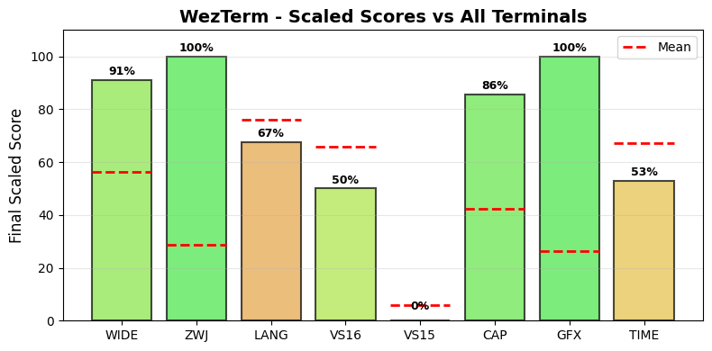

.. _wezterm:

WezTerm
-------


Tested Software version 20260117-154428-05343b38 on Linux.
The homepage URL of this terminal is https://wezfurlong.org/wezterm/.
Full results available at ucs-detect_ repository path
`data/wezterm.yaml <https://github.com/jquast/ucs-detect/blob/master/data/wezterm.yaml>`_.

.. _weztermscores:

Score Breakdown
+++++++++++++++

Detailed breakdown of how scores are calculated for *WezTerm*:

.. table::
   :class: sphinx-datatable

   ===  =====================================  ===========  ====================
     #  Score Type                             Raw Score    Final Scaled Score
   ===  =====================================  ===========  ====================
     1  :ref:`WIDE <weztermwide>`              99.92%       90.9%
     2  :ref:`ZWJ <weztermzwj>`                100.00%      100.0%
     3  :ref:`LANG <weztermlang>`              90.30%       67.5%
     4  :ref:`VS16 <weztermvs16>`              50.00%       50.0%
     5  :ref:`VS15 <weztermvs15>`              0.00%        0.0%
     6  :ref:`Capabilities <weztermdecmodes>`  85.71%       85.7%
     7  :ref:`Graphics <weztermgraphics>`      100%         100.0%
     8  :ref:`TIME <weztermtime>`              130.98s      52.9%
   ===  =====================================  ===========  ====================

**Score Comparison Plot:**

The following plot shows how this terminal's scores compare to all other terminals tested.



   Scaled scores comparison across all metrics (normalized 0-100%)

**Final Scaled Score Calculation:**

- Raw Final Score: 73.65%
  (weighted average: WIDE + ZWJ + LANG + VS16 + VS15 + CAP + GFX + 0.5*TIME)
  the categorized 'average' absolute support level of this terminal
  Note: TIME is normalized to 0-1 range before averaging.
  TIME is weighted at 0.5 (half as powerful as other metrics).
  CAP (Capabilities) is the fraction of 7 notable capabilities supported.
  GFX (Graphics) scores 100% for modern protocols (iTerm2, Kitty),
  50% for legacy only (Sixel, ReGIS), 0% for none.
  Sixel/ReGIS support contributes to the GFX score at 50%.

- Final Scaled Score: 62.4%
  (normalized across all terminals tested).
  *Final Scaled scores* are normalized (0-100%) relative to all terminals tested

**WIDE Score Details:**

Wide character support calculation:

- Total successful codepoints: 7260
- Total codepoints tested: 7266
- Formula: 7260 / 7266
- Result: 99.92%

**ZWJ Score Details:**

Emoji ZWJ (Zero-Width Joiner) support calculation:

- Total successful sequences: 1445
- Total sequences tested: 1445
- Formula: 1445 / 1445
- Result: 100.00%

**VS16 Score Details:**

Variation Selector-16 support calculation:

- Errors: 213 of 426 codepoints tested
- Success rate: 50.0%
- Formula: 50.0 / 100
- Result: 50.00%

**VS15 Score Details:**

Variation Selector-15 support calculation:

- Errors: 158 of 158 codepoints tested
- Success rate: 0.0%
- Formula: 0.0 / 100
- Result: 0.00%

**Capabilities Score Details:**

Notable terminal capabilities (6 / 7):

- Bracketed Paste (2004): **yes**
- Synced Output (2026): **yes**
- Focus Events (1004): **yes**
- Mouse SGR (1006): **yes**
- Graphemes (2027): **yes**
- Kitty Keyboard: **no**
- XTGETTCAP: **yes**

Raw score: 85.71%

**Graphics Score Details:**

Graphics protocol support (100%):

- Sixel: **yes**
- ReGIS: **no**
- iTerm2: **no**
- Kitty: **yes**

Scoring: 100% for modern (iTerm2/Kitty), 50% for legacy only (Sixel/ReGIS), 0% for none

**TIME Score Details:**

Test execution time:

- Elapsed time: 130.98 seconds
- Note: This is a raw measurement; lower is better
- Scaled score uses inverse log10 scaling across all terminals
- Scaled result: 52.9%

**LANG Score Details (Geometric Mean):**

Geometric mean calculation:

- Formula: (p₁ × p₂ × ... × pₙ)^(1/n) where n = 94 languages
- About `geometric mean <https://en.wikipedia.org/wiki/Geometric_mean>`_
- Result: 90.30%

.. _weztermwide:

Wide character support
++++++++++++++++++++++

Wide character support of *WezTerm* is **99.9%** (6 errors of 7266 codepoints tested).

Sequence of a WIDE character, from midpoint of alignment failure records:

.. table::
   :class: sphinx-datatable

   ===  =================================================  =============  ==========  =========  ==================================
     #  Codepoint                                          Python         Category      wcwidth  Name
   ===  =================================================  =============  ==========  =========  ==================================
     1  `U+0001F1F9 <https://codepoints.net/U+0001F1F9>`_  '\\U0001f1f9'  So                  2  REGIONAL INDICATOR SYMBOL LETTER T
   ===  =================================================  =============  ==========  =========  ==================================

Total codepoints: 1


- Shell test using `printf(1)`_, ``'|'`` should align in output::

        $ printf "\xf0\x9f\x87\xb9|\\n12|\\n"
        🇹|
        12|

- python `wcwidth.wcswidth()`_ measures width 2,
  while *WezTerm* measures width 1.

.. _weztermzwj:

Emoji ZWJ support
+++++++++++++++++

Compatibility of *WezTerm* with the Unicode Emoji ZWJ sequence table is **100.0%** (0 errors of 1445 sequences tested).

.. _weztermvs16:

Variation Selector-16 support
+++++++++++++++++++++++++++++

Emoji VS-16 results for *WezTerm* is 213 errors
out of 426 total codepoints tested, 50.0% success.
Sequence of a NARROW Emoji made WIDE by *Variation Selector-16*, from midpoint of alignment failure records:

.. table::
   :class: sphinx-datatable

   ===  =========================================  =========  ==========  =========  =====================
     #  Codepoint                                  Python     Category      wcwidth  Name
   ===  =========================================  =========  ==========  =========  =====================
     1  `U+2733 <https://codepoints.net/U+2733>`_  '\\u2733'  So                  1  EIGHT SPOKED ASTERISK
     2  `U+FE0F <https://codepoints.net/U+FE0F>`_  '\\ufe0f'  Mn                  0  VARIATION SELECTOR-16
   ===  =========================================  =========  ==========  =========  =====================

Total codepoints: 2


- Shell test using `printf(1)`_, ``'|'`` should align in output::

        $ printf "\xe2\x9c\xb3\xef\xb8\x8f|\\n12|\\n"
        ✳️|
        12|

- python `wcwidth.wcswidth()`_ measures width 2,
  while *WezTerm* measures width 1.


.. _weztermvs15:

Variation Selector-15 support
+++++++++++++++++++++++++++++

Emoji VS-15 results for *WezTerm* is 158 errors
out of 158 total codepoints tested, 0.0% success.
Sequence of a WIDE Emoji made NARROW by *Variation Selector-15*, from midpoint of alignment failure records:

.. table::
   :class: sphinx-datatable

   ===  =================================================  =============  ==========  =========  =====================
     #  Codepoint                                          Python         Category      wcwidth  Name
   ===  =================================================  =============  ==========  =========  =====================
     1  `U+0001F3AE <https://codepoints.net/U+0001F3AE>`_  '\\U0001f3ae'  So                  2  VIDEO GAME
     2  `U+FE0E <https://codepoints.net/U+FE0E>`_          '\\ufe0e'      Mn                  0  VARIATION SELECTOR-15
   ===  =================================================  =============  ==========  =========  =====================

Total codepoints: 2


- Shell test using `printf(1)`_, ``'|'`` should align in output::

        $ printf "\xf0\x9f\x8e\xae\xef\xb8\x8e|\\n1|\\n"
        🎮︎|
        1|

- python `wcwidth.wcswidth()`_ measures width 1,
  while *WezTerm* measures width 2.


.. _weztermgraphics:

Graphics Protocol Support
+++++++++++++++++++++++++

*WezTerm* supports the following graphics protocols: Sixel_, `Kitty graphics protocol`_.

**Detection Methods:**

- **Sixel** and **ReGIS**: Detected via the Device Attributes (DA1) query
  ``CSI c`` (``\x1b[c``). Extension code ``4`` indicates Sixel_ support,
  ``3`` ReGIS_.
- **Kitty graphics**: Detected by sending a Kitty graphics query and
  checking for an ``OK`` response.
- **iTerm2 inline images**: Detected via the iTerm2 capabilities query
  ``OSC 1337 ; Capabilities``.

**Device Attributes Response:**

- Extensions reported: 4, 6, 18, 22, 52
- Sixel_ indicator (``4``): present
- ReGIS_ indicator (``3``): not present

.. _Sixel: https://en.wikipedia.org/wiki/Sixel
.. _ReGIS: https://en.wikipedia.org/wiki/ReGIS
.. _`iTerm2 inline images`: https://iterm2.com/documentation-images.html
.. _`Kitty graphics protocol`: https://sw.kovidgoyal.net/kitty/graphics-protocol/

.. _weztermlang:

Language Support
++++++++++++++++

The following 67 languages were tested with 100% success:

Aja, Amarakaeri, Arabic, Standard, Assyrian Neo-Aramaic, Baatonum, Bamun, Belanda Viri, Bora, Catalan (2), Chickasaw, Chinantec, Chiltepec, Dagaare, Southern, Dangme, Dari, Dendi, Dinka, Northeastern, Ditammari, Dzongkha, Evenki, Farsi, Western, Fon, French (Welche), Fur, Ga, Gen, Gilyak, Gumuz, Kabyle, Lamnso', Lao, Lingala (tones), Maldivian, Maori (2), Mazahua Central, Mirandese, Mixtec, Metlatónoc, Mòoré, Nanai, Navajo, Orok, Otomi, Mezquital, Panjabi, Western, Pashto, Northern, Picard, Pular (Adlam), Saint Lucian Creole French, Secoya, Seraiki, Shipibo-Conibo, Siona, South Azerbaijani, Tagalog (Tagalog), Tai Dam, Tamazight, Central Atlas, Tem, Thai, Thai (2), Tibetan, Central, Ticuna, Uduk, Veps, Vietnamese, Waama, Yaneshaʼ, Yiddish, Eastern, Yoruba, Éwé.

The following 27 languages are not fully supported:

.. table::
   :class: sphinx-datatable

   ========================================================  ==========  =========  =============
   lang                                                        n_errors    n_total  pct_success
   ========================================================  ==========  =========  =============
   :ref:`Sanskrit (Grantha) <weztermlangsanskritgrantha>`           219        293  25.3%
   :ref:`Javanese (Javanese) <weztermlangjavanesejavanese>`         372        530  29.8%
   :ref:`Tamil <weztermlangtamil>`                                  106        175  39.4%
   :ref:`Tamil (Sri Lanka) <weztermlangtamilsrilanka>`              106        175  39.4%
   :ref:`Kannada <weztermlangkannada>`                              157        287  45.3%
   :ref:`Khmer, Central <weztermlangkhmercentral>`                  196        443  55.8%
   :ref:`Sinhala <weztermlangsinhala>`                              101        258  60.9%
   :ref:`Tamang, Eastern <weztermlangtamangeastern>`                 25         70  64.3%
   :ref:`Bengali <weztermlangbengali>`                              135        385  64.9%
   :ref:`Panjabi, Eastern <weztermlangpanjabieastern>`              103        302  65.9%
   :ref:`Gujarati <weztermlanggujarati>`                            113        343  67.1%
   :ref:`Bhojpuri <weztermlangbhojpuri>`                            101        313  67.7%
   :ref:`Magahi <weztermlangmagahi>`                                 97        314  69.1%
   :ref:`Malayalam <weztermlangmalayalam>`                          258        845  69.5%
   :ref:`Hindi <weztermlanghindi>`                                  113        390  71.0%
   :ref:`Marathi <weztermlangmarathi>`                              111        391  71.6%
   :ref:`Burmese <weztermlangburmese>`                               76        268  71.6%
   :ref:`Nepali <weztermlangnepali>`                                 93        352  73.6%
   :ref:`Maithili <weztermlangmaithili>`                             90        357  74.8%
   :ref:`Khün <weztermlangkhn>`                                      90        396  77.3%
   :ref:`Sanskrit <weztermlangsanskrit>`                            111        493  77.5%
   :ref:`Mon <weztermlangmon>`                                       72        332  78.3%
   :ref:`Telugu <weztermlangtelugu>`                                 78        384  79.7%
   :ref:`Chakma <weztermlangchakma>`                                 47        267  82.4%
   :ref:`Shan <weztermlangshan>`                                     18        181  90.1%
   :ref:`Urdu (2) <weztermlangurdu2>`                                 1         82  98.8%
   :ref:`Urdu <weztermlangurdu>`                                      1        110  99.1%
   ========================================================  ==========  =========  =============

.. _weztermlangsanskritgrantha:

Sanskrit (Grantha)
^^^^^^^^^^^^^^^^^^

Sequence of language *Sanskrit (Grantha)* from midpoint of alignment failure records:

.. table::
   :class: sphinx-datatable

   ===  =================================================  =============  ==========  =========  =====================
     #  Codepoint                                          Python         Category      wcwidth  Name
   ===  =================================================  =============  ==========  =========  =====================
     1  `U+00011305 <https://codepoints.net/U+00011305>`_  '\\U00011305'  Lo                  1  GRANTHA LETTER A
     2  `U+00011302 <https://codepoints.net/U+00011302>`_  '\\U00011302'  Mc                  0  GRANTHA SIGN ANUSVARA
   ===  =================================================  =============  ==========  =========  =====================

Total codepoints: 2


- Shell test using `printf(1)`_, ``'|'`` should align in output::

        $ printf "\xf0\x91\x8c\x85\xf0\x91\x8c\x82|\\n12|\\n"
        𑌅𑌂|
        12|

- python `wcwidth.wcswidth()`_ measures width 2,
  while *WezTerm* measures width 1.

.. _weztermlangjavanesejavanese:

Javanese (Javanese)
^^^^^^^^^^^^^^^^^^^

Sequence of language *Javanese (Javanese)* from midpoint of alignment failure records:

.. table::
   :class: sphinx-datatable

   ===  =========================================  =========  ==========  =========  ==================
     #  Codepoint                                  Python     Category      wcwidth  Name
   ===  =========================================  =========  ==========  =========  ==================
     1  `U+A9A0 <https://codepoints.net/U+A9A0>`_  '\\ua9a0'  Lo                  1  JAVANESE LETTER TA
     2  `U+A9C0 <https://codepoints.net/U+A9C0>`_  '\\ua9c0'  Mc                  0  JAVANESE PANGKON
     3  `U+A9B1 <https://codepoints.net/U+A9B1>`_  '\\ua9b1'  Lo                  1  JAVANESE LETTER SA
     4  `U+A9C0 <https://codepoints.net/U+A9C0>`_  '\\ua9c0'  Mc                  0  JAVANESE PANGKON
     5  `U+A9AE <https://codepoints.net/U+A9AE>`_  '\\ua9ae'  Lo                  1  JAVANESE LETTER WA
   ===  =========================================  =========  ==========  =========  ==================

Total codepoints: 5


- Shell test using `printf(1)`_, ``'|'`` should align in output::

        $ printf "\xea\xa6\xa0\xea\xa7\x80\xea\xa6\xb1\xea\xa7\x80\xea\xa6\xae|\\n12345|\\n"
        ꦠ꧀ꦱ꧀ꦮ|
        12345|

- python `wcwidth.wcswidth()`_ measures width 5,
  while *WezTerm* measures width 3.

.. _weztermlangtamil:

Tamil
^^^^^

Sequence of language *Tamil* from midpoint of alignment failure records:

.. table::
   :class: sphinx-datatable

   ===  =========================================  =========  ==========  =========  ===================
     #  Codepoint                                  Python     Category      wcwidth  Name
   ===  =========================================  =========  ==========  =========  ===================
     1  `U+0B95 <https://codepoints.net/U+0B95>`_  '\\u0b95'  Lo                  1  TAMIL LETTER KA
     2  `U+0BBE <https://codepoints.net/U+0BBE>`_  '\\u0bbe'  Mc                  0  TAMIL VOWEL SIGN AA
   ===  =========================================  =========  ==========  =========  ===================

Total codepoints: 2


- Shell test using `printf(1)`_, ``'|'`` should align in output::

        $ printf "\xe0\xae\x95\xe0\xae\xbe|\\n12|\\n"
        கா|
        12|

- python `wcwidth.wcswidth()`_ measures width 2,
  while *WezTerm* measures width 1.

.. _weztermlangtamilsrilanka:

Tamil (Sri Lanka)
^^^^^^^^^^^^^^^^^

Sequence of language *Tamil (Sri Lanka)* from midpoint of alignment failure records:

.. table::
   :class: sphinx-datatable

   ===  =========================================  =========  ==========  =========  ===================
     #  Codepoint                                  Python     Category      wcwidth  Name
   ===  =========================================  =========  ==========  =========  ===================
     1  `U+0B95 <https://codepoints.net/U+0B95>`_  '\\u0b95'  Lo                  1  TAMIL LETTER KA
     2  `U+0BBE <https://codepoints.net/U+0BBE>`_  '\\u0bbe'  Mc                  0  TAMIL VOWEL SIGN AA
   ===  =========================================  =========  ==========  =========  ===================

Total codepoints: 2


- Shell test using `printf(1)`_, ``'|'`` should align in output::

        $ printf "\xe0\xae\x95\xe0\xae\xbe|\\n12|\\n"
        கா|
        12|


.. _weztermlangkannada:

Kannada
^^^^^^^

Sequence of language *Kannada* from midpoint of alignment failure records:

.. table::
   :class: sphinx-datatable

   ===  =========================================  =========  ==========  =========  =====================
     #  Codepoint                                  Python     Category      wcwidth  Name
   ===  =========================================  =========  ==========  =========  =====================
     1  `U+0C85 <https://codepoints.net/U+0C85>`_  '\\u0c85'  Lo                  1  KANNADA LETTER A
     2  `U+0C82 <https://codepoints.net/U+0C82>`_  '\\u0c82'  Mc                  0  KANNADA SIGN ANUSVARA
   ===  =========================================  =========  ==========  =========  =====================

Total codepoints: 2


- Shell test using `printf(1)`_, ``'|'`` should align in output::

        $ printf "\xe0\xb2\x85\xe0\xb2\x82|\\n12|\\n"
        ಅಂ|
        12|

- python `wcwidth.wcswidth()`_ measures width 2,
  while *WezTerm* measures width 1.

.. _weztermlangkhmercentral:

Khmer, Central
^^^^^^^^^^^^^^

Sequence of language *Khmer, Central* from midpoint of alignment failure records:

.. table::
   :class: sphinx-datatable

   ===  =========================================  =========  ==========  =========  ===================
     #  Codepoint                                  Python     Category      wcwidth  Name
   ===  =========================================  =========  ==========  =========  ===================
     1  `U+1780 <https://codepoints.net/U+1780>`_  '\\u1780'  Lo                  1  KHMER LETTER KA
     2  `U+17D2 <https://codepoints.net/U+17D2>`_  '\\u17d2'  Mn                  0  KHMER SIGN COENG
     3  `U+178A <https://codepoints.net/U+178A>`_  '\\u178a'  Lo                  1  KHMER LETTER DA
     4  `U+17C5 <https://codepoints.net/U+17C5>`_  '\\u17c5'  Mc                  0  KHMER VOWEL SIGN AU
   ===  =========================================  =========  ==========  =========  ===================

Total codepoints: 4


- Shell test using `printf(1)`_, ``'|'`` should align in output::

        $ printf "\xe1\x9e\x80\xe1\x9f\x92\xe1\x9e\x8a\xe1\x9f\x85|\\n123|\\n"
        ក្ដៅ|
        123|

- python `wcwidth.wcswidth()`_ measures width 3,
  while *WezTerm* measures width 2.

.. _weztermlangsinhala:

Sinhala
^^^^^^^

Sequence of language *Sinhala* from midpoint of alignment failure records:

.. table::
   :class: sphinx-datatable

   ===  =========================================  =========  ==========  =========  =================================
     #  Codepoint                                  Python     Category      wcwidth  Name
   ===  =========================================  =========  ==========  =========  =================================
     1  `U+0D9A <https://codepoints.net/U+0D9A>`_  '\\u0d9a'  Lo                  1  SINHALA LETTER ALPAPRAANA KAYANNA
     2  `U+0DCF <https://codepoints.net/U+0DCF>`_  '\\u0dcf'  Mc                  0  SINHALA VOWEL SIGN AELA-PILLA
   ===  =========================================  =========  ==========  =========  =================================

Total codepoints: 2


- Shell test using `printf(1)`_, ``'|'`` should align in output::

        $ printf "\xe0\xb6\x9a\xe0\xb7\x8f|\\n12|\\n"
        කා|
        12|

- python `wcwidth.wcswidth()`_ measures width 2,
  while *WezTerm* measures width 1.

.. _weztermlangtamangeastern:

Tamang, Eastern
^^^^^^^^^^^^^^^

Sequence of language *Tamang, Eastern* from midpoint of alignment failure records:

.. table::
   :class: sphinx-datatable

   ===  =========================================  =========  ==========  =========  ========================
     #  Codepoint                                  Python     Category      wcwidth  Name
   ===  =========================================  =========  ==========  =========  ========================
     1  `U+0915 <https://codepoints.net/U+0915>`_  '\\u0915'  Lo                  1  DEVANAGARI LETTER KA
     2  `U+093E <https://codepoints.net/U+093E>`_  '\\u093e'  Mc                  0  DEVANAGARI VOWEL SIGN AA
   ===  =========================================  =========  ==========  =========  ========================

Total codepoints: 2


- Shell test using `printf(1)`_, ``'|'`` should align in output::

        $ printf "\xe0\xa4\x95\xe0\xa4\xbe|\\n12|\\n"
        का|
        12|


.. _weztermlangbengali:

Bengali
^^^^^^^

Sequence of language *Bengali* from midpoint of alignment failure records:

.. table::
   :class: sphinx-datatable

   ===  =========================================  =========  ==========  =========  =====================
     #  Codepoint                                  Python     Category      wcwidth  Name
   ===  =========================================  =========  ==========  =========  =====================
     1  `U+0985 <https://codepoints.net/U+0985>`_  '\\u0985'  Lo                  1  BENGALI LETTER A
     2  `U+0982 <https://codepoints.net/U+0982>`_  '\\u0982'  Mc                  0  BENGALI SIGN ANUSVARA
   ===  =========================================  =========  ==========  =========  =====================

Total codepoints: 2


- Shell test using `printf(1)`_, ``'|'`` should align in output::

        $ printf "\xe0\xa6\x85\xe0\xa6\x82|\\n12|\\n"
        অং|
        12|

- python `wcwidth.wcswidth()`_ measures width 2,
  while *WezTerm* measures width 1.

.. _weztermlangpanjabieastern:

Panjabi, Eastern
^^^^^^^^^^^^^^^^

Sequence of language *Panjabi, Eastern* from midpoint of alignment failure records:

.. table::
   :class: sphinx-datatable

   ===  =========================================  =========  ==========  =========  ======================
     #  Codepoint                                  Python     Category      wcwidth  Name
   ===  =========================================  =========  ==========  =========  ======================
     1  `U+0A15 <https://codepoints.net/U+0A15>`_  '\\u0a15'  Lo                  1  GURMUKHI LETTER KA
     2  `U+0A3E <https://codepoints.net/U+0A3E>`_  '\\u0a3e'  Mc                  0  GURMUKHI VOWEL SIGN AA
   ===  =========================================  =========  ==========  =========  ======================

Total codepoints: 2


- Shell test using `printf(1)`_, ``'|'`` should align in output::

        $ printf "\xe0\xa8\x95\xe0\xa8\xbe|\\n12|\\n"
        ਕਾ|
        12|

- python `wcwidth.wcswidth()`_ measures width 2,
  while *WezTerm* measures width 1.

.. _weztermlanggujarati:

Gujarati
^^^^^^^^

Sequence of language *Gujarati* from midpoint of alignment failure records:

.. table::
   :class: sphinx-datatable

   ===  =========================================  =========  ==========  =========  =====================
     #  Codepoint                                  Python     Category      wcwidth  Name
   ===  =========================================  =========  ==========  =========  =====================
     1  `U+0A95 <https://codepoints.net/U+0A95>`_  '\\u0a95'  Lo                  1  GUJARATI LETTER KA
     2  `U+0A83 <https://codepoints.net/U+0A83>`_  '\\u0a83'  Mc                  0  GUJARATI SIGN VISARGA
   ===  =========================================  =========  ==========  =========  =====================

Total codepoints: 2


- Shell test using `printf(1)`_, ``'|'`` should align in output::

        $ printf "\xe0\xaa\x95\xe0\xaa\x83|\\n12|\\n"
        કઃ|
        12|

- python `wcwidth.wcswidth()`_ measures width 2,
  while *WezTerm* measures width 1.

.. _weztermlangbhojpuri:

Bhojpuri
^^^^^^^^

Sequence of language *Bhojpuri* from midpoint of alignment failure records:

.. table::
   :class: sphinx-datatable

   ===  =========================================  =========  ==========  =========  ========================
     #  Codepoint                                  Python     Category      wcwidth  Name
   ===  =========================================  =========  ==========  =========  ========================
     1  `U+0915 <https://codepoints.net/U+0915>`_  '\\u0915'  Lo                  1  DEVANAGARI LETTER KA
     2  `U+093E <https://codepoints.net/U+093E>`_  '\\u093e'  Mc                  0  DEVANAGARI VOWEL SIGN AA
   ===  =========================================  =========  ==========  =========  ========================

Total codepoints: 2


- Shell test using `printf(1)`_, ``'|'`` should align in output::

        $ printf "\xe0\xa4\x95\xe0\xa4\xbe|\\n12|\\n"
        का|
        12|

- python `wcwidth.wcswidth()`_ measures width 2,
  while *WezTerm* measures width 1.

.. _weztermlangmagahi:

Magahi
^^^^^^

Sequence of language *Magahi* from midpoint of alignment failure records:

.. table::
   :class: sphinx-datatable

   ===  =========================================  =========  ==========  =========  ========================
     #  Codepoint                                  Python     Category      wcwidth  Name
   ===  =========================================  =========  ==========  =========  ========================
     1  `U+0915 <https://codepoints.net/U+0915>`_  '\\u0915'  Lo                  1  DEVANAGARI LETTER KA
     2  `U+093E <https://codepoints.net/U+093E>`_  '\\u093e'  Mc                  0  DEVANAGARI VOWEL SIGN AA
   ===  =========================================  =========  ==========  =========  ========================

Total codepoints: 2


- Shell test using `printf(1)`_, ``'|'`` should align in output::

        $ printf "\xe0\xa4\x95\xe0\xa4\xbe|\\n12|\\n"
        का|
        12|


.. _weztermlangmalayalam:

Malayalam
^^^^^^^^^

Sequence of language *Malayalam* from midpoint of alignment failure records:

.. table::
   :class: sphinx-datatable

   ===  =========================================  =========  ==========  =========  =======================
     #  Codepoint                                  Python     Category      wcwidth  Name
   ===  =========================================  =========  ==========  =========  =======================
     1  `U+0D05 <https://codepoints.net/U+0D05>`_  '\\u0d05'  Lo                  1  MALAYALAM LETTER A
     2  `U+0D02 <https://codepoints.net/U+0D02>`_  '\\u0d02'  Mc                  0  MALAYALAM SIGN ANUSVARA
   ===  =========================================  =========  ==========  =========  =======================

Total codepoints: 2


- Shell test using `printf(1)`_, ``'|'`` should align in output::

        $ printf "\xe0\xb4\x85\xe0\xb4\x82|\\n12|\\n"
        അം|
        12|

- python `wcwidth.wcswidth()`_ measures width 2,
  while *WezTerm* measures width 1.

.. _weztermlanghindi:

Hindi
^^^^^

Sequence of language *Hindi* from midpoint of alignment failure records:

.. table::
   :class: sphinx-datatable

   ===  =========================================  =========  ==========  =========  ========================
     #  Codepoint                                  Python     Category      wcwidth  Name
   ===  =========================================  =========  ==========  =========  ========================
     1  `U+0915 <https://codepoints.net/U+0915>`_  '\\u0915'  Lo                  1  DEVANAGARI LETTER KA
     2  `U+093E <https://codepoints.net/U+093E>`_  '\\u093e'  Mc                  0  DEVANAGARI VOWEL SIGN AA
   ===  =========================================  =========  ==========  =========  ========================

Total codepoints: 2


- Shell test using `printf(1)`_, ``'|'`` should align in output::

        $ printf "\xe0\xa4\x95\xe0\xa4\xbe|\\n12|\\n"
        का|
        12|


.. _weztermlangmarathi:

Marathi
^^^^^^^

Sequence of language *Marathi* from midpoint of alignment failure records:

.. table::
   :class: sphinx-datatable

   ===  =========================================  =========  ==========  =========  ========================
     #  Codepoint                                  Python     Category      wcwidth  Name
   ===  =========================================  =========  ==========  =========  ========================
     1  `U+0915 <https://codepoints.net/U+0915>`_  '\\u0915'  Lo                  1  DEVANAGARI LETTER KA
     2  `U+093E <https://codepoints.net/U+093E>`_  '\\u093e'  Mc                  0  DEVANAGARI VOWEL SIGN AA
   ===  =========================================  =========  ==========  =========  ========================

Total codepoints: 2


- Shell test using `printf(1)`_, ``'|'`` should align in output::

        $ printf "\xe0\xa4\x95\xe0\xa4\xbe|\\n12|\\n"
        का|
        12|


.. _weztermlangburmese:

Burmese
^^^^^^^

Sequence of language *Burmese* from midpoint of alignment failure records:

.. table::
   :class: sphinx-datatable

   ===  =========================================  =========  ==========  =========  ====================
     #  Codepoint                                  Python     Category      wcwidth  Name
   ===  =========================================  =========  ==========  =========  ====================
     1  `U+1000 <https://codepoints.net/U+1000>`_  '\\u1000'  Lo                  1  MYANMAR LETTER KA
     2  `U+1031 <https://codepoints.net/U+1031>`_  '\\u1031'  Mc                  0  MYANMAR VOWEL SIGN E
   ===  =========================================  =========  ==========  =========  ====================

Total codepoints: 2


- Shell test using `printf(1)`_, ``'|'`` should align in output::

        $ printf "\xe1\x80\x80\xe1\x80\xb1|\\n12|\\n"
        ကေ|
        12|

- python `wcwidth.wcswidth()`_ measures width 2,
  while *WezTerm* measures width 1.

.. _weztermlangnepali:

Nepali
^^^^^^

Sequence of language *Nepali* from midpoint of alignment failure records:

.. table::
   :class: sphinx-datatable

   ===  =========================================  =========  ==========  =========  ========================
     #  Codepoint                                  Python     Category      wcwidth  Name
   ===  =========================================  =========  ==========  =========  ========================
     1  `U+0915 <https://codepoints.net/U+0915>`_  '\\u0915'  Lo                  1  DEVANAGARI LETTER KA
     2  `U+093E <https://codepoints.net/U+093E>`_  '\\u093e'  Mc                  0  DEVANAGARI VOWEL SIGN AA
   ===  =========================================  =========  ==========  =========  ========================

Total codepoints: 2


- Shell test using `printf(1)`_, ``'|'`` should align in output::

        $ printf "\xe0\xa4\x95\xe0\xa4\xbe|\\n12|\\n"
        का|
        12|


.. _weztermlangmaithili:

Maithili
^^^^^^^^

Sequence of language *Maithili* from midpoint of alignment failure records:

.. table::
   :class: sphinx-datatable

   ===  =========================================  =========  ==========  =========  ========================
     #  Codepoint                                  Python     Category      wcwidth  Name
   ===  =========================================  =========  ==========  =========  ========================
     1  `U+0915 <https://codepoints.net/U+0915>`_  '\\u0915'  Lo                  1  DEVANAGARI LETTER KA
     2  `U+093E <https://codepoints.net/U+093E>`_  '\\u093e'  Mc                  0  DEVANAGARI VOWEL SIGN AA
   ===  =========================================  =========  ==========  =========  ========================

Total codepoints: 2


- Shell test using `printf(1)`_, ``'|'`` should align in output::

        $ printf "\xe0\xa4\x95\xe0\xa4\xbe|\\n12|\\n"
        का|
        12|


.. _weztermlangkhn:

Khün
^^^^

Sequence of language *Khün* from midpoint of alignment failure records:

.. table::
   :class: sphinx-datatable

   ===  =========================================  =========  ==========  =========  =======================
     #  Codepoint                                  Python     Category      wcwidth  Name
   ===  =========================================  =========  ==========  =========  =======================
     1  `U+1A20 <https://codepoints.net/U+1A20>`_  '\\u1a20'  Lo                  1  TAI THAM LETTER HIGH KA
     2  `U+1A6E <https://codepoints.net/U+1A6E>`_  '\\u1a6e'  Mc                  0  TAI THAM VOWEL SIGN E
     3  `U+1A60 <https://codepoints.net/U+1A60>`_  '\\u1a60'  Mn                  0  TAI THAM SIGN SAKOT
   ===  =========================================  =========  ==========  =========  =======================

Total codepoints: 3


- Shell test using `printf(1)`_, ``'|'`` should align in output::

        $ printf "\xe1\xa8\xa0\xe1\xa9\xae\xe1\xa9\xa0|\\n12|\\n"
        ᨠᩮ᩠|
        12|

- python `wcwidth.wcswidth()`_ measures width 2,
  while *WezTerm* measures width 1.

.. _weztermlangsanskrit:

Sanskrit
^^^^^^^^

Sequence of language *Sanskrit* from midpoint of alignment failure records:

.. table::
   :class: sphinx-datatable

   ===  =========================================  =========  ==========  =========  ========================
     #  Codepoint                                  Python     Category      wcwidth  Name
   ===  =========================================  =========  ==========  =========  ========================
     1  `U+0915 <https://codepoints.net/U+0915>`_  '\\u0915'  Lo                  1  DEVANAGARI LETTER KA
     2  `U+093E <https://codepoints.net/U+093E>`_  '\\u093e'  Mc                  0  DEVANAGARI VOWEL SIGN AA
   ===  =========================================  =========  ==========  =========  ========================

Total codepoints: 2


- Shell test using `printf(1)`_, ``'|'`` should align in output::

        $ printf "\xe0\xa4\x95\xe0\xa4\xbe|\\n12|\\n"
        का|
        12|


.. _weztermlangmon:

Mon
^^^

Sequence of language *Mon* from midpoint of alignment failure records:

.. table::
   :class: sphinx-datatable

   ===  =========================================  =========  ==========  =========  ====================
     #  Codepoint                                  Python     Category      wcwidth  Name
   ===  =========================================  =========  ==========  =========  ====================
     1  `U+1012 <https://codepoints.net/U+1012>`_  '\\u1012'  Lo                  1  MYANMAR LETTER DA
     2  `U+1039 <https://codepoints.net/U+1039>`_  '\\u1039'  Mn                  0  MYANMAR SIGN VIRAMA
     3  `U+1002 <https://codepoints.net/U+1002>`_  '\\u1002'  Lo                  1  MYANMAR LETTER GA
     4  `U+1031 <https://codepoints.net/U+1031>`_  '\\u1031'  Mc                  0  MYANMAR VOWEL SIGN E
   ===  =========================================  =========  ==========  =========  ====================

Total codepoints: 4


- Shell test using `printf(1)`_, ``'|'`` should align in output::

        $ printf "\xe1\x80\x92\xe1\x80\xb9\xe1\x80\x82\xe1\x80\xb1|\\n123|\\n"
        ဒ္ဂေ|
        123|

- python `wcwidth.wcswidth()`_ measures width 3,
  while *WezTerm* measures width 2.

.. _weztermlangtelugu:

Telugu
^^^^^^

Sequence of language *Telugu* from midpoint of alignment failure records:

.. table::
   :class: sphinx-datatable

   ===  =========================================  =========  ==========  =========  ====================
     #  Codepoint                                  Python     Category      wcwidth  Name
   ===  =========================================  =========  ==========  =========  ====================
     1  `U+0C05 <https://codepoints.net/U+0C05>`_  '\\u0c05'  Lo                  1  TELUGU LETTER A
     2  `U+0C02 <https://codepoints.net/U+0C02>`_  '\\u0c02'  Mc                  0  TELUGU SIGN ANUSVARA
   ===  =========================================  =========  ==========  =========  ====================

Total codepoints: 2


- Shell test using `printf(1)`_, ``'|'`` should align in output::

        $ printf "\xe0\xb0\x85\xe0\xb0\x82|\\n12|\\n"
        అం|
        12|

- python `wcwidth.wcswidth()`_ measures width 2,
  while *WezTerm* measures width 1.

.. _weztermlangchakma:

Chakma
^^^^^^

Sequence of language *Chakma* from midpoint of alignment failure records:

.. table::
   :class: sphinx-datatable

   ===  =================================================  =============  ==========  =========  ===================
     #  Codepoint                                          Python         Category      wcwidth  Name
   ===  =================================================  =============  ==========  =========  ===================
     1  `U+00011107 <https://codepoints.net/U+00011107>`_  '\\U00011107'  Lo                  1  CHAKMA LETTER KAA
     2  `U+00011133 <https://codepoints.net/U+00011133>`_  '\\U00011133'  Mn                  0  CHAKMA VIRAMA
     3  `U+00011120 <https://codepoints.net/U+00011120>`_  '\\U00011120'  Lo                  1  CHAKMA LETTER YYAA
     4  `U+0001112C <https://codepoints.net/U+0001112C>`_  '\\U0001112c'  Mc                  0  CHAKMA VOWEL SIGN E
   ===  =================================================  =============  ==========  =========  ===================

Total codepoints: 4


- Shell test using `printf(1)`_, ``'|'`` should align in output::

        $ printf "\xf0\x91\x84\x87\xf0\x91\x84\xb3\xf0\x91\x84\xa0\xf0\x91\x84\xac|\\n123|\\n"
        𑄇𑄳𑄠𑄬|
        123|

- python `wcwidth.wcswidth()`_ measures width 3,
  while *WezTerm* measures width 2.

.. _weztermlangshan:

Shan
^^^^

Sequence of language *Shan* from midpoint of alignment failure records:

.. table::
   :class: sphinx-datatable

   ===  =========================================  =========  ==========  =========  ====================
     #  Codepoint                                  Python     Category      wcwidth  Name
   ===  =========================================  =========  ==========  =========  ====================
     1  `U+1010 <https://codepoints.net/U+1010>`_  '\\u1010'  Lo                  1  MYANMAR LETTER TA
     2  `U+1031 <https://codepoints.net/U+1031>`_  '\\u1031'  Mc                  0  MYANMAR VOWEL SIGN E
   ===  =========================================  =========  ==========  =========  ====================

Total codepoints: 2


- Shell test using `printf(1)`_, ``'|'`` should align in output::

        $ printf "\xe1\x80\x90\xe1\x80\xb1|\\n12|\\n"
        တေ|
        12|


.. _weztermlangurdu2:

Urdu (2)
^^^^^^^^

Sequence of language *Urdu (2)* from midpoint of alignment failure records:

.. table::
   :class: sphinx-datatable

   ===  =========================================  =========  ==========  =========  ===============================
     #  Codepoint                                  Python     Category      wcwidth  Name
   ===  =========================================  =========  ==========  =========  ===============================
     1  `U+0601 <https://codepoints.net/U+0601>`_  '\\u0601'  Cf                  1  ARABIC SIGN SANAH
     2  `U+06F1 <https://codepoints.net/U+06F1>`_  '\\u06f1'  Nd                  1  EXTENDED ARABIC-INDIC DIGIT ONE
   ===  =========================================  =========  ==========  =========  ===============================

Total codepoints: 2


- Shell test using `printf(1)`_, ``'|'`` should align in output::

        $ printf "\xd8\x81\xdb\xb1|\\n12|\\n"
        ؁۱|
        12|


.. _weztermlangurdu:

Urdu
^^^^

Sequence of language *Urdu* from midpoint of alignment failure records:

.. table::
   :class: sphinx-datatable

   ===  =========================================  =========  ==========  =========  ===============================
     #  Codepoint                                  Python     Category      wcwidth  Name
   ===  =========================================  =========  ==========  =========  ===============================
     1  `U+0601 <https://codepoints.net/U+0601>`_  '\\u0601'  Cf                  1  ARABIC SIGN SANAH
     2  `U+06F1 <https://codepoints.net/U+06F1>`_  '\\u06f1'  Nd                  1  EXTENDED ARABIC-INDIC DIGIT ONE
   ===  =========================================  =========  ==========  =========  ===============================

Total codepoints: 2


- Shell test using `printf(1)`_, ``'|'`` should align in output::

        $ printf "\xd8\x81\xdb\xb1|\\n12|\\n"
        ؁۱|
        12|

- python `wcwidth.wcswidth()`_ measures width 2,
  while *WezTerm* measures width 1.

.. _weztermdecmodes:

DEC Private Modes Support
+++++++++++++++++++++++++

DEC private modes results for *WezTerm*: 4 changeable modes
of 5 supported out of 5 total modes tested (100.0% support, 80.0% changeable).

Complete list of DEC private modes tested:

.. table::
   :class: sphinx-datatable

   ======  ===================  ============================  ===========  ============  =========
     Mode  Name                 Description                   Supported    Changeable    Enabled
   ======  ===================  ============================  ===========  ============  =========
     1004  FOCUS_IN_OUT_EVENTS  Send FocusIn/FocusOut events  Yes          Yes           No
     1006  MOUSE_EXTENDED_SGR   Enable SGR Mouse Mode         Yes          Yes           No
     2004  BRACKETED_PASTE      Set bracketed paste mode      Yes          Yes           No
     2026  SYNCHRONIZED_OUTPUT  Synchronized Output           Yes          Yes           No
     2027  GRAPHEME_CLUSTERING  Grapheme Clustering           Yes          No            Yes
   ======  ===================  ============================  ===========  ============  =========

**Summary**: 4 changeable, 1 not changeable.

.. _weztermkittykbd:

Kitty Keyboard Protocol
+++++++++++++++++++++++

*WezTerm* does not support the `Kitty keyboard protocol`_.

.. _`Kitty keyboard protocol`: https://sw.kovidgoyal.net/kitty/keyboard-protocol/

.. _weztermxtgettcap:

XTGETTCAP (Terminfo Capabilities)
+++++++++++++++++++++++++++++++++

*WezTerm* supports the ``XTGETTCAP`` sequence and reports **23** terminfo capabilities.

.. table::
   :class: sphinx-datatable

   ===  ============  ========================================================
     #  Capability    Value
   ===  ============  ========================================================
     1  ``Co``        ``256``
     2  ``RGB``       ``8/8/8``
     3  ``TN``        ``WezTerm``
     4  ``acsc``      ````aaffggiijjkkllmmnnooppqqrrssttuuvvwwxxyyzz{{||}}~~``
     5  ``bce``       ``1``
     6  ``ccc``       ``1``
     7  ``colors``    ``256``
     8  ``is2``       ``[!p[?3;4l>``
     9  ``kmous``     ``[<``
    10  ``npc``       ``1``
    11  ``pairs``     ``32767``
    12  ``rmcup``     ``[?1049l``
    13  ``rs1``       ``c]104``
    14  ``setab``     ``[%?%p1%{8}%<%t4%p1%d%e%p1%{16}%<%t10%p1%{8}%-%d%e48;5;%p...``
    15  ``setaf``     ``[%?%p1%{8}%<%t3%p1%d%e%p1%{16}%<%t9%p1%{8}%-%d%e38;5;%p1...``
    16  ``sgr``       ``%?%p9%t(0%e(B%;[0%?%p6%t;1%;%?%p5%t;2%;%?%p2%t;4%;%?%p...``
    17  ``sitm``      ````
    18  ``smcup``     ``[?1049h``
    19  ``u6``        ``[%i%d;%dR``
    20  ``u7``        ````
    21  ``u8``        ``[?%[;0123456789]c``
    22  ``u9``        ````
    23  ``xenl``      ``1``
   ===  ============  ========================================================

The ``XTGETTCAP`` sequence (``DCS + q Pt ST``) allows applications to query
terminfo capabilities directly from the terminal emulator, rather than relying
on the system terminfo database.

.. _weztermreproduce:

Reproduction
++++++++++++

To reproduce these results for *WezTerm*, install and run ucs-detect_
with the following commands::

    pip install ucs-detect
    ucs-detect --rerun data/wezterm.yaml

.. _weztermtime:

Test Execution Time
+++++++++++++++++++

The test suite completed in **130.98 seconds** (130s).

This time measurement represents the total duration of the test execution,
including all Unicode wide character tests, emoji ZWJ sequences, variation
selectors, language support checks, and DEC mode detection.

.. _`printf(1)`: https://www.man7.org/linux/man-pages/man1/printf.1.html
.. _`wcwidth.wcswidth()`: https://wcwidth.readthedocs.io/en/latest/intro.html
.. _`ucs-detect`: https://github.com/jquast/ucs-detect
.. _`DEC Private Modes`: https://blessed.readthedocs.io/en/latest/dec_modes.html
